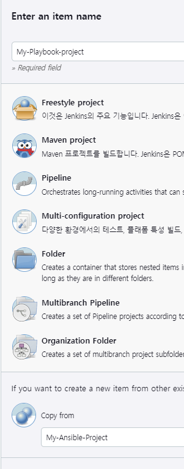
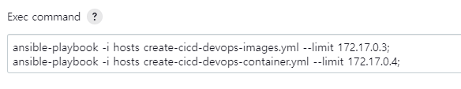
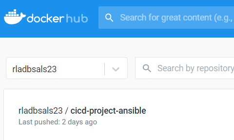
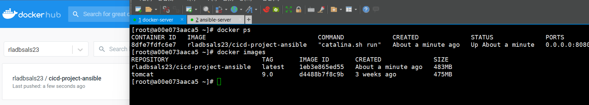

1. 젠킨스에 My-Playbook-project를 생성한다. (My-Ansible-project를 카피한다.)

2. 빌드 후 조치에 커맨드를 추가한다.

3. 젠킨스를 빌드하기 전 도커 허브에 이미지 파일 업로드 상태를 확인한다.

4. 젠킨스 빌드 후 도커허브에 이미지가 업로드되어있고 docker-server에 이미지 pull 및 컨테이너 생성이 완료된 것을 확인한다.

