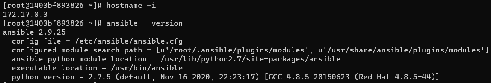
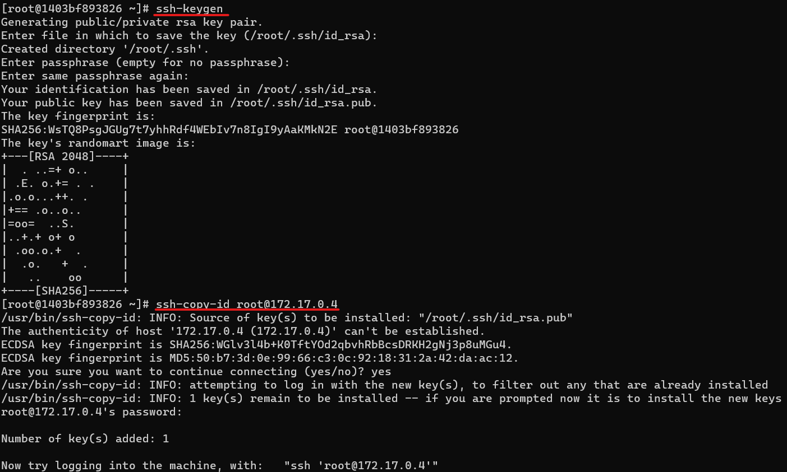
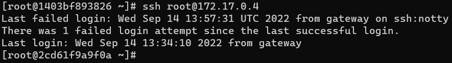

1. 도커 이미지 다운로드 및 컨테이너 설치.
```
$ docker pull edowon0623/ansible:latest
$ docker run --privileged -itd --name ansible-server -p 20022:22 -p 8083:8080 -e container=docker -v /sys/fs/cgroup:/sys/fs/cgroup edowon0623/ansible:latest /usr/sbin/init
```

2. ansible-server 에 등록할 docker-server와 ansible-server의 IP정보를 확인한다. <br>jenkins-server또한 bridge네트워크로 등록되어있어서 함께 확인되는 것으로 보인다.


3. ansible-server 에 ssh로 접속 후 호스트명과 ansible 버전정보를 간단하게 확인한다.



4. /etc/ansible/hosts 에 ansible-server 와 docker-server 의 ip를 추가한다.

```
[devops]
172.17.0.3
172.17.0.4
```

5. ansible-server 에서 ssh-keygen 명령어를 통해 public/private 키를 생성한다.



6. ssh로 docker-server에 접속해보면 패스워드 입력 없이 접속이 가능하다. ansible-server 도 동일한 작업을 해준다.

