1. My-Docker-Project라는 새로운 프로젝트를 생성한다.(My-Third-Project의 설정을 복사한다.)

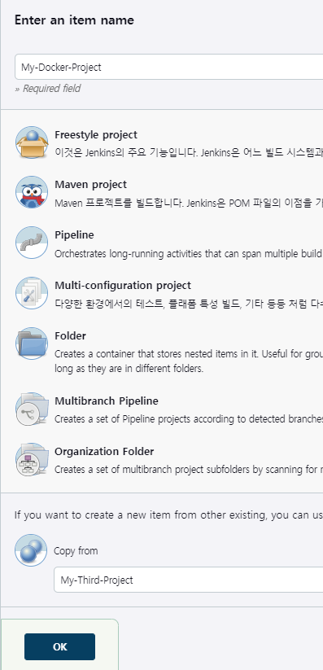

2. Poll SCM의 설정은 해제한다.
3. 기존 빌드 후 조치 설정도 삭제한다.
4. 새로운 빌드 후 조치 설정을 추가한다.


5. docker-server의 디렉토리 상태를 확인 후 젠킨스에서 빌드를 진행하여 파일이 생성되는지 본다.

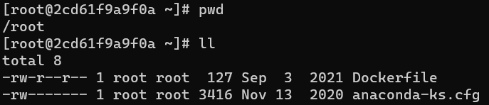
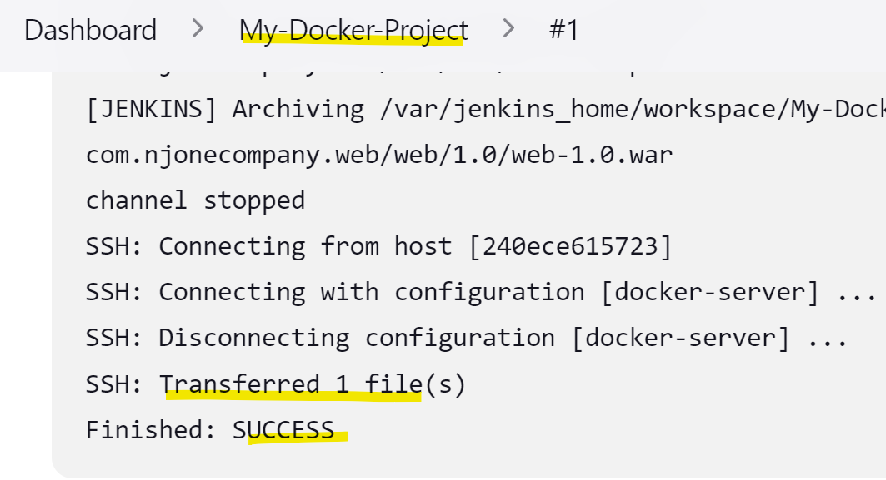
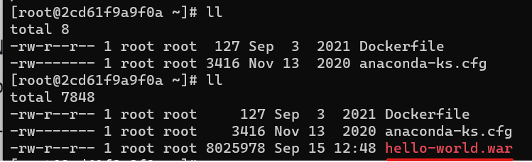

6. Dockerfile 의 내용을 확인하고 빌드를 진행한다.
```
$ docker build -t docker-server -f Dockerfile .
```

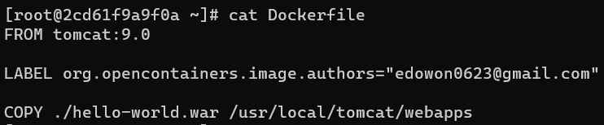

7. 이미지가 잘 생성되었고 해당 이미지로 mytomcat이라는 컨테이너를 생성한다.

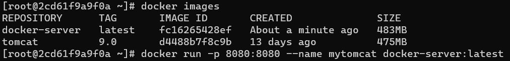

8. 컨테이너가 잘 실행되고 있는지 확인한다.

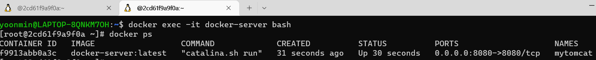

9. 호스트PC에서 docker-server 컨테이너에 접속해보면 다음과 같이 hello-world 서비스가 정상적으로 실행되는것으로 확인된다.

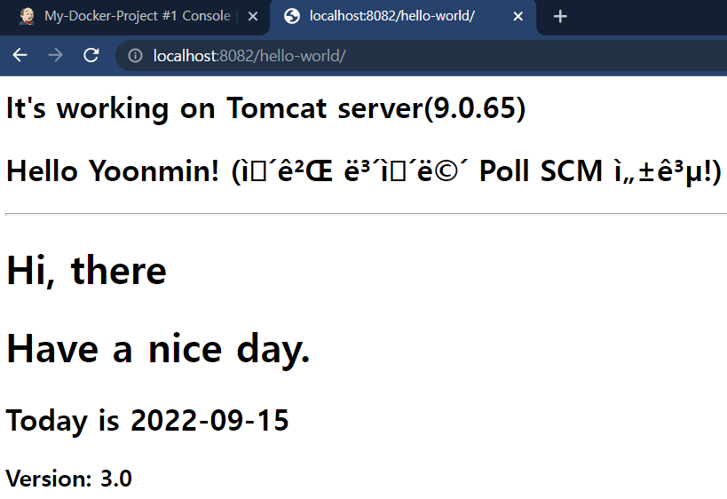

### 6 ~ 7 번 과정을 자동화 하기 위해서 Exec명령어를 추가한다
* 기존에 만들었던 컨테이너와 이미지는 모두 삭제한다.

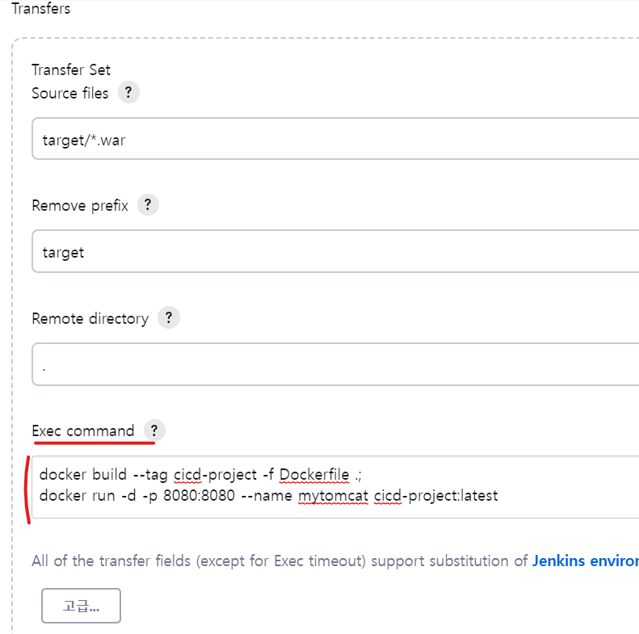

* 젠킨스에서 빌드가 완료된것을 확인한다.

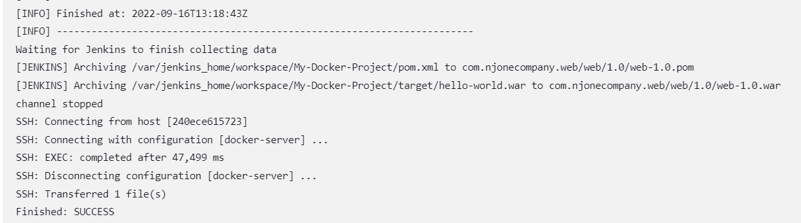

* docker-server에서 이미지와 컨테이너가 젠킨스의 Exec 명령어에 의해서 생성된 것을 확인한다.

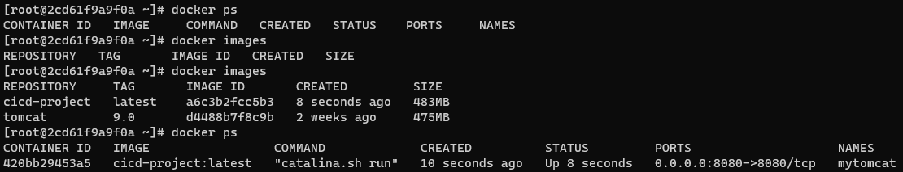