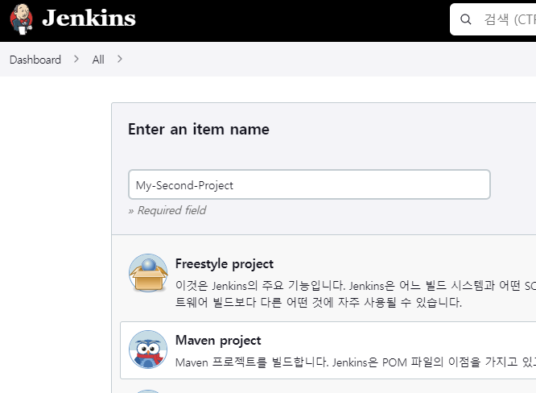
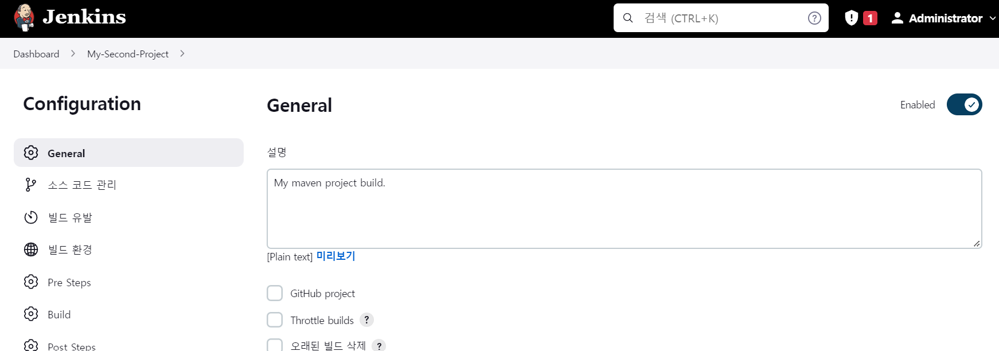
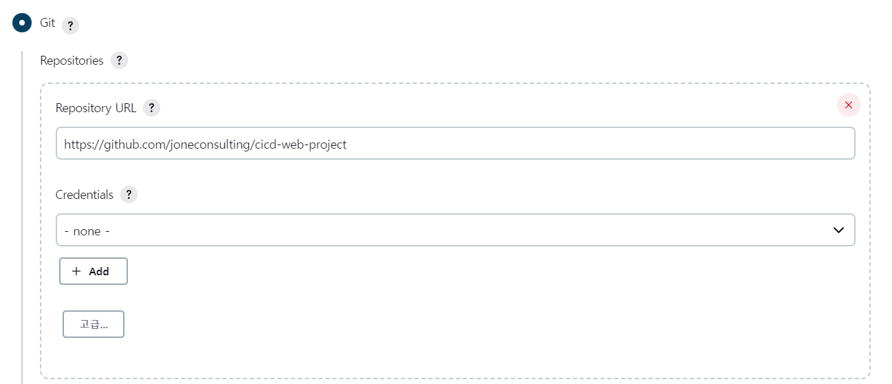
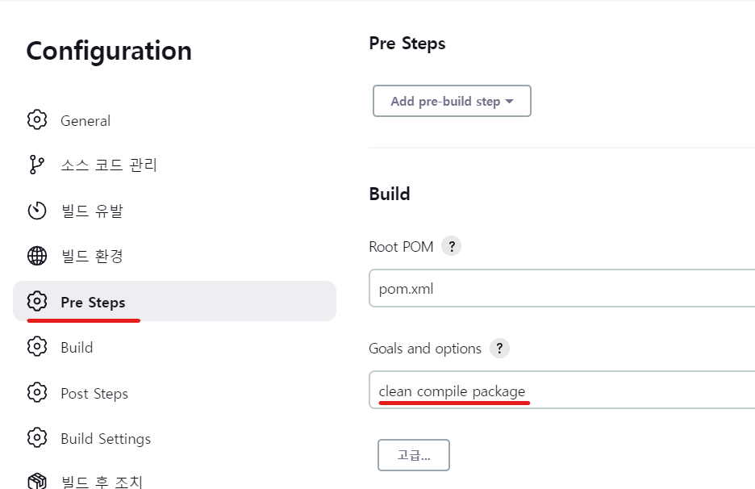
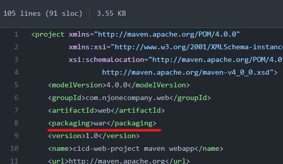
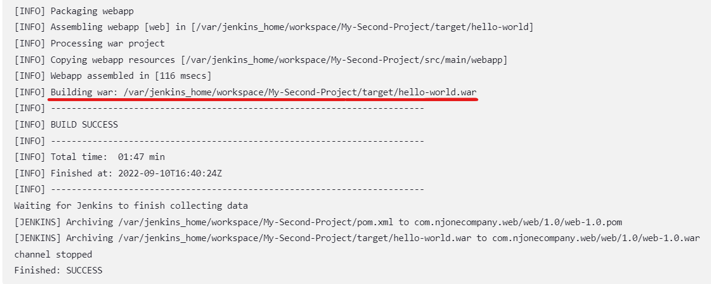
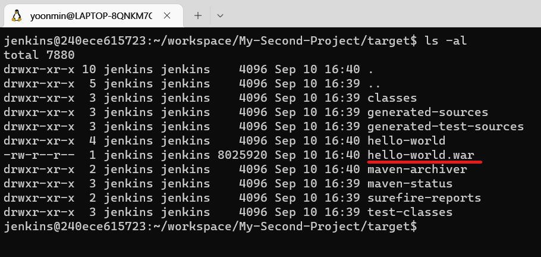

1. 새로운 Item 으로 Maven프로젝트 만들기

2. 간단한 프로젝트 설명을 General에 기입한다.

3. 소스코드를 가져올 Git repository URL을 설정한다.  
Private repository라면 Credentials 항목에 계정을 추가한다.

4. Pre Steps에 Maven Goals를 설정한다.

* pom.xml에 packaging이 war로 설정되어 있기 때문에 package 가 되고나면 war파일이 생성된다.

5. 콘솔로그에서 결과파일의 경로를 확인할 수 있다.

6. 도커 컨테이너에서 해당 디렉토리로 이동하여 파일이 실제로 생성되었는지 확인한다.

