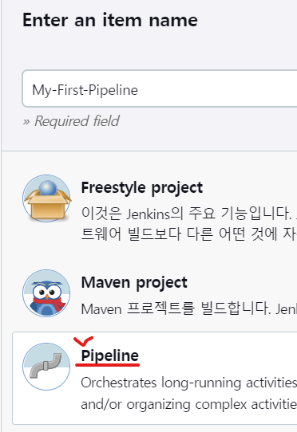
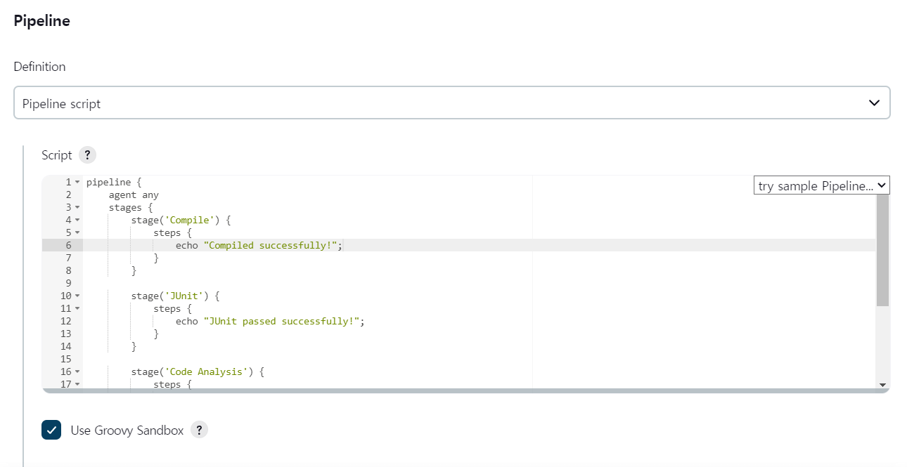
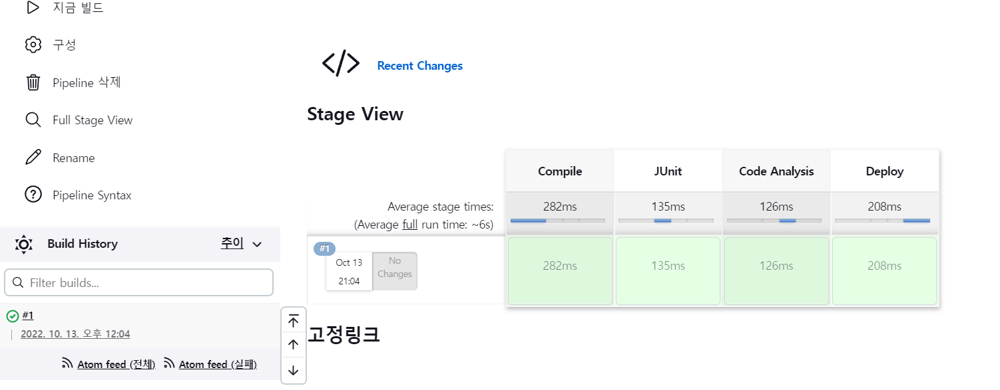
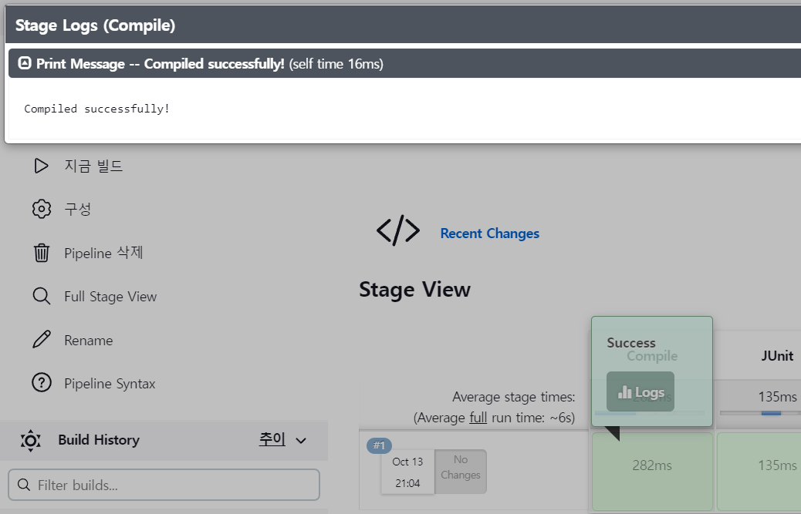
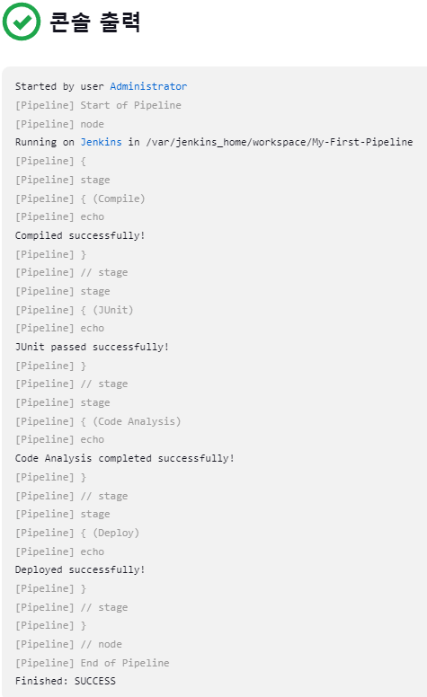
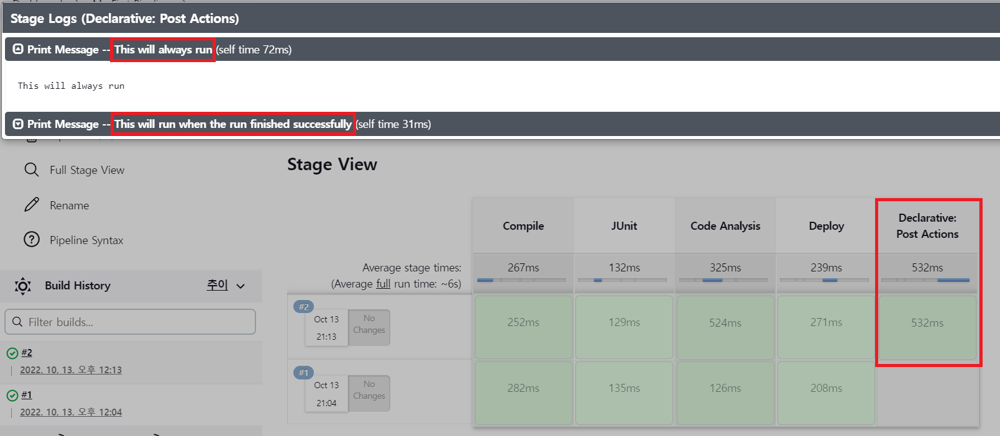
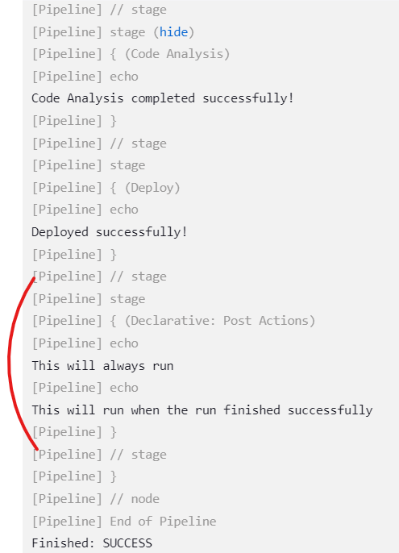

* 새로운 Item으로 Pipeline을 만든다.



* Pipeline 항목에 스크립트를 작성한다.



<details>
<summary>사용 된 스크립트</summary>
<div markdown="1">

```
pipeline {
    agent any
    stages {
        stage('Compile') {
            steps {
                echo "Compiled successfully!";
            }
        }

        stage('JUnit') {
            steps {
                echo "JUnit passed successfully!";
            }
        }

        stage('Code Analysis') {
            steps {
                echo "Code Analysis completed successfully!";
            }
        }

        stage('Deploy') {
            steps {
                echo "Deployed successfully!";
            }
        }
    }
}
```

</div>
</details>

* 빌드를 해보면 각 단계별로 걸린 시간과 성공유무를 표시해준다.



* 각 단계를 클릭하면 성공표시와 로그를 확인할 수 있다.



* 콘솔을 확인해보면 각 단계별로 진행이 되었고 콘솔이 찍혀있는것을 확인할 수 있다.



* 스크립트를 수정하여 post 항목을 추가해보자.
* post는 빌드의 성공여부에 상관없이 빌드가 끝나면 실행되는 항목이다.

<details>
<summary>수정 된 스크립트</summary>
<div markdown="1">

```
pipeline {
    agent any
    stages {
        stage('Compile') {
            steps {
                echo "Compiled successfully!";
            }
        }

        stage('JUnit') {
            steps {
                echo "JUnit passed successfully!";
            }
        }

        stage('Code Analysis') {
            steps {
                echo "Code Analysis completed successfully!";
            }
        }

        stage('Deploy') {
            steps {
                echo "Deployed successfully!";
            }
        }
    }

    post {
      always {
        echo "This will always run"
      }
      success {
        echo "This will run when the run finished successfully"
      }
      failure {
        echo "This will run if failed"
      }
      unstable {
        echo "This will run when the run was marked as unstable"
      }
      changed {
        echo "This will run when the state of the pipeline has changed"
      }
    }
}
```

</div>
</details>

* 다시한번 빌드해보면 Post Actions가 추가된 것을 확인할 수 있다.
* 로그를 클릭해보면 Post Actions에서 수행 후 남긴 메시지도 확인할 수 있다.



* 콘솔에서도 Post Actions 에 대한 내용을 확인할 수 있다.

