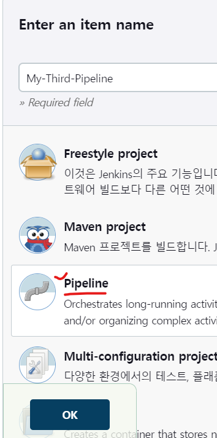
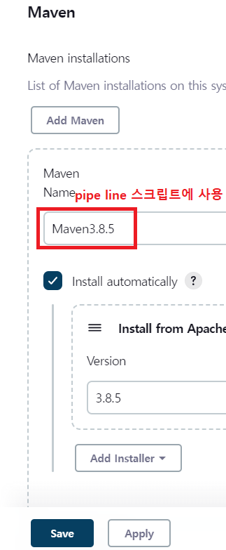
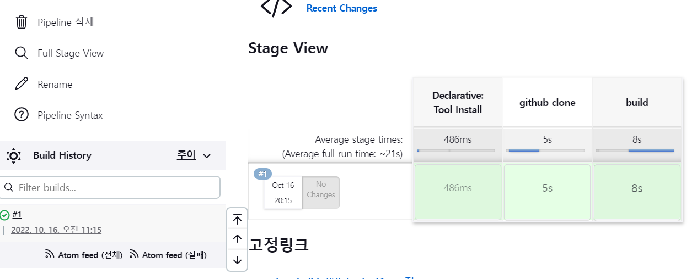

* 이전에 작업했던 cicd-web-project 예제를 Maven 빌드 하기



* Dashboard > Jenkins 관리 > Global Tool Configuration 에서 Maven 설정을 한다.



* Pipeline 구성에 스크립트를 설정한다.


<details>
<summary>설정 한 스크립트</summary>
<div markdown="1">

```
pipeline {
    agent any
    tools {
        maven 'Maven3.8.5'
    }
    stages {
        stage('github clone') {
            steps {
                git branch: 'main', url: 'https://github.com/joneconsulting/cicd-web-project'
            }
        }

        stage('build') {
            steps {
                sh '''
                    echo build start
                    mvn clean compile package -DskipTests=true
                '''
            }
        }
    }
}
```

</div>
</details>

* 빌드 결과 화면

