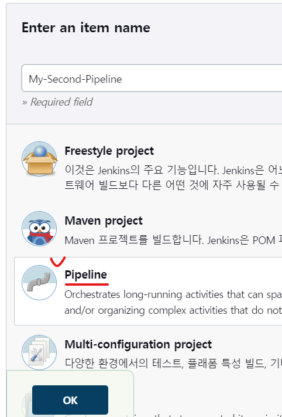
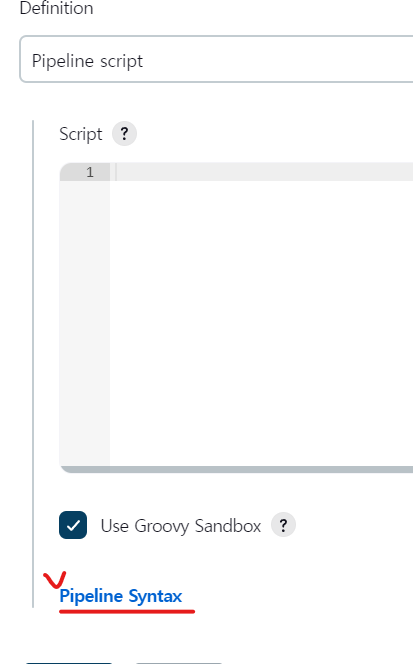
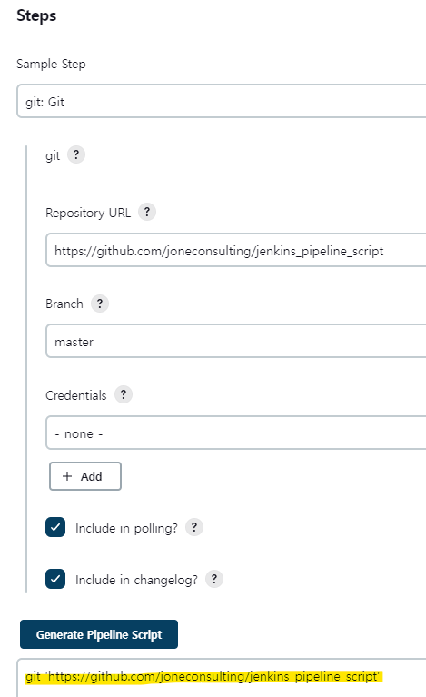
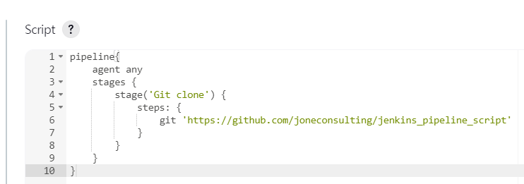
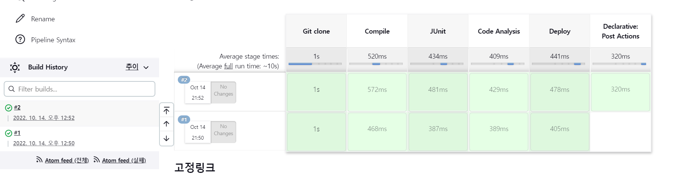

* 새로운 Pipeline 프로젝트를 만든다.



* Pipeline 문법을 모를때 Pipeline Syntax 기능을 이용해볼 수 있다.



* 완성 된 스크립트를 pipeline 스크립트에 활용한다.





* 실행하고자 하는 스크립트를 Pipeline 스크립트에 직접 명시할 수도 있고, 파일로 만들어서 파일을 실행할 수도 있다.

<details>
<summary>설정 한 스크립트</summary>
<div markdown="1">

```
pipeline {
    agent any
    stages {
        stage('Git clone') {
            steps {
                git 'https://github.com/joneconsulting/jenkins_pipeline_script';
            }
        }

        stage('Compile') {
            steps {
                echo "Compiled successfully!";
                sh './build.sh'
            }
        }

        stage('JUnit') {
            steps {
                echo "JUnit passed successfully!";
                sh './unit.sh'
            }
        }

        stage('Code Analysis') {
            steps {
                echo "Code Analysis completed successfully!";
                sh './quality.sh'
            }
        }

        stage('Deploy') {
            steps {
                echo "Deployed successfully!";
                sh './deploy.sh'
            }
        }
    }

    post {
      always {
        echo "This will always run"
      }
      success {
        echo "This will run when the run finished successfully"
      }
      failure {
        echo "This will run if failed"
      }
      unstable {
        echo "This will run when the run was marked as unstable"
      }
      changed {
        echo "This will run when the state of the pipeline has changed"
      }
    }
}
```

</div>
</details>

