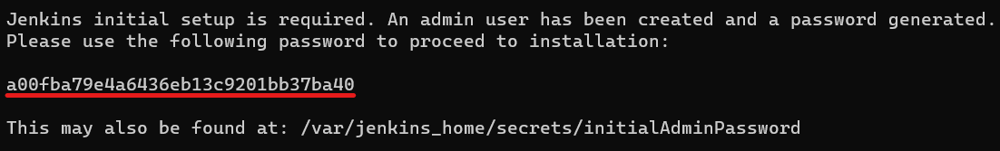
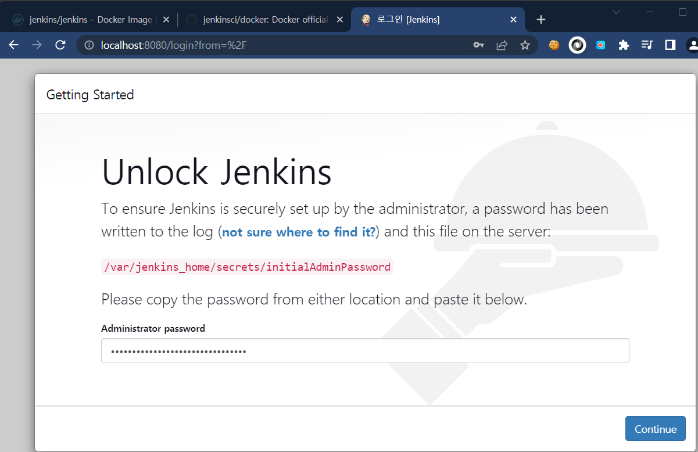
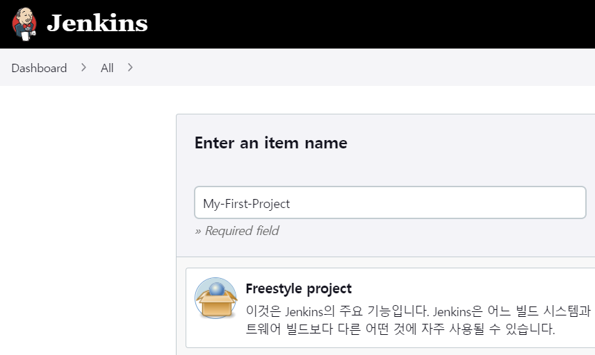
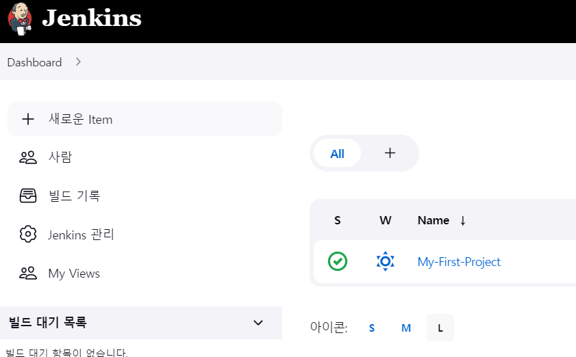
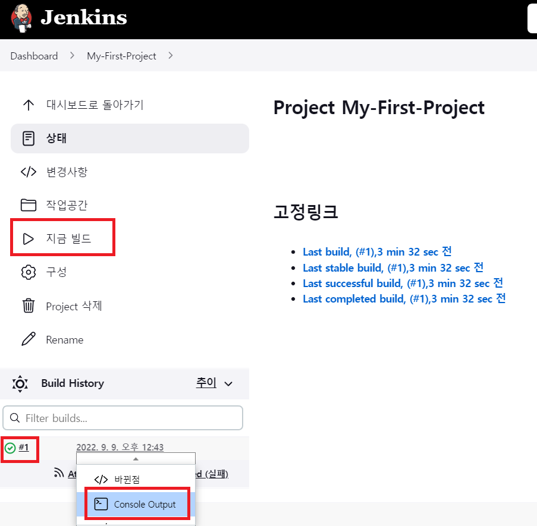
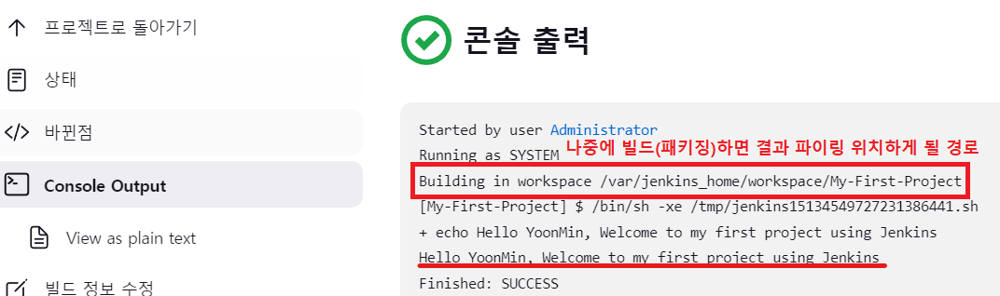

### 젠킨스 설치
* `docker run -d -v jenkins_home:/var/jenkins_home -p 8080:8080 -p 50000:50000 --restart=on-failure --name jenkins/server jenkins/jenkins:lts-jdk11`
* docker logs ${도커컨테이너 이름/ID} 도커 초기 패스워드 확인.

* http://localhost:8080 으로 접속해보면 젠킨스에 접속 가능하다.

* 새로운 Item을 추가하기 위하여 프로젝트 생성.

* 도커의 젠킨스는 리눅스 환경이기 때문에 간단한 테스트를 위해 쉘스크립트를 추가한다.

* 대시보드에 추가된 프로젝트를 클릭하여 지금 빌드를 실행하면 아래 상태와 콘솔정보를 확인할 수 있다

