1. Item name -> My-Ansible-Project
* Copy from: My-Docker-Project

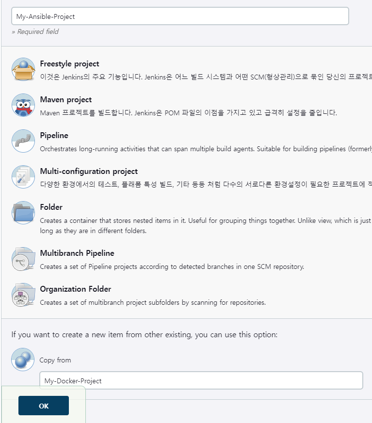

2. 기존의 빌드후 조치를 삭제하고 Send build artifacts over SSH 를 추가한다

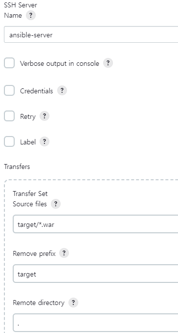

3. ansible-server에 first-devops-playbook.yml 을 작성한다


4. hosts파일을 만든다. (ansible-server에 먼저 테스트 하기 위한 용도)
```
172.17.0.3
```

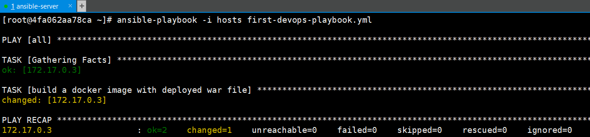
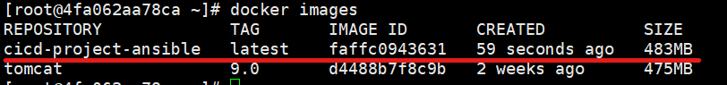

5. first-devops-playbook.yml에 커맨드를 추가한다.

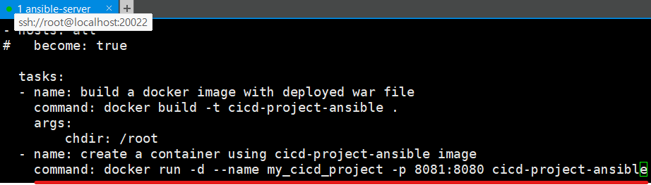

6. 추가한 커맨드까지 실행되어 도커 컨테이너 프로세스가 확인된다.


7. 젠킨스가 first-devops-playbook.yml 까지 실행할 수 있도록 설정한다.

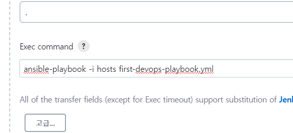

8. 젠킨스를 빌드하여 ansible-server에서 도커 이미지와 컨테이너 프로세스가 정상적으로 생성되고 실행됐는지 확인한다.

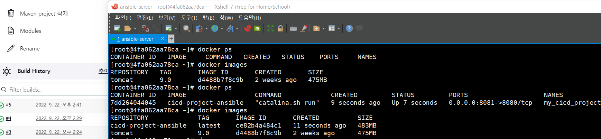

9. ansible-server 의 서비스에 접속해서 정상적으로 접속되는지 확인한다.

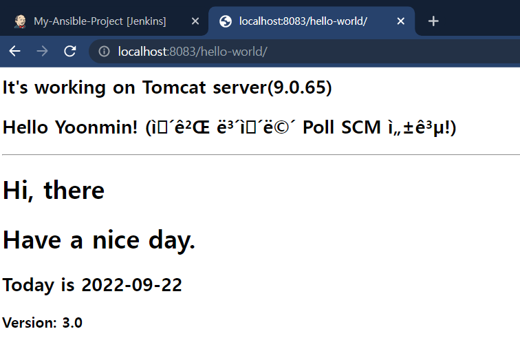

10. 한번더 빌드(또는 Poll SCM)를 시도하면 실패한다.
* 이미 생성된 컨테이너를 또다시 생성하려고 하기 때문에 오류가 발생됐다.

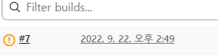

11. first-devops-playbook.yml 에 명령어를 추가한다.
* 컨테이너 중지 -> 컨테이너 삭제 -> 이미지 삭제 순으로 명령어가 추가되었다.

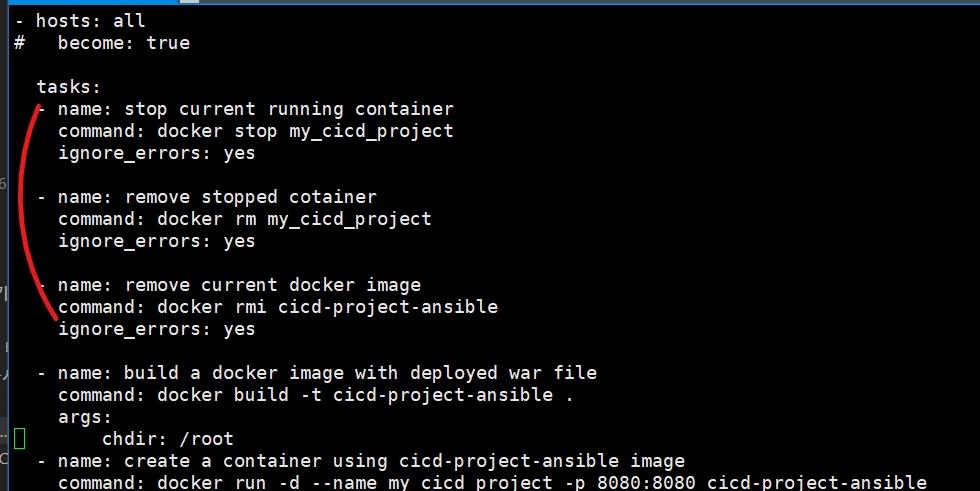

12. 다시 빌드해보면 정상적으로 완료되는것을 확인할 수 있다.

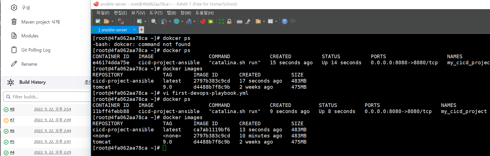