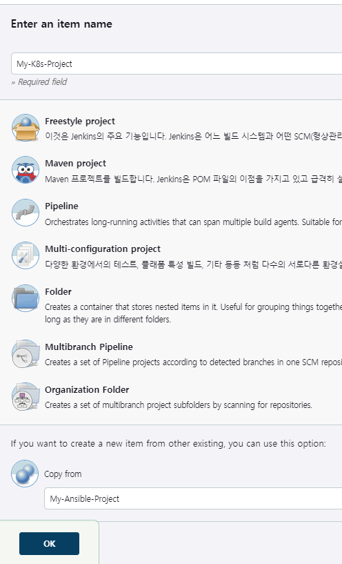
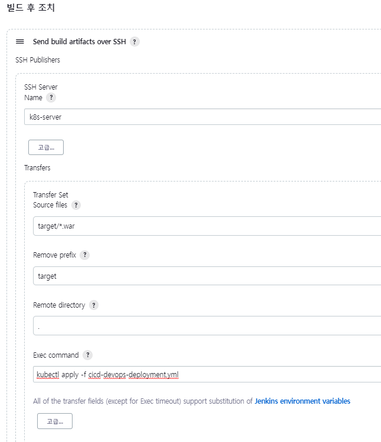
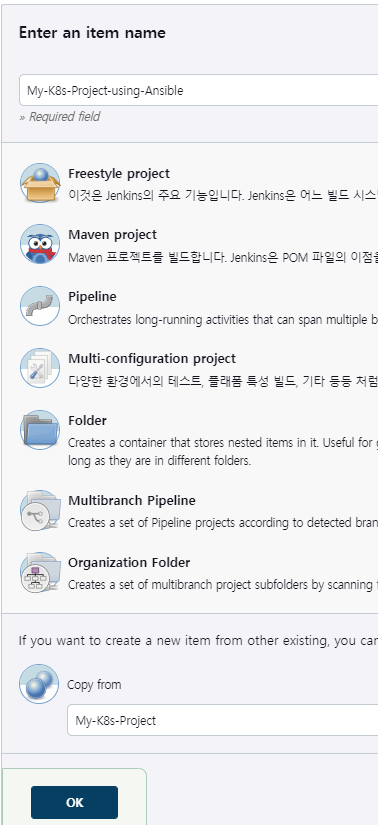
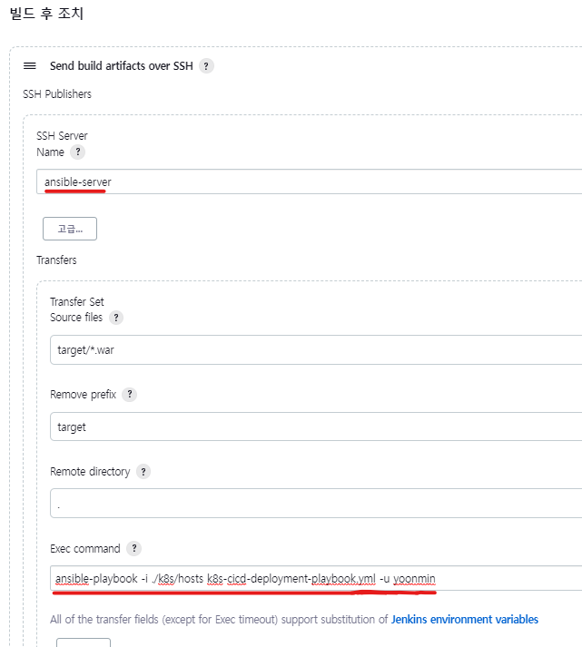

### Jenkins에서 K8s로 바로 명령 전달
* Jenkins관리 - Configuration System에서 SSH server를 추가한다

* 젠킨스에서 빌드하면 다음과 같이 k8s에서 cicd-devops-deployment.yml 가 실행되어 
deployment, pod 가 생성되었다

### Jenkins에서 ansible-server로 명령 전달 후, ansible-server가 K8s에 전달

