## 개발 방법론(Waterfall vs Agile)
### Waterfall
* 각 단계의 구분이 뚜렸하며 순차적으로 진행된다.
* 각 단계는 이전단계가 완료된 후에만 진행될 수 있다.
* 기본적으로 요구사항정의 -> 분석/설계 -> 구현 -> 테스트 -> 운영의 단계를 가지고있다.
* 폭포가 거꾸로 돌아가기 어려운 것처럼 한번 진행된 단계는 이전단계로 돌아가기 상당히 어렵다.
* 따라서 고객의 Needs가 바로 반영되기 어렵고 반영된다고 하더라도 굉장히 많은 시간과 비용이 발생된다. 경우에 따라 다음 프로젝트에 반영해야되는 상황도 발생한다.
* 지금도 널리 사용되는 좋은 개발 방법론 중에 하나이며 특정 프로젝트의 규모와 상황에 따라 Waterfall 방법이 필요한 경우도 있다.
* 그러나 최근의 추세처럼 시시각각 고객의 요구사항이 변하고 다양한 요구사항을 수용하기 위해서는 적합하지 않다.

### Agile
* 아무런 계획이 없거나 지나치게 계획이 많은 개발 방법들 사이에서 타협점을 찾기 위해 나온 방법론이다.
* 프로젝트의 생명 주기또한 반복적인 과정을 통해서 점점 소프트웨어가 진화되고 사용자의 Needs를 만족시켜가는 과정이다.

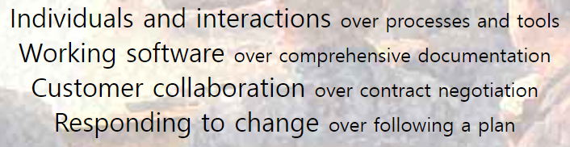

에자일선언문 출처|https://agilemanifesto.org/
-|-
개인과 상호 작용 | 프로세스 및 도구
작동하는 소프트웨어 | 포괄적인 문서
고객과의 협력 | 계약 및 협상
변화에 대응 | 계획
* Agile 선언문에서는 오른쪽도 중요한 내용이지만 그보다 외쪽에 조금 더 높은 가치를 둔다는 내용이다.(둘다 중요하지만 상대적이라는 점을 인지해야한다)
* 종류 : 익스트림 프로그래밍, 페어프로그래밍, 테스트주도개발, 스크럽

### 클라우드 네이티브 아키텍처
* 클라우드 네이티브 아키텍처 및 기술은 클라우드에서 빌드되고 클라우드 컴퓨팅 모델을 최대한 활용하는 워크로드를 디자인, 생성 및 운영하는 접근방식이다.
* 클라우드 네이티브 기술을 통해 조직은 퍼블릭, 프라이빗 및 하이브리드 클라우드와 같은 최신 동적 환경에서 확장 가능한 애플리케이션을 빌드하고 실행할 수 있다. 컨테이너, 서비스 메시, 마이크로 서비스, 변경할 수 없는 인프라 및 선언적 API는 이 접근 방식을 예로 들 수 있다.
* 이러한 기술을 사용하면 복원력, 관리 가능 및 관찰 가능한 느슨하게 결합된 시스템을 사용할 수 있다. 강력한 자동화와 결합되어 엔지니어는 최소한의 수고로 자주 예측 가능하게 높은 영향을 미치는 변경을 할 수 있다.

### 클라우드 네이티브 어플리케이션의 필수항목
* CNCF, Pivotal 에서 정의한 클라우드 어플리케이션의 구성요소.
```
Microservice: 마이크로 서비스로 개발된다.
Containers: 마이크로 서비스를 개발하고 배포하기 위해 콘테이너 가상화 환경이 거의 표준처럼 사용된다.
DevOps: 서비스에 문제가 생겼을 경우나 사용자의 Needs가 생겼을 경우 바로바로 수정/반영/배포 해주기 위해 개발과 운영조직간의 유기적인 협력을 통해 지속적으로 서비스를 개선해나가는 방법.
CI/CD: 자동화 파이프라인에 의해 자동으로 통합/빌드/테스트/배포 를 거쳐서 운영상태가 된다.
```

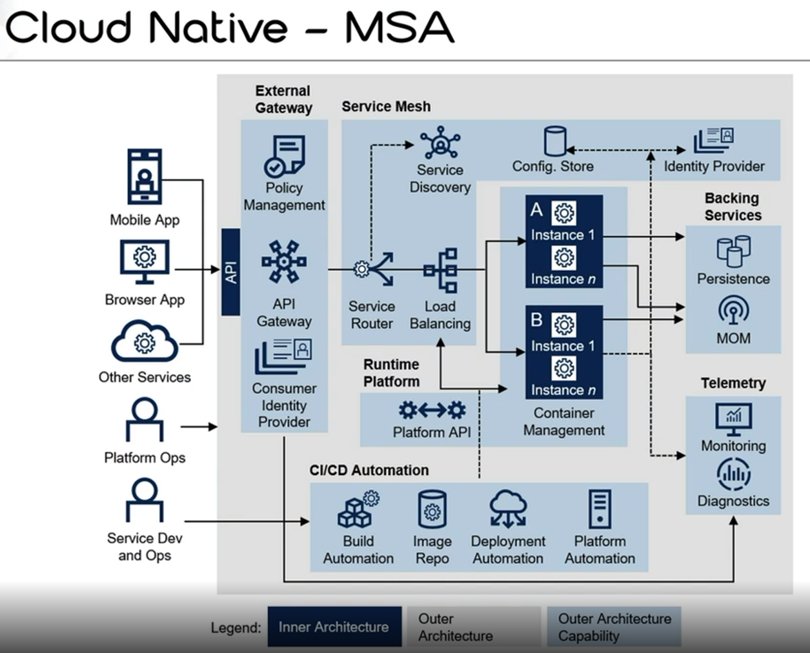

* Inner Architecture: 도메인에 대해서 비즈니스 로직을 갖고 서비스를 개발하는 부분.
* Outer Architecture: 이너아키텍처로 구성 된 부분들이 운영, 작동되도록 서포팅하는 지원 시스템.

### CI/CD 자동화 도구의 이해
* CI: 작업된 코드의 컴파일, 테스트, 패키징 작업.(빌드/테스트/머지의 자동화)
  * 레파지토리에서 머지와 충돌의 해결을 가끔하면 문제가 커지기 때문에 작은단위로 여러번 자주 배포하는것이 중요하다.
  * 생산성을 향상시키고 문제점을 빠르게 발견할 수 있기 때문에 수정에 용이하게 사용된다.
  * 때문에 코드의 품질이 전체적으로 크게 향상된다.
* CD: CI에 의해 패키징된 결과물을 개발서버, 테스트서버, 운영서버로 배포하는 작업.
  * Continuous Delivery? Continuous Deployment? 패키징된 결과물을 수동으로 배포(delivery)하느냐 자동으로 배포하느냐(deployment)의 차이이다

### 젠킨스
* 젠킨스를 활용하면 CI단계를 SCM(=VCS, git)으로부터 소스를 가져와서 빌드 -> 테스트 -> 패키징 으로 정의해두고 테스트시 문제가 발생하면 개발자들에게 알림을 보낼 수도 있고 패키징까지 정상 완료되면 운영환경에 배포까지 할 수 있다.

* 다양한 Plugins 연동이 가능하다.
  * Build Plugins: Maven, Ant, Gradle
  * VCS Plugins: Git, SVN
  * Languages Plugins: Java, Python, Node.js

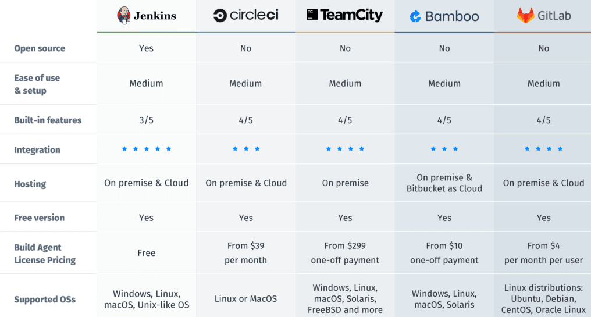

* 젠킨스에서는 각각의 작업 단계를 Item이라는 개념으로 만들어 사용하며 Item을 연결하여 PipeLine으로 만들 수도 있다.
* 젠킨스의 고유한 문법인 DSL(파일명: JenkinsFile)을 통해서 스크립트로 PipeLine을 만들 수 있다.
* https://www.jenkins.io/download/

</br>

### >>>Jenkins 설치 실습 <a target="_blank" href="https://github.com/yoonmin-kim/TIL/blob/main/CI%C2%B7CD/Jenkins%20%EC%84%A4%EC%B9%98.md">(이동)</a> <<<
</br>

### CI/CD를 위한 Git, Maven 설정
* Jenkins관리 -> 플러그인관리 메뉴에서 깃허브 플러그인을 확인한다.

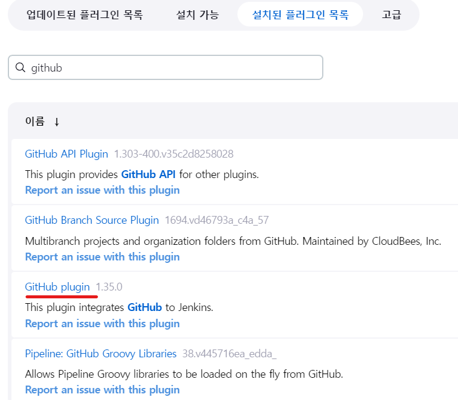

* Jenkins관리 -> Global Tool Configuration 메뉴에서 Git 항목을 설정한다.
* 젠킨스 컨테이너에서 git 명령을 사용할 수 있는 상태인지 확인 후 기본 명령어를 git으로 설정하고 저장한다.

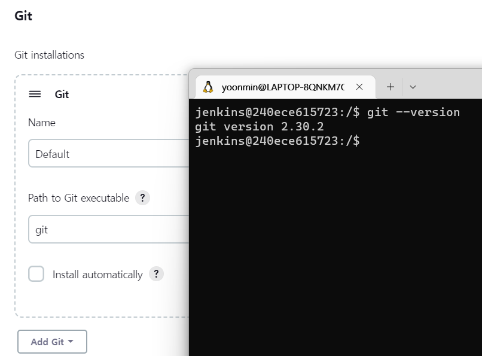

* Jenkins관리 -> 플러그인관리 메뉴에서 Maven 플러그인을 확인 후 설치한다.


* Jenkins관리 -> Global Tool Configuration 메뉴에서 Maven 항목을 설정한다.
* 젠킨스 컨테이너에 메이븐이 깔려있지 않기 때문에 Install automatically를 설정해준다.

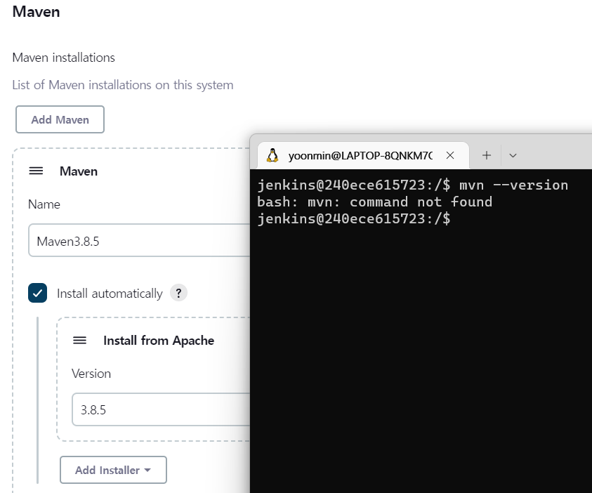

</br>

### >>>Git에서 코드 가져와서 빌드하기 실습 <a target="_blank" href="https://github.com/yoonmin-kim/TIL/blob/main/CI%C2%B7CD/Jenkins%20%EC%84%A4%EC%B9%98.md">(이동)</a> <<<
</br>

### >>>Tomcat서버 연동 및 배포하기 실습 <a target="_blank" href="https://github.com/yoonmin-kim/TIL/blob/main/CI%C2%B7CD/%ED%86%B0%EC%BA%A3%EC%84%9C%EB%B2%84%EC%97%90%20%EB%B0%B0%ED%8F%AC%ED%95%98%EA%B8%B0.md">(이동)</a> <<<
</br>

### Poll SCM 설정을 통한 지속적인 파일 업데이트

* Project > Configure > BuildTriggers
  * Build preiodically -> cron job (업데이트 사항이 없어도 빌드를 진행함)
  * Poll SCM -> cron job (commit 하면 변경 된 사항이 생기며 이때 빌드를 진행함)
* 유닉스계역의 잡 스케줄러인 cron job 으로 Poll을 등록할 수 있다


* 소스를 수정하여 github에 push한다.

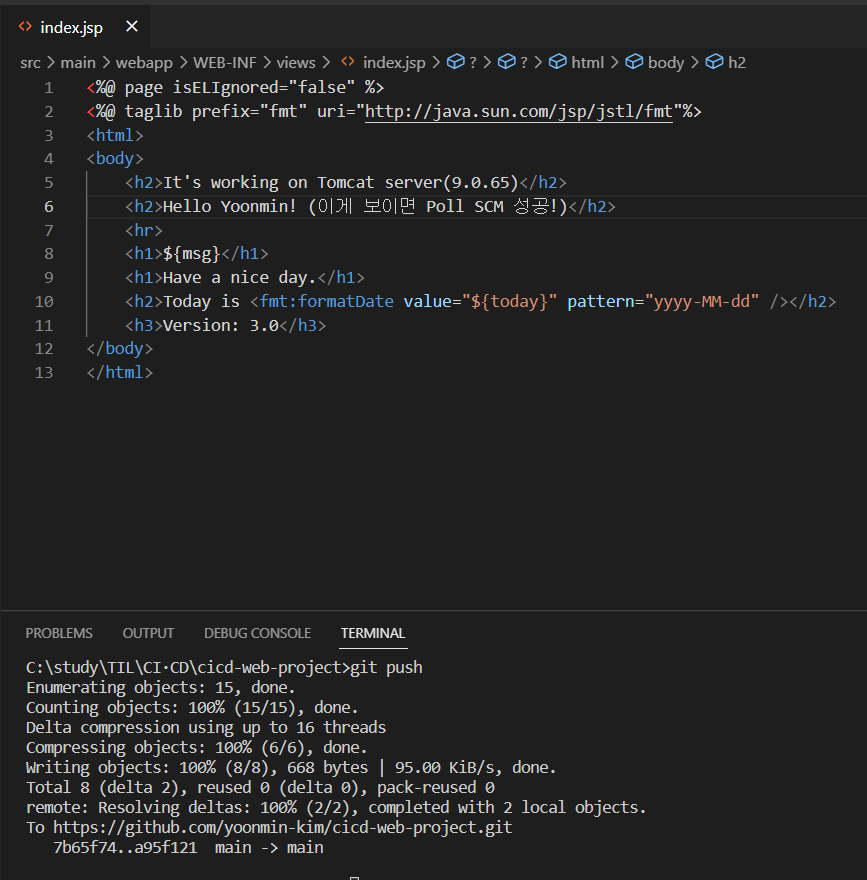

* 젠킨스가 Poll SCM 하고있는 github repo에서 수정한 소스가 push 된 것을 확인한다.

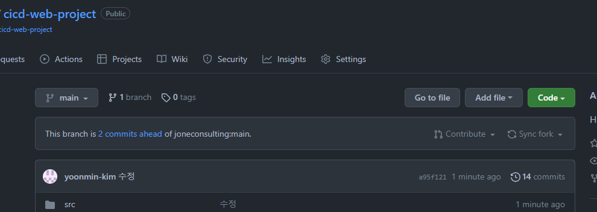

* 이후 젠킨스에서 자동으로 빌드를 시작하고있다.

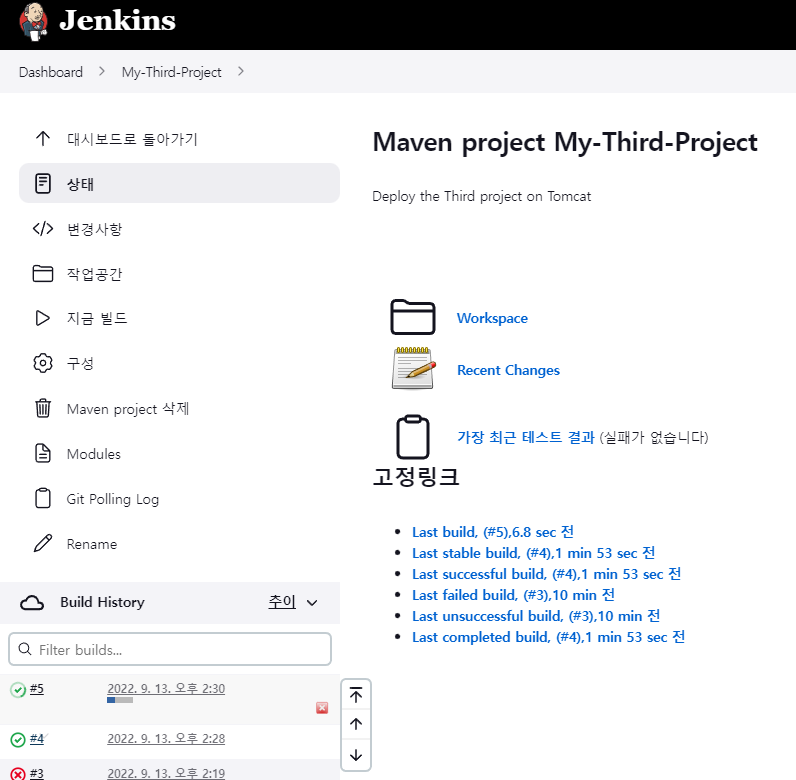

* 인코딩이 깨졌지만 자동으로 반영되어 화면이 변경 된 것을 확인할 수 있었다.

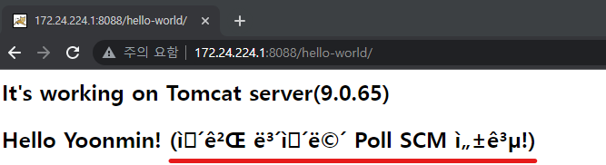

### SSH + Docker가 설치되어 있는 VM(컨테이너) 사용하기
1. 젠킨스관리 -> 플러그인관리에서 Publish Over SSH 플러그인을 설치한다.

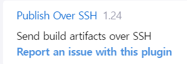

2. 젠킨스관리 -> 시스템설정에 Publish over SSH 항목이 추가 된 것을 확인한다.
3. docker 환경에 SSH서버를 띄운 뒤 정상적으로 접속되는지 확인한다.


4. Publish over SSH 항목에 docker에서 실행중인 SSH서버를 설정해준다. (이미지에 나와있지는 않지만 포트번호까지 정확히 기입하자.)

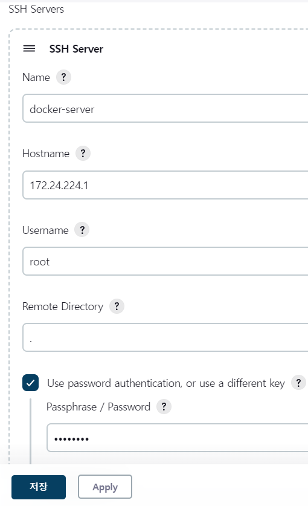

5. SSH서버에서 docker서비스가 active상태인지 확인하고 정상적으로 서비스 start가 되지 않을경우 아래 참고하여 재설치하자
* 참고: https://jhooq.com/docker-daemon-centos/

### >>>Docker Container에 배포하기 실습 <a target="_blank" href="https://github.com/yoonmin-kim/TIL/blob/main/CI%C2%B7CD/Docker%20Container%EC%97%90%20%EB%B0%B0%ED%8F%AC%ED%95%98%EA%B8%B0.md">(이동)</a> <<<
</br>

### Infrastructure as Code(IaC)
* 시스템, 하드웨어 또는 인터페이스의 구성정보를 파일(스크립트)을 통해 관리 및 프로비저닝.
  * 직접 커맨드를 입력하거나 GUI환경에서 클릭하는것이 아니라 스크립트를 통해 프로그래밍이 가능해지면서 자동화할 수 있는 부분이 상당히 많아진다.
* IT 인프라스트럭쳐, 베어메탈 서버 등의 물리 장비 및 가상 머신과 관련된 구성 리소스를 관리.
* 버전 관리를 통한 리소스 관리.

(Ansible)
* 여러 개의 서버를 효율적으로 관리할 수 있게 해주는 환경 구성 자동화 도구.
  * Configuration Management, Deployment & Orchestration tool.
  * IT infrastructure 자동화
* Push 기반 서비스.
* Simple, Agentless.
* 할 수 있는 일.
  * 설치: apt-get, yum, homebrew
  * 파일 및 스크립트 배포: copy
  * 다운로드: get_url, git
  * 실행: shell, task
* 결과
  * ok/failed/changed/unreachable

### Test Ansible module
* 실행옵션
  * -i(--inventory-file): 적용 될 호스트들에 대한 파일 정보, 해당 옵션이 없을 경우 /etc/ansible/hosts 가 디폴트로 사용된다.
  * -m(--module-name): 모듈 선택
  * -k(--ask-pass): 관리자 암호 요청
  * -K(--ask-become-pass): 관리자 권한 상승
  * --list-hosts: 적용되는 호스트 목록
* 멱등성
  * 같은 설정을 여러 번 적용하더라도 결과가 달라지지 않는 성질
  * ex) echo -e "[mygroup]\n172.20.10.11" >> /etc/ansible/hosts
  * 아래 이미지를 보면 [mygroup]ip 가 동일하게 2개가 생성 된 것을 확인할 수 있다.
  * ansible을 통해 해당 명령을 사용하게 되면 멱등성에 의해서 1개만 생성된다.

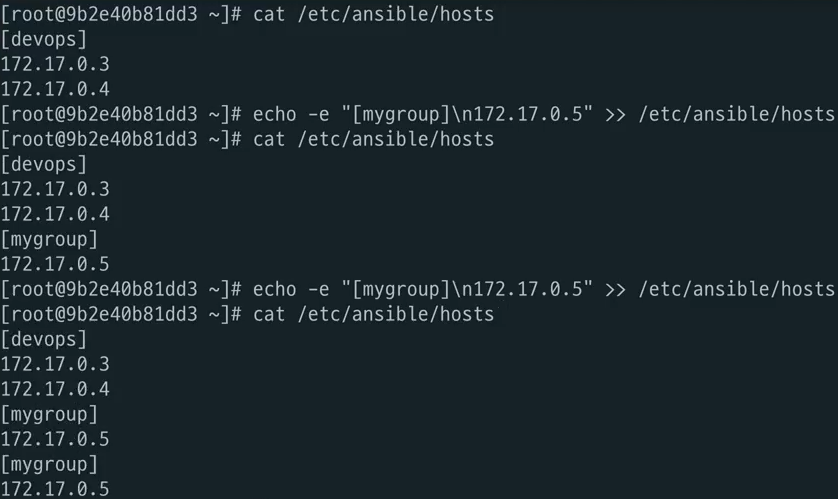

* https://docs.ansible.com/ansible/2.9/modules/list_of_all_modules.html
* Ansible Test
```
$ ansible all -m ping
```

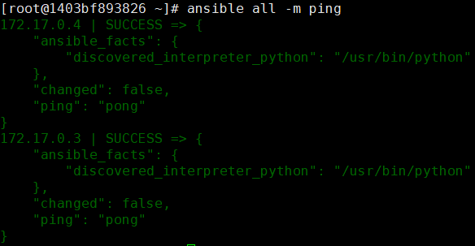

```
$ ansible all -m shell -a "free -h"
```

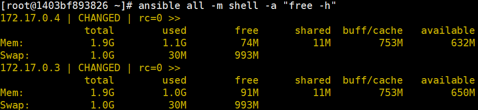

* /tmp 디렉토리에 test.txt 파일을 복사
```
$ ansible all -m copy -a "src=./test.txt dest=/tmp"
```
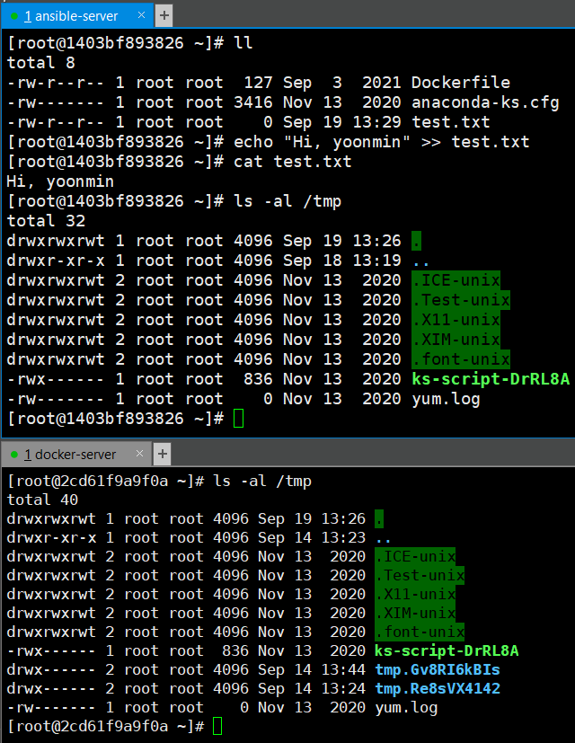

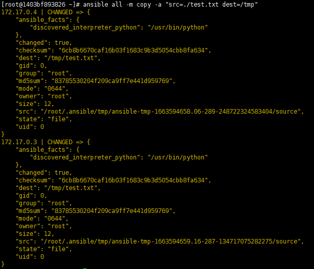

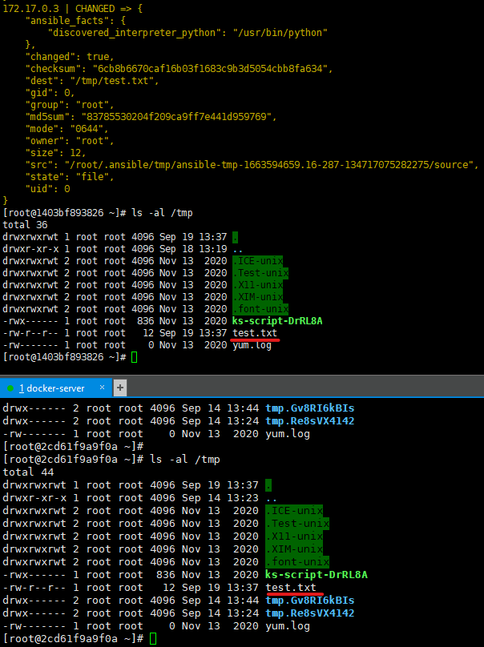

```
$ ansible devops -m yum -a "name=httpd state=present"
```
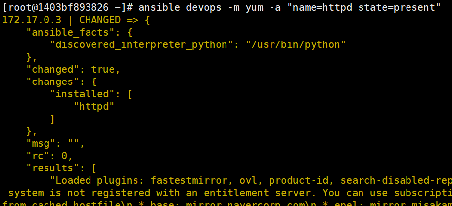
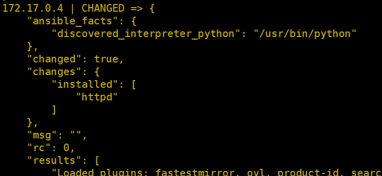
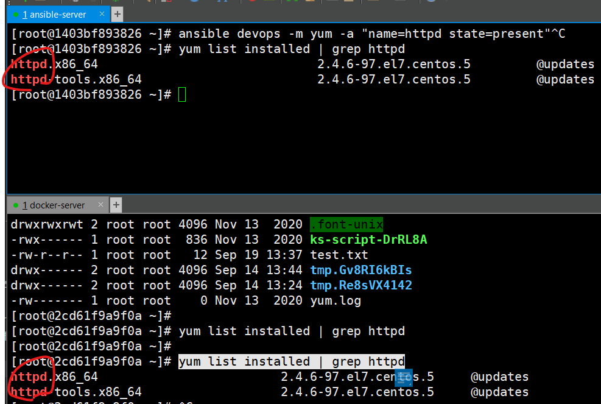

### Ansible Playbook
* 사용자가 원하는 내용을 미리 작성해 놓은 파일
  * ex) 설치, 파일전송, 서비스 재시작...
  * ex) 다수의 서버에 반복 작업을 처리하는 경우
* Playbook
  * $ vi first-playbook.yml 작성
  * $ ansible-playbook first-playbook.yml
  * $ cat/etc/ansible/hosts

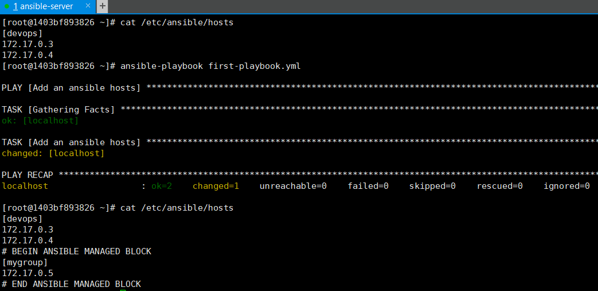
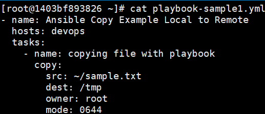
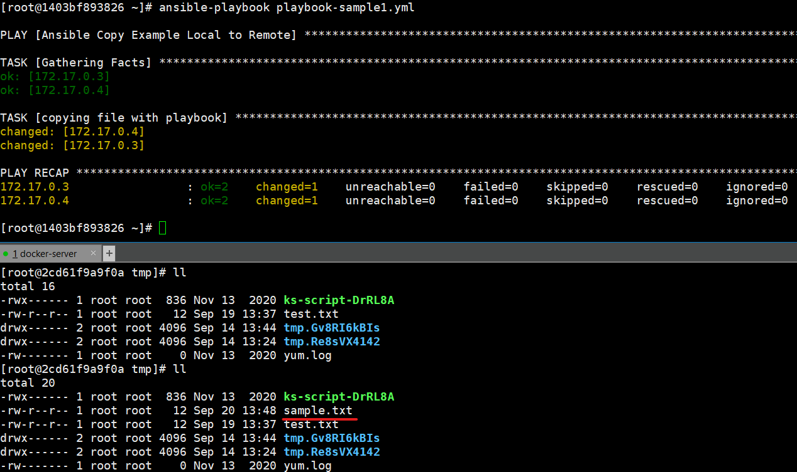

### Jenkins + Asible 연동하기
* Jnkins관리 -> 시스템 설정 -> SSH Server 추가

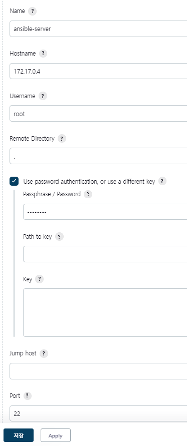

### >>>Jenkins + Ansible Playbook 사용하기 실습 <a target="_blank" href="https://github.com/yoonmin-kim/TIL/blob/main/CI%C2%B7CD/Jenkins%2BAnsible%20Playbook.md">(이동)</a> <<<
</br>

### Ansible을 이용한 Docker 이미지 관리

* 기존이미지에 태그를 붙인다. 해당 이미지를 도커 허브에 올린다.

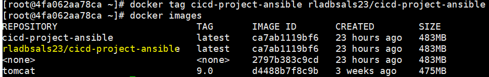

* docker login 명령어를 통해 로그인을 한 뒤
* docker push rladbsals23/cicd-project-ansible 를 하면 도커 허브에 업로드가 된다.

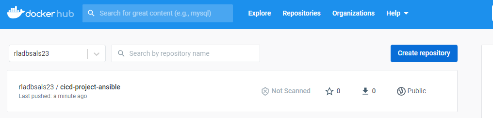

* 도커 이미지를 빌드하고 푸시하고 삭제하는 playbook.yml 파일을 생성한다.

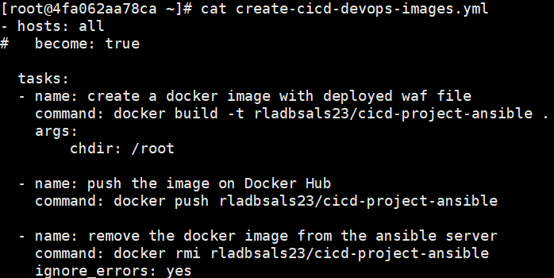

* ansible-playbook을 실행하여 도커허브에 이미지가 업로드 되는 것을 확인한다.

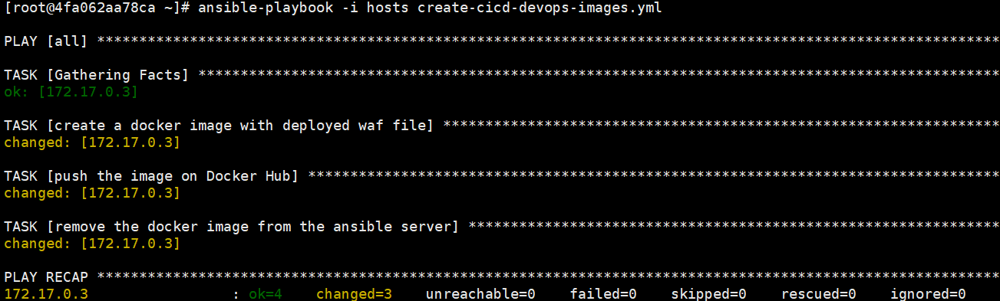
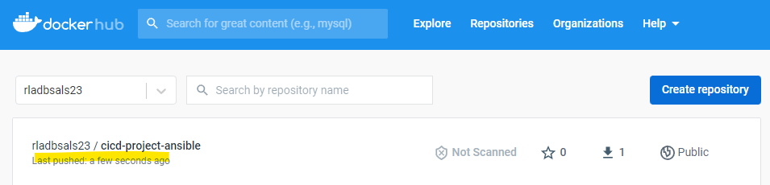

* 기존의 컨테이너 생성용 playbook.yml을 수정한다.
* 도커 이미지명을 바꿔주고 이미지를 허브에서 내려받는 명령도 추가한다.
```
$ mv first-devops-playbook.yml create-cicd-devops-container.yml
```

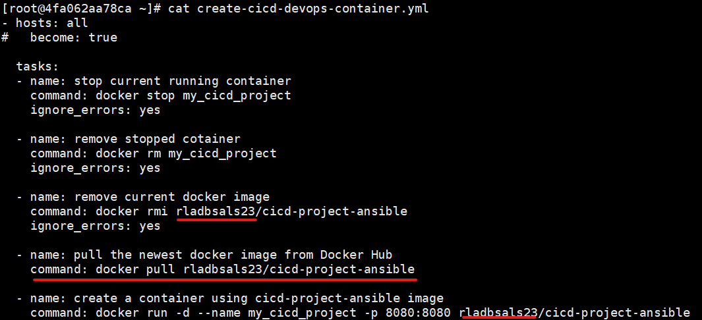

* 등록 된 hosts 모두 실행하는게 아니라 --limit 옵션을 줘서 제한을 할 수 있다.

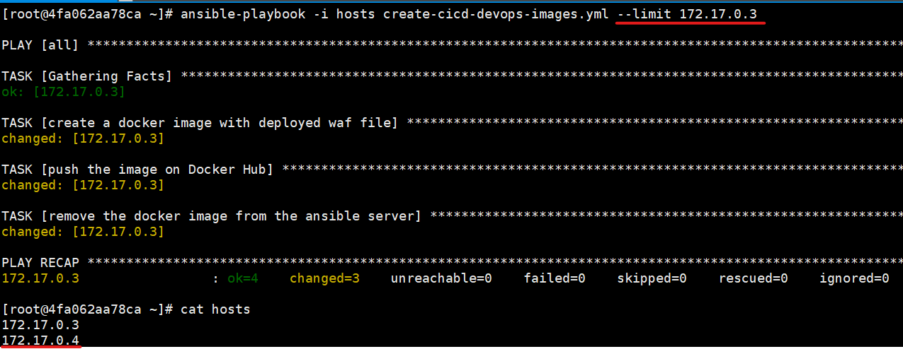

* 도커허브에 정상적으로 업로드 된 것을 확인한다.

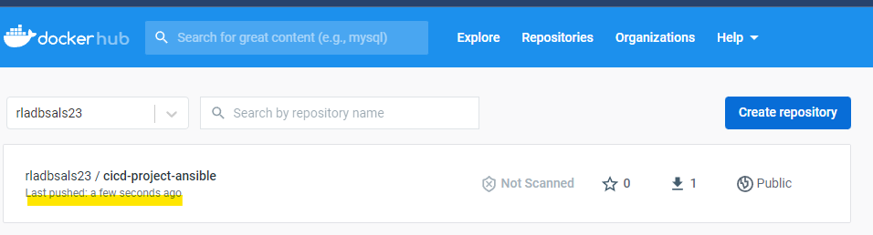

### >>>Ansible Playbook으로 Docker컨테이너 생성하기 실습 <a target="_blank" href="https://github.com/yoonmin-kim/TIL/blob/main/CI%C2%B7CD/Ansible%20Playbook으로%20Docker컨테이너%20생성하기.md">(이동)</a> <<<
</br>

### Kubernetes 소개
* 오픈소스 기반의 컨테이너화 된 애플리케이션(워크로드와 서비스)의 자동배포, 스케일링 등을 제공하는 관리 플랫폼

가능|불가능
-|-
컨테이너화 된 애플리케이션 구동|소스코드 배포x, 빌드x
서비스 디스커버리와 로드 밸런싱| 앺플리케이션 레벨 서비스x
스토리지 오케스트레이션|로깅, 모니터링 솔루션x
자동화 된 롤아웃과 롤백|포괄적인 머신 설정, 유지보수, 관리, 자동복구 시스템을 제공x
자동화 된 빈 패킹(bin packing)|
자동화 된 복구(self-healing)|
시크릿과 구성 관리

### Kubernetes Cluster

* Master(Control Plane) Node가 각 Work Node를 관리한다.
* 실제 컨테이너를 스케줄링하고 운영하는 것은 Work Node이다.
* Master Node와 Work Node를 묶어서 쿠버네티스 클러스터라고 한다.
```
Master Node: 설정정보, 사용자 스케줄관리, api 처리가 가능하도록 구성되어있다.
Work Node: 실제 운영하고자하는 컨테이너를 관리하기 위한 Pod라는 개념과 Pod를 운영하기 위한 Kublet이라는 개념이 포함되어있다.
Services: 각 Pod간에 데이터를 주고받을 수 있도록 네트워크 관련된 작업을 해준다. 또한, Replicated 된 Pods 그룹 간에 로드 밸런싱을 제공한다.
Pods: 애플리케이션을 위해 서로 상호 작용해야 하는 컨테이너들의 논리적인 집합.

1. 개발자 혹은 관리자가 UI/CLI 환경에서 명령어을 Master Node의 API서버에 전달을 한다.
2. API서버는 자기가 가용하고 있는 Worker Node 들에게 해당 명령어를 전달한다.
3. 2번 과정에서 전달되는 명령어를 전달받는 역할을 Kube Proxy가 한다. 
(Kube Proxy는 클러스터의 각 Node에서 실행되고 있는 네트워크 Proxy이다. 네트워크의 유지/관리를 담당한다.)
4. 사용자들은 각각의 Work Node에 붙어서 어플리케이션 서비스를 이용한다.
```

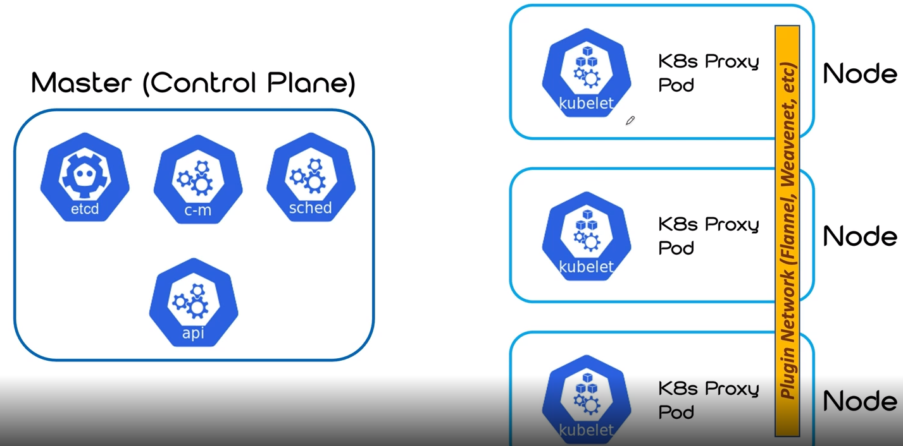

### Kubernetes 설치
* https://github.com/joneconsulting/k8s/blob/master/install/kubernetes_install.md

### Kubernetes 기본 명령어
* 노드확인
  * $ kubectl get nodes
* 파드확인
  * $ kubectl get pod [-o wide]
* 서비스확인
  * $ kubectl get services
* Nginx 서버 실행
  * $ kubectl run sample-nginx --image=nginx --port=80

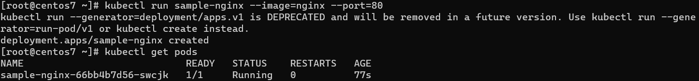

* 컨테이너 정보 확인
  * $ kubectl describe pods sample-nginx
  * 어떤 Node에 설치됐는지, NameSpace, IP, 포트, 컨테이너 이미지, Events 등을 확인할 수 있다.

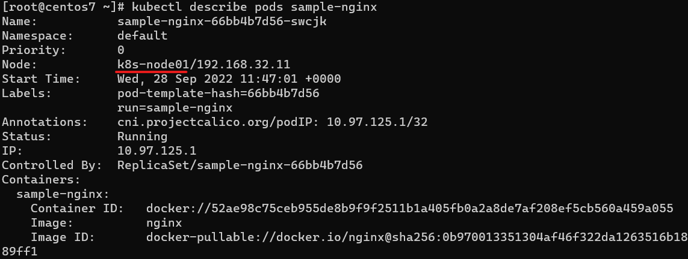

* 파드삭제
  * $ kubectl delete pod/sample-nginx
* 디플로이먼트 생성  
  * $ kubectl create deployment sample-nginx --images=nginx
  * 일반 pod 실행과 deployment는 pod를 실행함에 있어서 차이는 없다
  * 다만 deployment는 pod가 crush, delete 등의 장애가 발생해도 최소 pod 수를 유지하려는 성질이 있고<br>
  그 외 좀 더 많은 특징을 가지고 있다.

* 디플로이먼트 확인
  * $ kubectl get deployments
* 디플로이먼트 스케일 변경(2로변경)
  * $kubectl scale deployment sample-nginx --replicas=2
  * 위 명령에서 곧바로 replicas=1로 설정하면 늘어났던 pod가 다시 줄어드는 것을 확인할 수 있다.

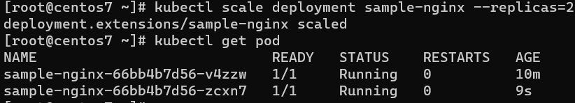

* 디플로이먼트 삭제
  * $ kubectl delete deployment.apps/sample-nginx

* samples1.yml 을 작성후 kubectl apply 명령으로 deployment작업 실행.
  * $ kubectl apply -f samples1.yml

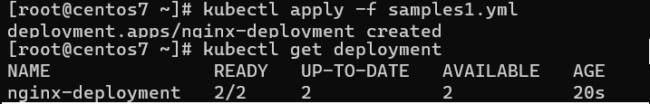

* 파드에 터널링으로 접속
  * $ kubectl exec -it nginx-deployment-7fd6966748-prw9l -- /bin/bash

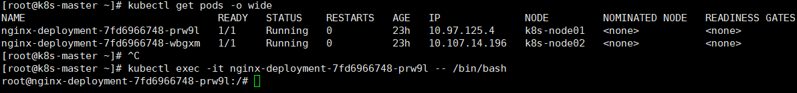

* 파드 노출(공개)
  * $ kubectl expose deployment nginx-deployment --port=80 --type=NodePort

* cicd-devops-deployment.yml 로 deployment 실행하기
  * $ kubectl apply -f cicd-devops-deployment.yml

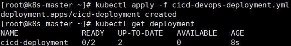

* cicd-devops-service.yml 로 service 실행하기
  * $ kubectl apply -f cicd-devops-service.yml

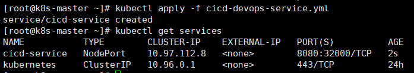

### Ansible에서 Kubernetes 제어하기

* ansible-server에서 미니큐브 호스트PC로 ssh접속이 가능하도록 설정한다.

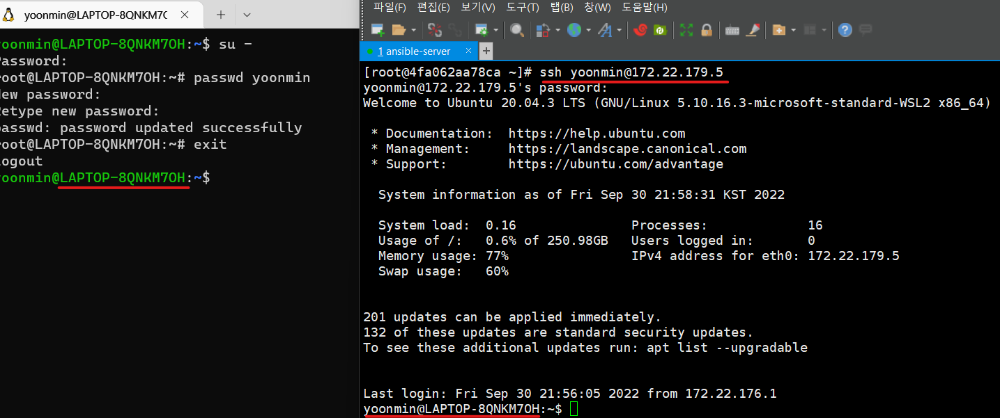

* ansible-server $HOME/k8s/hosts 파일을 만든다

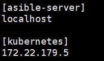

* 아래와 같은 오류가 발생하면 다음의 명령어를 실행한다.
```
$ ssh-copy-id yoonmin@172.22.179.5
```


* 미니큐브 호스트PC에 $HOME/.ssh/authorized_keys 파일을 확인해보면 ansible-server의 정보가 추가된 것을 확인할 수 있다.

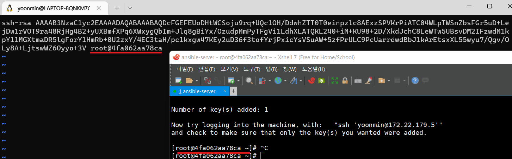

* 다시 실패했던 명령어를 yoonmin계정으로 시도하면 성공하는것을 확인할 수 있다.

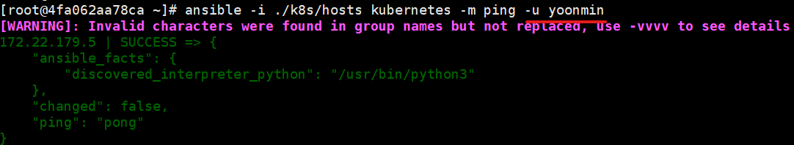

### Ansible playbook으로 Kubernetes Script 실행하기

* ansible-server 에 k8s-cicd-deployment-playbook.yml 을 생성한다.

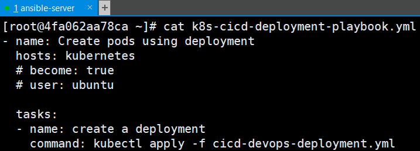

* 미니큐브에 cicd-devops-deployment.yml 을 생성한다.

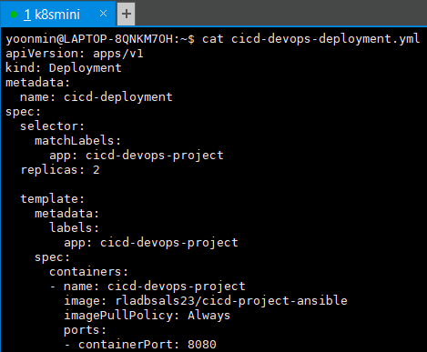

* 다음의 명령을 ansible-server 에서 실행하면 미니큐브에 deployment가 생성된 것을 확인할 수 있다.
```
$ ansible-playbook -i ./k8s/hosts k8s-cicd-deployment-playbook.yml -u yoonmin
```
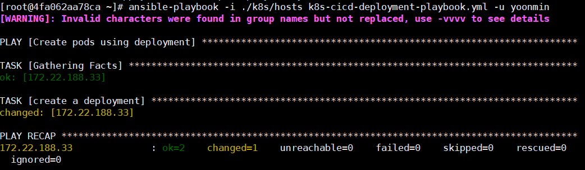

* 미니큐브에서 ansible-server 의 playbook 명령에 의해 생성된 deployment 가 확인된다.

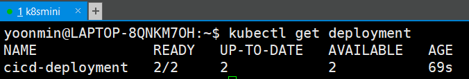

* 명령어를 실행했는데 맥OS 같은 경우 오류가 발생할 수 있다. 그럴때는 아래와 같이 절대경로를 추가해주면 해결된다.

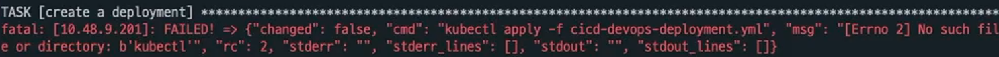
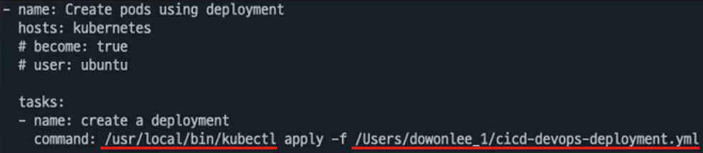

* ansible-server 에 k8s-cicd-service-playbook.yml 을 생성한다.

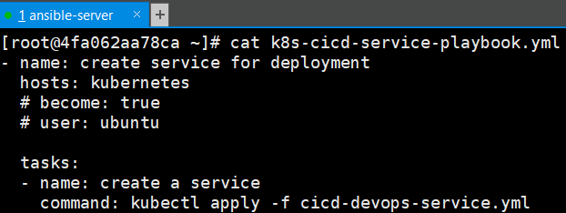

* 미니큐브에 cicd-devops-service.yml 을 생성한다.

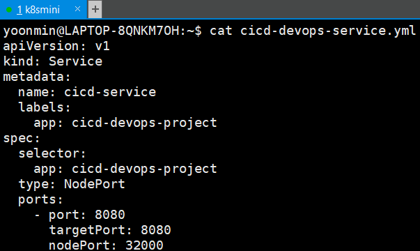

* ansible-server 에서 다음의 명령을 실행하면 미니큐브에 service가 실행된 것을 확인할 수 있다.
```
$ ansible-playbook -i ./k8s/hosts k8s-cicd-service-playbook.yml -u yoonmin
``` 

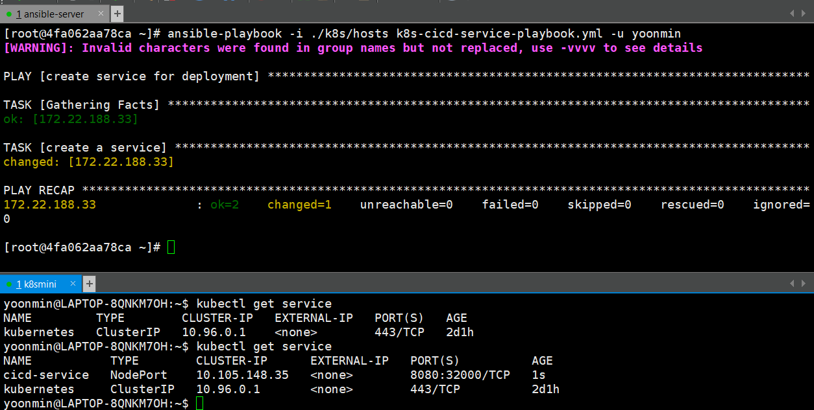
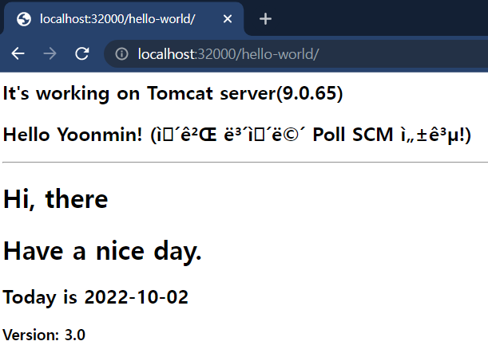