* 젠킨스를 통해 CI자동화를 하기 위한 파일 준비

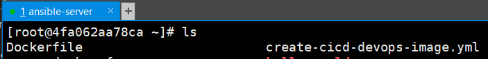

* 젠킨스 프로젝트 생성

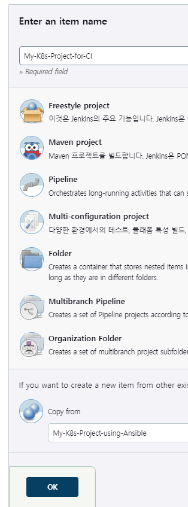

* 빌드 후 조치 커맨드를 작성한다

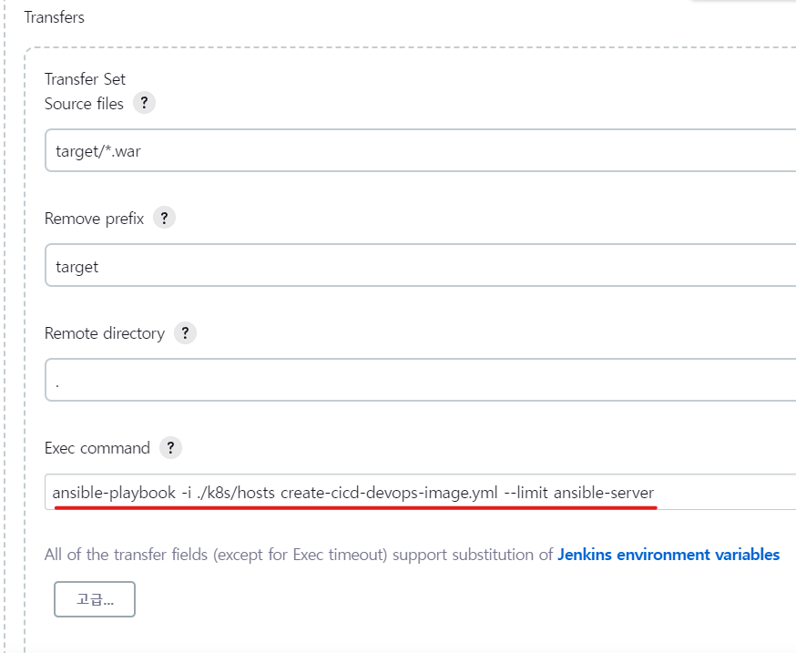

* ansible-playbook 에 의해서 CI작업이 완료 된 것을 확인한다

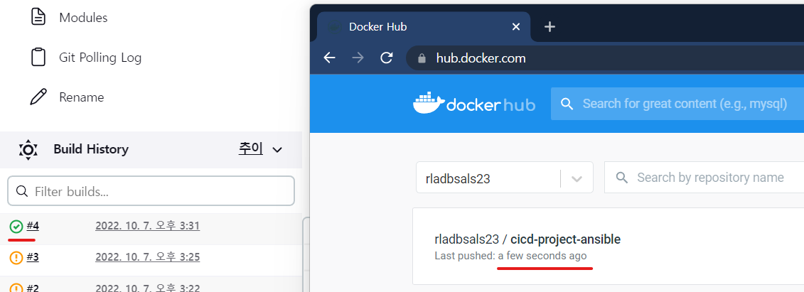

* 빌드 후 조치를 추가하여 Build other projects를 고른다
* 해당 프로젝트의 빌드가 끝나면 이어서 진행 될 프로젝트를 선택한 것이다

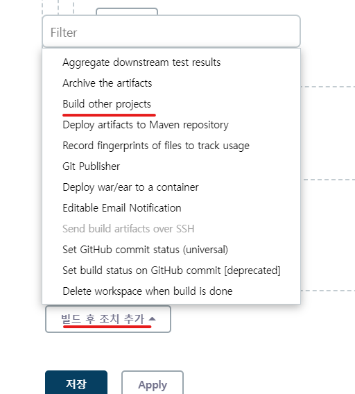
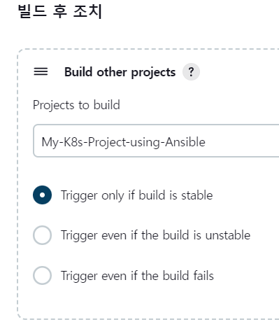

* 해당 프로젝트가 끝나고 트리거가 작동하여 이어서 빌드 후 조치에 설정 된 프로젝트가 진행되었다

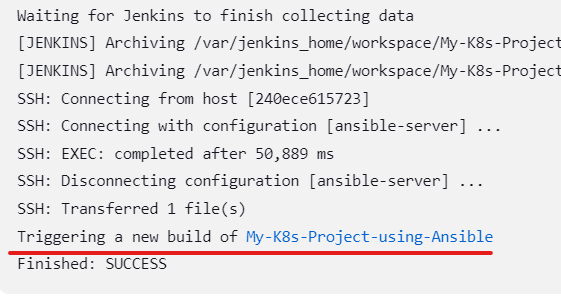
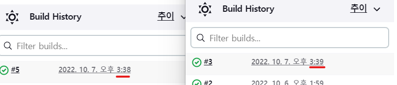
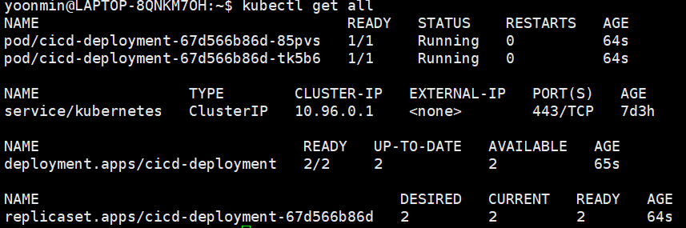

* My-K8s-Project-using-Ansible 에서 PollSCM설정을 해제한다
* ansible-server 에서 ansible-playbook 으로 쿠버네티스에 deployment를 생성할 때 이미 deployment가 존재할 경우 삭제할 수 있도록 커맨드를 추가한다
* 존재하는 deployment가 없을 경우 오류가 발생할 수 있기 때문에 ignore_errors 옵션을 추가한다

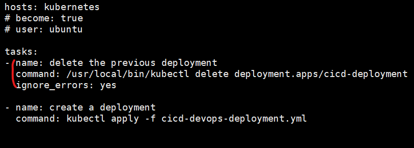

* github에 push를 하거나 My-K8s-Project-for-CI 를 수동으로 빌드 할 경우 My-K8s-Project-using-Ansible 까지 자동으로 빌드되어 최종적으로
* 쿠버네티스에 deployment가 생성되는 것을 확인 할 수 있다

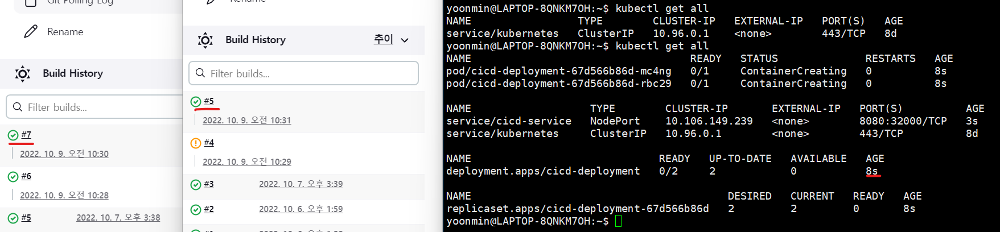