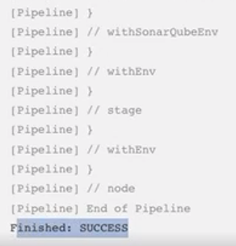
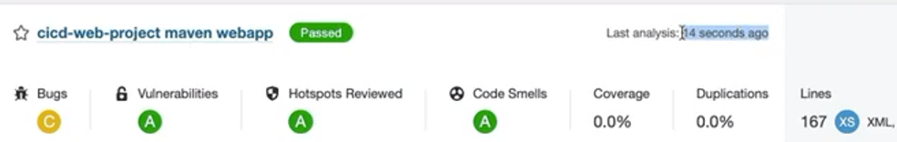

* My-Third-Pipeline 에 스크립트를 추가한다
* build 다음 위치에 추가해야한다
```
pipeline {
    agent any
    tools {
        maven 'Maven3.8.5'
    }
    stages {
        stage('github clone') {
            steps {
                git branch: 'main', url: 'https://github.com/yoonmin-kim/cicd-web-project'
            }
        }

        stage('build') {
            steps {
                sh '''
                    echo build start
                    mvn clean compile package -DskipTests=true
                '''
            }
        }
        
        stage('SonarQube analysis') {
            steps {
                withSonarQubeEnv('SonarQube-server') {
                    sh 'mvn sonar:sonar'
                }
            }
        }
    }
}
```

* 빌드 완료후 소나큐브 작업까지 완료된 것을 확인한다.



