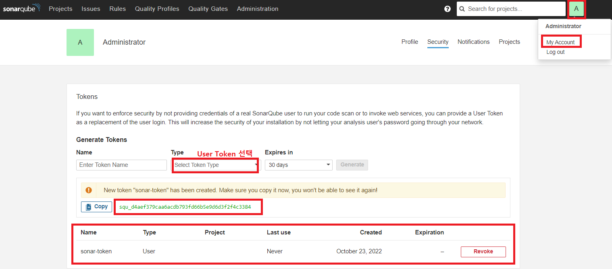
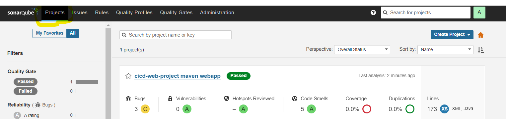
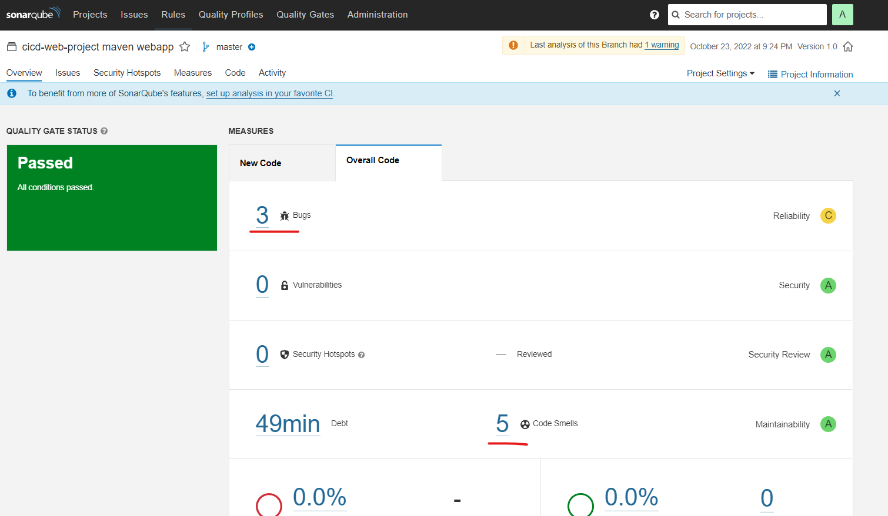
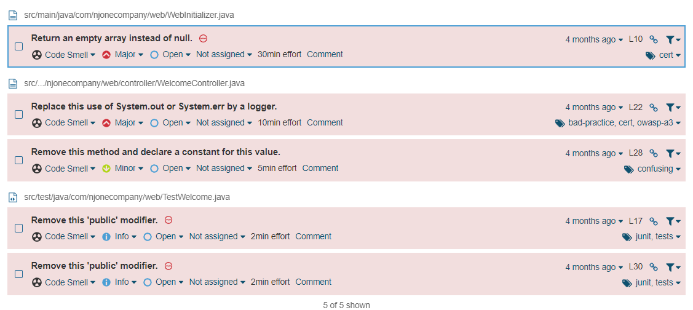
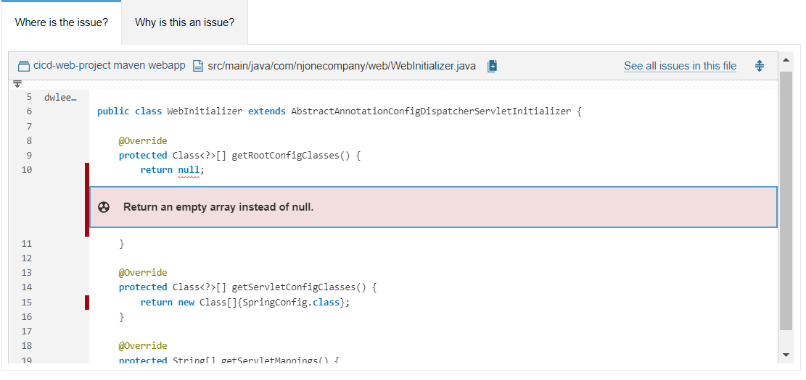

###  메이븐 빌드시 소나큐브로 정보를 전송
* Maven Project에 Plugin 설정 추가
  * https://docs.sonarqube.org/latest/analysis/scan/sonarscanner-for-maven/
  * How to Fix Version of Maven Plugin 항목을 복사 후 프로젝트의 pom.xml에 추가한다
```
<plugin>
    <groupId>org.sonarsource.scanner.maven</groupId>
    <artifactId>sonar-maven-plugin</artifactId>
    <version>3.7.0.1746</version>
</plugin>
```
* 위 플러그인 버전을 아래 링크의 버전으로 변경한다
    * https://mvnrepository.com/artifact/org.sonarsource.scanner.maven/sonar-maven-plugin/3.9.1.2184

* 소나큐브 페이지에 접속한 뒤 젠킨스에서 접근을 허용하기 위해 토큰을 발급할 수 있다.



```
token : squ_016fc2c467186cb417bac0b3c220a620f61863a0
```
* 아래 명령을 이용해서 프로젝트를 빌드한다.

```
mvn sonar:sonar -Dsonar.host.url=http://localhost:9000 -X -Dsonar.login=squ_016fc2c467186cb417bac0b3c220a620f61863a0
```


* 소나큐브 페이지에서 Projects 를 클릭해보면 좀전에 빌드한 결과를 확인할 수 있다.
* 특별한 문제가 없기 때문에 Passed로 표시가 된다.



* 문제라고 발견 된 내용을 확인 할 수 있다.



