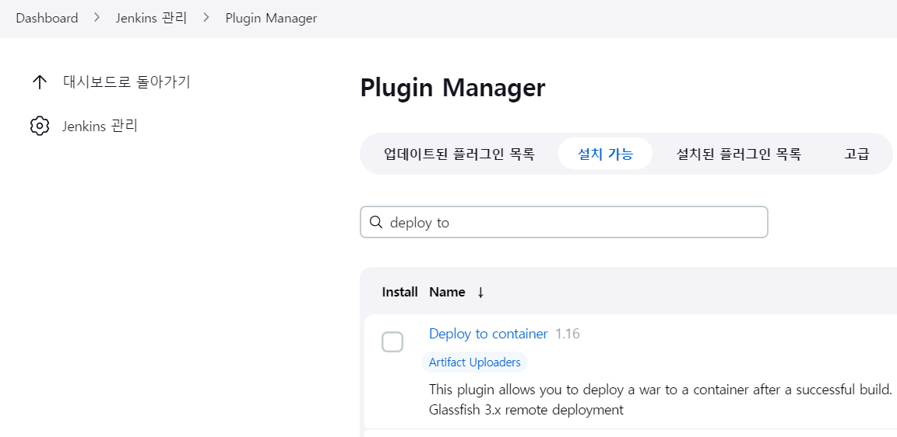
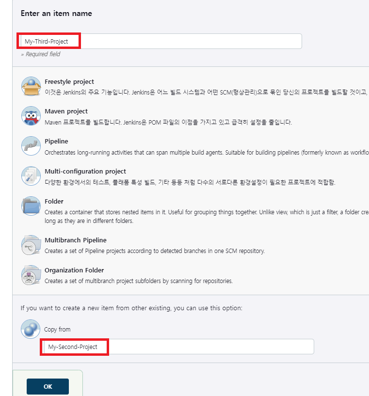
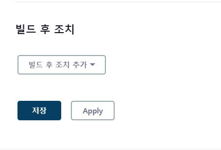
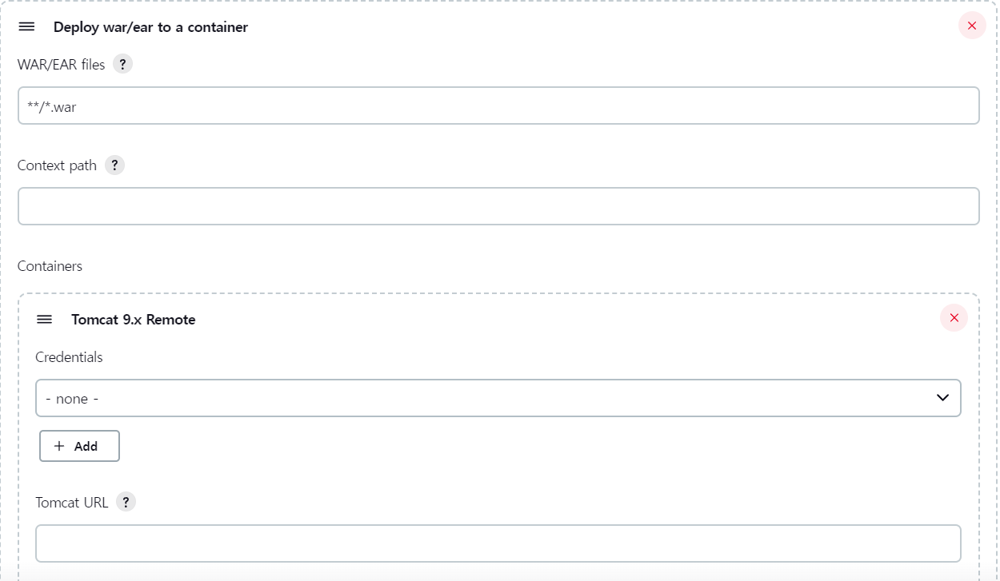
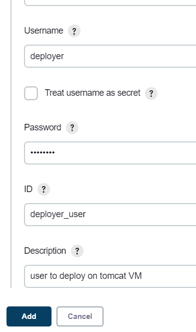
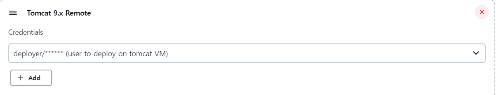
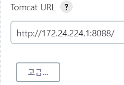
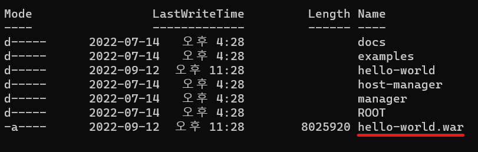
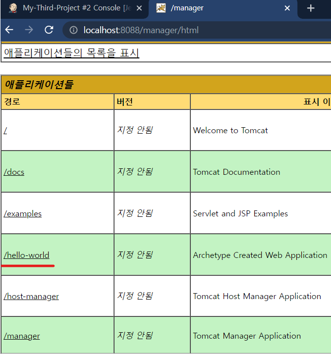

## CI/CD 작업을 위한 Tomcat 서버 연동

### 사전작업 : https://www.inflearn.com/course/%EC%A0%A0%ED%82%A8%EC%8A%A4-ci-cd-%ED%8C%8C%EC%9D%B4%ED%94%84%EB%9D%BC%EC%9D%B8/unit/124590

1. Deploy to container 플러그인을 다운받는다.

2. 새로 프로젝트를 만들고 기존 프로젝트의 설정과 동일하게 맞춰준다.

3. 빌드 후 조치 항목을 Deploy war/ear to a container 로 선택한다.

4. 컨테이너에 배포할 대상을 지정해준다. (war파일로 지정.)
5. 컨테이너를 Tomcat9 버전으로 선택한다.

6. Credentail 을 deployer 유저를 추가한다.

7. Credentail 로 추가한 deployer 유저를 선택한다.

8. 도커 컨테이너안에 있는 젠킨스가 로컬호스트 톰캣을 바라볼 수 있도록 eth0 IP로 설정한다.

9. 젠킨스 콘솔로그에 빌드와 디플로이가 완료되었다는 로그를 확인한다.

10. 톰캣 webapps 폴더에 war파일이 정상적으로 배포되었음을 확인한다.

11. 톰캣 애플리케이션 목록에 hello-word 가 추가된 것을 확인한다.

