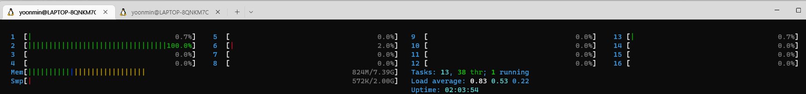

### 도커관련 참고할 내용은 공식 문서를 확인하자
https://docs.docker.com/

### CentOS 부팅시 docker 자동 스타트
* systemclt status docker 로 확인해보면 loaded가 disabled 상태인것을 알 수 있다
* 이는 부팅시에 docker 서비스가 자동으로 실행되지 않는다는 것을 의미한다
* systemctl enable docker 를 실행하여 enabled로 변경한다
* 참고로 우분투는 이과정이 기본으로 되어있어서 별도의 작업이 필요없다


___

### Ubuntu, CentOS 에서 일반 유저에게 도커 권한 부여하기
```
1. root계정 접속
su -
패스워드 입력

2. guru라는 유저가 docker라는 그룹의 맴버가 되도록 허가)
usermod -a -G docker guru

3. guru 유저로 docker 실행 확인
su - guru
docker ps
```

### 컨테이너 동작방식
```
(docker hub에 컨테이너 이미지 존재하는지 검색하기)
docker search nginx

(hub에서 이미지 가져오기)
doker pull nginx:latest

(이미지를 컨테이터로 실행하기)
docker run -d --name web -p 80:80 nginx:latest
```

### 도커이미지 레이어
* nginx 를 pull 할 경우 5개의 이미지 레이어로 되어있는것을 확인 할 수 있다


* /var/lib/docker/overlay2 에서 실제 이미지 레이어가 저장 된 것을 확인할 수 있다


### 도커파일
* 쉽고, 간단, 명확한 구문을 가진 text file 로 Top-Down 해석
* 컨테이너 이미지를 생성할 수 있는 고유의 지시어(Instruction)를 가짐
* 대소문자 구분하지 않으나 가독성을 위해 사용함
* 각 라인은 하나의 이미지 레이어로 생성된다
* 도커파일은 가독성이 좋고 크기가 작을 수록 좋다 다음과 같이 동일한 구문도 한줄로 작성하여 이미지 레이어를 줄일 수 있도록 하자
```
(RUN 명령을 줄이기 전)
FROM ubuntu:18.04
RUN apt-get update
RUN apt-get install -y apache2
RUN echo "TEST WEB" > /var/www/html/index.html
EXPOSE 80
CMD ["/usr/sbin/apache2ctl", "-DFOREGROUND"]

(RUN 명령을 줄인 후)
FROM ubuntu:18.04
RUN apt-get update \
    && apt-get install -y apache2
RUN echo "TEST WEB" > /var/www/html/index.html
EXPOSE 80
CMD ["/usr/sbin/apache2ctl", "-DFOREGROUND"]
```

### 도커파일 문법
* Top-Down 방식이기 때문에 FROM이 가장 처음 선언되어야 한다

|지시어|설명|
|-|-|
|#|comment|
|FROM|컨테이너의 BASE IMAGE(운영환경)|
|MAINTAINER|이미지를 생성한 사람의 이름 및 정보|
|LABEL|컨테이너이미지에 컨테이너의 정보를 저장|
|`RUN`|`컨테이너 빌드를 위해 base image에서 실행할 commands`|
|`COPY`|`컨테이너 빌드시 호스트의 파일을 컨테이너로 복사`|
|`ADD`|`컨테이너 빌드시 호스트의 파일(tar, url포함)을 컨테이너로 복사`|
|`WORKDIR`|`컨테이너 빌드시 명령이 실행될 작업 디렉터리 설정`|
|`ENV`|`환경변수 지정`|
|`USER`|`명령 및 컨테이너 실행시 적용할 유저 설정`|
|VOLUME|파일 또는 디렉토리를 컨테이너의 디렉토리로 마운트|
|EXPOSE|컨테이너 동작 시 외부에서 사용할 포트 지정|
|CMD|컨테이너 동작 시 자동으로 실행할 서비스나 스크립트 지정|
|ENTRYPOINT|CMD와 함께 사용하면서 command 지정 시 사용|

___

### 내가만든 컨테이너를 배포하려면?
* 도커파일을 이용하여 이미지 빌드
* 도커허브 로그인 및 push

```
docker build -t hellojs:latest .  <- 여기 . 은 디렉토리 경로이기 때문에 빼먹지 말자
docker login
docker push hellojs:latest
```

### 컨테이너 보관 창고(Registry)
* Registry : 컨테이너 이미지를 저장하는 저장소
* Docker Hub : hub.docker.com
  * 모든 사용자들이 볼 수 있는 Public한 공간이다
* Private Registry : 사내의 컨테이너 저장소


```
$ docker run -d -p 5000:5000 --restart always --name registry registry:2
$ docker tag httpd:latest localhost:5000/httpd:latest
$ docker push localhost:5000/httpd:latest
```
* registry에 push 하기 위해서는 이미지명을 `ip:port/이미지` 형태로 작성해야 한다

___

### 컨테이너 이미지 사용하기
* 이미지 검색 docker search [옵션]<이미지이름:태그명>
* 이미지 다운로드 docker pull [옵션]<이미지이름:태그명>
* 다운 받은 이미지 목록 출력 docker images
* 다운 받은 이미지 상세보기 docker inspect [옵션]<이미지이름:태그명>
* 이미지 삭제 docker rmi [옵션]<이미지이름>

### 컨테이너 사용하기
```
$ docker create --name webserver nginx:1.14
$ docker start webserver
$ docker ps
$ docker inspect webserver
$ docker top webeserver -> 컨테이너 내부에 동작중인 프로세스들 확인
$ docker logs webserver
$ docker stop webserver
$ docker rm webserver
$ docker attach centos -> 포그라운드로 실행중인 컨테이너에 연결
$ docker exec -it webserver /bin/bash
```

### 실습
1. 다운로드 받을 이미지 검색


2. 이미지 다운로드


3. 이미지 확인


4. 이미지 풀 아이디 확인


5. create 명령을 통해 컨테이너 생성하기(기본이 백그라운드 명령이다)


6. 컨테이너 실행하기


7. 컨테이너 세부정보 확인하기


8. 세부정보 중 일부 정보만 표시하기 
* 명령이 길때는 alias 를 활용해보자


9. curl을 통해 nginx 서비스 확인해보자
* 리눅스 환경이라면 컨테이너 ipaddr로 바로 붙을 수 있다 curl 172.17.0.2
* 윈도우의 경우 wsl환경이기 때문에 ifconfig를 통해 확인할 수 있는 eth0 inet 으로 확인이 가능하다

10. 컨테이너 log확인
* -f 옵션(follow)을 주면 실시간으로 로그정보를 확인할 수 있다 마치 tail -f 와 같다


11. 컨테이너에서 실행중인 프로세스 확인


12. 백그라운드로 실행중인 컨테이너에 접속


13. 동작중인 컨테이너 실행 및 종료


14. 컨테이너 삭제
* 실행중인 컨테이너를 삭제할때는 -f 옵션을 준다


___

### 컨테이너 Memorry 리소스 제한
* 제한단위는 b, k, m ,g 로 할당

옵션|의미
-|-
--memorry, -m| 컨테이너가 사용할 최대 메모리 양을 지정
--memorry-swap|컨테이너가 사용할 스왑 메모리 영역에 대한 설정<br> 메모리+스왑.생략 시 메모리의 2배가 설정됨
--memorry-reservation|--memorry값보다 적은 값으로 구성하는 소프트 제한 값 설정
--oom-kill-disable|OOM Killer가 프로세스 kill하지 못하도록 보호

### 컨테이너 CPU 레소스 제한
옵션|의미
-|-
--cpus|컨테이너에 할당할 CPU core수를 지정<br>--cpus="1.5" 컨테이너가 최대 1.5개의 CPU파워 사용가능
--cpuset-cpus|컨테이너가 사용할 수 있는 CPU나 코어를 할당.cpu index는 0부터.<br>--cpuset-cpus=0-4
--cpu-share|컨테이너가 사용하는 CPU 비중을 1024값을 기반으로 설정<br>--cpus-share 2048 기본 값보다 두배 많은 CPU자원을 할당

### 컨테이너 Block I/O 제한
옵션|의미
-|-
--blkio-weight<br>--blkio-weight-device|Block IO의 Quota를 설정할 수 있으며 100~1000 까지 선택<br>default500
--device-read-bps<br>--device-write-bps|특정 디바이스에 대한 읽기와 쓰기 작업의 초당 제한을 kb, mb, gb, 단위로 설정
--device-read-iops<br>--device-write-iops|컨테이너의 read/write속도의 쿼터를 설정한다.<br>초당 quota를 제한해서I/O를 발생시킴.0이상의 정수로 표기<br>초당 데이터 전송량=IOPS*블럭크기(단위 데이터 용량)

### 컨테이너 사용 리소스 확인(모니터링)
* docker monitoring commands
  * docker stat : 실행중인 컨테이너의 런타임 통계를 확인
  * docker stats [OPTIONS][CONTAINER...]
* docker event : 도커 호스트의 실시간 event 정보를 수집해서 출력
  * docker events -f container=<NAME>
  * docker image -f container=<NAME>
* cAdvisor
  * https://github.com/google.cadvisor

___

## 컨테이너 리소스 관리 실습
### stress container 생성
* 컨테이너 빌드 : 부하 테스트 프로그램 stress 를 설치하고 동작시키는 컨테이너 빌드
* CPU 부하 테스트 : 2개 cpu core를 100% 사용하도록 부하 발생 : stress --cpu 2
* 메모리 부하 테스트 : 프로세스 수 2개와 사용할 메모리만큼 부하 발생 : stress --vm 2 --vm-bytes<사용할 크기>
```
$ vi dockerfile
FROM debian
MAINTAINER Yoonmin Kim <kym1026@kakao.com>
RUN apt-get update; apt-get install stress -y
CMD ["/bin/sh","-c","stress -c 2"]
```
* 데비안 환경에 stress 설치


* max-memorry, swap-memorry 와의 관계 테스트


* $ docker run -d -m 100M --name m4 --oom-kill-disable=true nginx:1.14


* $ docker run --cpuset-cpus 1 --name c1 -d stress:latest stress --cpu 1
* $ htop
* 인덱스 1번 cpu만 풀로드 상태인것을 확인할 수 있다



* $ docker run --cpuset-cpus 1 --name c1 -d stress:latest stress --cpu 1
* 인덱스 1번 cpu만 풀로드 상태인것을 확인할 수 있다


* docker run -c 2048 --name cload1 -d stress:latest
* docker run --name cload2 -d stress:latest
* docker run -c 512 --name cload3 -d stress:latest
* docker run -c 512 --name cload4 -d stress:latest
* docker stats
* 원래라면 CPU % 가 200 100 50 50 이 나와야 할 것 같은데 모두 200으로 나오는 이유는 별도의 확인이 필요함


* wsl 환경에서 오류가 발생하여 강사님 실습 참고
* 컨테이너 내부의 I/O 속도를 조절한 모습


___

## 컨테이너 볼륨
* 컨테이너 이미지는 readonly
* 컨테이너에 추가되는 데이터들은 별도의 RW 레이어에 저장
* Union File System=overlay
* 컨테이너를 rm명령어로 날리게 되면 컨테이너 내부에서 쌓아뒀던 데이터도 날아간다
* 해당 데이터들을 영구적으로 보관하고 싶을때가 있다 그럴때는 -v옵션을 사용하여 별도의 디렉토리를 설정한다(볼륨마운트)

```
$ docker run -d --name db \
-v /dbdata:/var/lib/mysql \
-e MYSQL_ALLOW_EMPTY_PASSWORD=pass \
mysql:latest
```

### volume 옵션 사용
```
(read write 모드로 볼륨 마운트)
$ docker run -d -v /dbdata:/var/lib/mysql -e MYSQL... mysql:latest
(read only 모드로 볼륨 마운트)
$ docker run -d -v /webdata:/var/www/html:ro httpd:latest
(/var/lib/docker/volumes/{uuid}/data 와 볼륨 마운트)
$ docker run -d -v /var/lib/mysql -e MYSQL... mysql:latest
```

### 컨테이너 끼리 데이터 공유하기
```
$ docker run -v /webdata:/webdata -d --name df smlinux/df:latest
$ docker run -v /webdata:/usr/share/nginx/html:ro -d ubuntu:latest
```

## 컨테이너 볼륨 실습

```
$ docker run -d --name db -v /dbdata:/var/lib/mysql -e MYSQL_ROOT_PASSWORD=pass mysql:latest
$ docker exec -it db /bin/bash
# mysql -u roo -ppass
# create database yoonmin;
# show databases;
```


* docker rm -f db 해도 호스트와 볼륨마운트 했기 때문에 새로 컨테이너 생성시 -V로 연결만 해주면 데이터를 그대로 사용가능하다

* 별도의 호스트볼륨을 마운트해주지 않으면 /var/lib/docker/volumes/${uuid}/_data 에 마운트된다
```
$ docker run -d --name db -v /var/lib/mysql -e MYSQL_ROOT_PASSWORD=pass mysql:latest
```


* 도커볼륨 확인하기

```
$ docker volume ls
```

* 호스트에 있는 index.html을 컨테이너의 nginx로 서비스해보기
* /webdata/index.html 을 nginx에 볼륨마운트

```
$ docker run -d --name web -p 80:80 -v /webdata:/usr/share/nginx/html:ro nginx:1.14
$ vi /webdata/index.html ->  YoonMin추가
```


* df명령을 index.html에 작성해주는 컨테이너와 작성된 index.html을 서비스해주는 컨테이너

```
(df.sh)
#!/bin/bash
mkdir -p /webdata
while true
do
  df -h / > /webdata/index.html
  sleep 10
done

(dockerfile)
FROM ubuntu:18.04
ADD df.sh /bin/df.sh
RUN chmod +x /bin/df.sh
ENTRYPOINT ["/bin/df.sh"]

$ docker build -t rladbsals23/df:latest .
$ docker run -d -v /webdata:/webdata --name df rladbsals23/df:latest
$ docker run -d --name web -v /webdata:/usr/share/nginx/html:ro -p 80:80 nginx:1.14
```


___

### 컨테이너 네트워크
* docker0
* L2통신기반
* container 생성 시 veth인터페이스 생성(sandbox)
* 모든 컨테이너는 외부 통신을 docker0 통해 진행
* container running 시 172.17.X.Y 로 IP주소 할당


### 컨테이너 포트를 외부로 노출
* port-forwarding
* container port를 외부로 노출시켜 외부 연결 허용
* iptables rule을 통한 포트 노출
```
-p hostPort:containerPort
-p containerPort <- 이 경우 호스트의 포트는 랜덤으로 열리게됨
-P <- 대문자P는 dockerfile에서 expose라고 정의된 포트에 맞춰서 랜덤포트가 정해진다
```
* $ docker run --name web -d `-p 80:80` nginx:1.14
* iptables -t nat -L -n -v

### 컨테이너 포트 고정
* docker0 내부 네크워크는 static하게 고정된 ip할당이 불가능하다
* 따라서 user-defined bridge network 를 생성한다
```
$ docker network create --driver bridge \
--subnet 192.168.100.0/24 \
--gateway 192.168.100.254 \
mynet
$ docker network ls

$ docker run -d --name web -p 80:80 nginx:1.14
$ curl localhost

$ docker run -d --name appjs \
--net mynet --ip 192.168.100.100 \  <- ip를 지정하지 않으면 gateway를 따라 1번씩 올려서 순차적으로 부여된다 (192.168.100.1)
-p 8080:8080 smlinux/appjs
$ curl localhost:8080
```


### 컨테이너끼리 통신
* --link 옵션을 사용해서 연결한다
