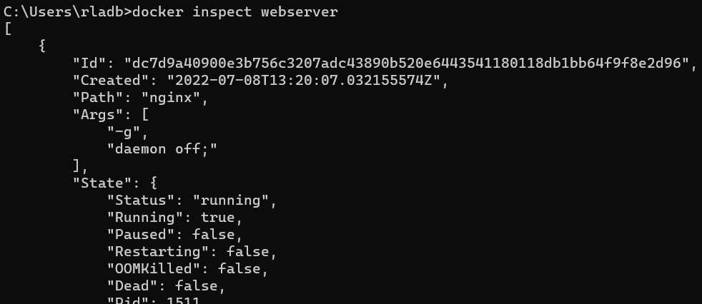

### 도커관련 참고할 내용은 공식 문서를 확인하자
https://docs.docker.com/

### CentOS 부팅시 docker 자동 스타트
* systemclt status docker 로 확인해보면 loaded가 disabled 상태인것을 알 수 있다
* 이는 부팅시에 docker 서비스가 자동으로 실행되지 않는다는 것을 의미한다
* systemctl enable docker 를 실행하여 enabled로 변경한다
* 참고로 우분투는 이과정이 기본으로 되어있어서 별도의 작업이 필요없다


___

### Ubuntu, CentOS 에서 일반 유저에게 도커 권한 부여하기
```
1. root계정 접속
su -
패스워드 입력

2. guru라는 유저가 docker라는 그룹의 맴버가 되도록 허가)
usermod -a -G docker guru

3. guru 유저로 docker 실행 확인
su - guru
docker ps
```

### 컨테이너 동작방식
```
(docker hub에 컨테이너 이미지 존재하는지 검색하기)
docker search nginx

(hub에서 이미지 가져오기)
doker pull nginx:latest

(이미지를 컨테이터로 실행하기)
docker run -d --name web -p 80:80 nginx:latest
```

### 도커이미지 레이어
* nginx 를 pull 할 경우 5개의 이미지 레이어로 되어있는것을 확인 할 수 있다


* /var/lib/docker/overlay2 에서 실제 이미지 레이어가 저장 된 것을 확인할 수 있다


### 도커파일
* 쉽고, 간단, 명확한 구문을 가진 text file 로 Top-Down 해석
* 컨테이너 이미지를 생성할 수 있는 고유의 지시어(Instruction)를 가짐
* 대소문자 구분하지 않으나 가독성을 위해 사용함
* 각 라인은 하나의 이미지 레이어로 생성된다
* 도커파일은 가독성이 좋고 크기가 작을 수록 좋다 다음과 같이 동일한 구문도 한줄로 작성하여 이미지 레이어를 줄일 수 있도록 하자
```
(RUN 명령을 줄이기 전)
FROM ubuntu:18.04
RUN apt-get update
RUN apt-get install -y apache2
RUN echo "TEST WEB" > /var/www/html/index.html
EXPOSE 80
CMD ["/usr/sbin/apache2ctl", "-DFOREGROUND"]

(RUN 명령을 줄인 후)
FROM ubuntu:18.04
RUN apt-get update \
    && apt-get install -y apache2
RUN echo "TEST WEB" > /var/www/html/index.html
EXPOSE 80
CMD ["/usr/sbin/apache2ctl", "-DFOREGROUND"]
```

### 도커파일 문법
* Top-Down 방식이기 때문에 FROM이 가장 처음 선언되어야 한다

|지시어|설명|
|-|-|
|#|comment|
|FROM|컨테이너의 BASE IMAGE(운영환경)|
|MAINTAINER|이미지를 생성한 사람의 이름 및 정보|
|LABEL|컨테이너이미지에 컨테이너의 정보를 저장|
|`RUN`|`컨테이너 빌드를 위해 base image에서 실행할 commands`|
|`COPY`|`컨테이너 빌드시 호스트의 파일을 컨테이너로 복사`|
|`ADD`|`컨테이너 빌드시 호스트의 파일(tar, url포함)을 컨테이너로 복사`|
|`WORKDIR`|`컨테이너 빌드시 명령이 실행될 작업 디렉터리 설정`|
|`ENV`|`환경변수 지정`|
|`USER`|`명령 및 컨테이너 실행시 적용할 유저 설정`|
|VOLUME|파일 또는 디렉토리를 컨테이너의 디렉토리로 마운트|
|EXPOSE|컨테이너 동작 시 외부에서 사용할 포트 지정|
|CMD|컨테이너 동작 시 자동으로 실행할 서비스나 스크립트 지정|
|ENTRYPOINT|CMD와 함께 사용하면서 command 지정 시 사용|

___

### 내가만든 컨테이너를 배포하려면?
* 도커파일을 이용하여 이미지 빌드
* 도커허브 로그인 및 push

```
docker build -t hellojs:latest .  <- 여기 . 은 디렉토리 경로이기 때문에 빼먹지 말자
docker login
docker push hellojs:latest
```

### 컨테이너 보관 창고(Registry)
* Registry : 컨테이너 이미지를 저장하는 저장소
* Docker Hub : hub.docker.com
  * 모든 사용자들이 볼 수 있는 Public한 공간이다
* Private Registry : 사내의 컨테이너 저장소


```
$ docker run -d -p 5000:5000 --restart always --name registry registry:2
$ docker tag httpd:latest localhost:5000/httpd:latest
$ docker push localhost:5000/httpd:latest
```
* registry에 push 하기 위해서는 이미지명을 `ip:port/이미지` 형태로 작성해야 한다

___

### 컨테이너 이미지 사용하기
* 이미지 검색 docker search [옵션]<이미지이름:태그명>
* 이미지 다운로드 docker pull [옵션]<이미지이름:태그명>
* 다운 받은 이미지 목록 출력 docker images
* 다운 받은 이미지 상세보기 docker inspect [옵션]<이미지이름:태그명>
* 이미지 삭제 docker rmi [옵션]<이미지이름>

### 컨테이너 사용하기
```
$ docker create --name webserver nginx:1.14
$ docker start webserver
$ docker ps
$ docker inspect webserver
$ docker top webeserver -> 컨테이너 내부에 동작중인 프로세스들 확인
$ docker logs webserver
$ docker stop webserver
$ docker rm webserver
$ docker attach centos -> 포그라운드로 실행중인 컨테이너에 연결
$ docker exec -it webserver /bin/bash
```

### 실습
1. 다운로드 받을 이미지 검색


2. 이미지 다운로드


3. 이미지 확인


4. 이미지 풀 아이디 확인


5. create 명령을 통해 컨테이너 생성하기(기본이 백그라운드 명령이다)


6. 컨테이너 실행하기


7. 컨테이너 세부정보 확인하기



8. 세부정보 중 일부 정보만 표시하기 
* 명령이 길때는 alias 를 활용해보자


9. curl을 통해 nginx 서비스 확인해보자
* 리눅스 환경이라면 컨테이너 ipaddr로 바로 붙을 수 있다 curl 172.17.0.2
* 윈도우의 경우 wsl환경이기 때문에 ifconfig를 통해 확인할 수 있는 eth0 inet 으로 확인이 가능하다

10. 컨테이너 log확인
* -f 옵션(follow)을 주면 실시간으로 로그정보를 확인할 수 있다 마치 tail -f 와 같다


11. 컨테이너에서 실행중인 프로세스 확인


12. 백그라운드로 실행중인 컨테이너에 접속


13. 동작중인 컨테이너 실행 및 종료


14. 컨테이너 삭제
* 실행중인 컨테이너를 삭제할때는 -f 옵션을 준다

