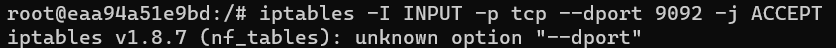
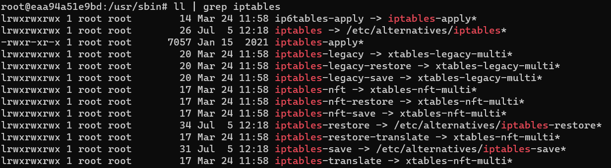
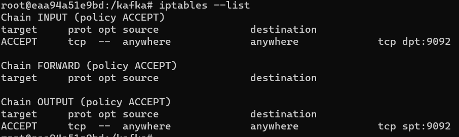

### 도커 우분투에서 iptables 사용시 이슈
* which iptables 를 하면 /usr/sbin/iptabls 를 확인할 수 있다



* 아래 이미지와 같이 iptables가 /etc/alternatives/iptables로 잡혀있는데 이분에 문제가 있는것 같다
* iptables 를 iptables-legacy로 바꿔주면 명령어가 잘 동작한다
* rm /usr/sbin/iptables
* ln -s /usr/sbin/iptables-legacy /usr/sbin/iptables



* 참고 : https://github.com/moby/moby/issues/38759

### iptables 사용하기
* 컨테이너 내에 액세스 하기 위해서는 처음 컨테이너를 실행할때 아래와 같은 옵션과 함께 실행한다
* docker run --cap-add=NET_ADMIN -it ubuntu
* 우부툰에서 기본적으로 ufw라는 방화벽을 쓰며, 해당 방화벽을 disable 시킨 상태에서 iptables 설치
* 기본적으로 root 계정으로만 작업이 가능하며 특정 유저로 작업하기 위해 user에 sudo 권한을 주는것을 확인해보자
```
$ ufw disable
$ iptables-legacy -I INPUT -p tcp --dport 9092 -j ACCEPT
$ iptables -I OUTPUT -p tcp --sport 9092 -j ACCEPT
```




* 네트워크 브릿지 참고 : https://docs.docker.com/network/bridge/