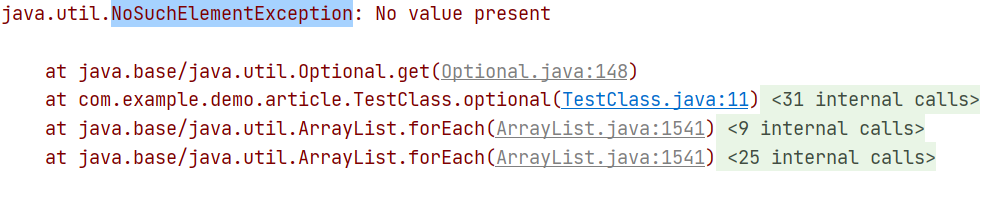
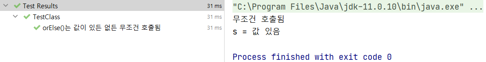
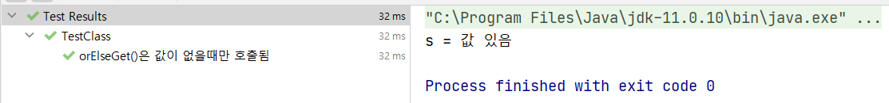

Modifier and Type|Method and Description
|-|-|
T|get()<br>If a value is present in this Optional, returns the value, otherwise throws NoSuchElementException.
T|orElse(T other)<br>Return the value if present, otherwise return other.
T|orElseGet(Supplier<? extends T> other)<br>Return the value if present, otherwise invoke other and return the result of that invocation.

```java
    @Test
    @DisplayName("get()은 값이 없을경우 NoSuchElementException 을 발생시킨다")
    void get() {
        Optional<String> empty = Optional.empty();
        String s = empty.get();
    }
```


```java
    @Test
    @DisplayName("orElse()는 값이 있든 없든 무조건 호출됨")
    void orElse() {
        Optional<String> value = Optional.of("값 있음");
        String s = value.orElse(무조건_호출됨());
        System.out.println("s = " + s);
    }

    private String 무조건_호출됨() {
        System.out.println("무조건 호출됨");
        return "무조건 호출됨";
    }
```


```java
    @Test
    @DisplayName("orElseGet()은 값이 없을때만 호출됨")
    void orElseGet() {
        Optional<String> value = Optional.of("값 있음");
        String s = value.orElseGet(() -> 값_없을때만_호출됨());
        System.out.println("s = " + s);
    }

    private String 값_없을때만_호출됨() {
        System.out.println("호출 안됨");
        return "값 없을때만 호출됨";
    }
```
