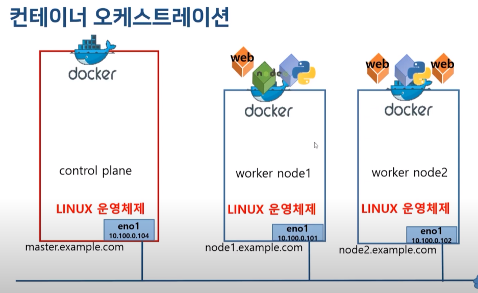
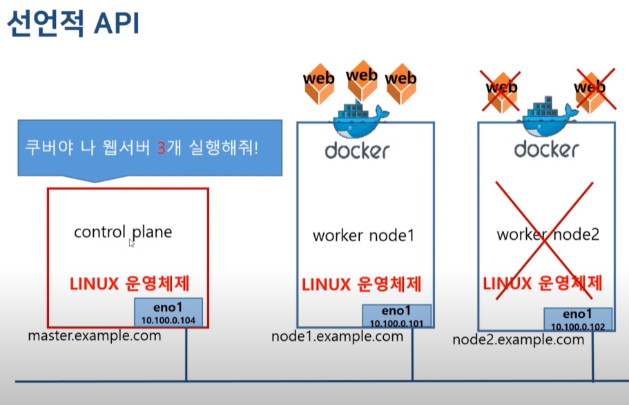

### 쿠버네티스(K8s)란
* 컨테이너 오케스트레이션 = 컨테이너를 도커 플랫폼에 올려서 관리 + 운영 + 클러스터 서비스 지원해 주는 것
* control plane 이라는 지휘자를 두고 worker node라는 연주자를 두는것과 같다
* 애플리케이션을 어떻게 배치했을 때 가장 최적의 환경이 되는지 관리하고
* 한쪽의 node가 죽어도 다른쪽의 node에서 잘 실행될 수 있도록 배치하고
* 필요하면 scale in-out 을 해준다

* 공홈 : https://kubernetes.io/

### K8s 특징
* 워크로드 분리
  * noode1, node2 분리해서 운영하지만 컨테이너간에 통신이 원활하게 잘 이뤄진다
* 어디서나 실행가능 - 온프레미스, 퍼블릭 클라우드(AKS, EKS, GKE등)
  * 온프레미스 환경에서 K8s를 운영하다가 퍼블릭 클라우드 환경으로 옮겨도 동일하게 운영이 가능하다
* 선언적 API
  * 쿠버네티스에게 요구사항만 선언하면 나머지는 쿠버네티스가 알아서 운영을 한다
  * web서버 3개를 운영하기위해 node1, node2 에 각각 1개 2개의 웹서버를 운영한다
  * 운영도중 node2에 장애가 발생하여 2개의 web서버가 다운되면 선언했던 요구사항을 맞추기 위해 쿠버네티스가 알아서 node1에 web서버 2개를 띄운다

### 쿠버네티스 클러스터를 직접 구성하는 도구
* kubeadm
  * 쿠버네티스에서 곧식 제공하는 클러스터 생성/관리 도구
* kubespray
  * 쿠버네티스 클러스터를 배포하는 오픈소스 프로젝트
  * 다양한 형식으로 쿠버네티스 클러스터 구성가능
  * 온프레미스에서 상용 서비스 클러스터 운영시 유용
  * 다양한 CNI제공 - p.60,61
### CNI(Container Network Interface)
* Container간 통신을 지원하는 VxLAN, POD Network 라고도 부름
* 다양한 종류의 플로그인이 존재
  * 플라넷(flannet), 칼리코(calico), 위브넷(weavenet) 등

### 쿠버네티스 클러스터 구성
* control plane(master node)
  * 워커 노드들의 상태를 관리하고 제어
  * single master
  * multi master(3, 5개의 master nodes)
* worker node
  * 도커 플랫폼을 통해 컨테이너를 동작하며 실제 서비스 제공

### kubeadm 을 이용한 쿠버네티스 설치 - 온프레미스
1. Docker Install
2. Kubernetes Install
<ol>
  1. 설치 전 환경설정 
  2. kubeadm, kubectl, kubelet 설치 
  3. control-plane 구성 
  4. worker node 구성 
  5. 설치확인
</ol>

### 우분투에 도커, K8s 설치
* https://docs.docker.com/engine/install/ubuntu/ 참고하여 도커 엔진 설치
* swapoff -a && sed -i '/swap/s/^/#/' /etc/fstab