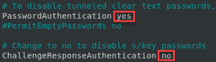

```
$ sudo apt-get install openssh-server
$ sudo service ssh status
$ grep Port /etc/ssh/sshd_config
$ sudo service ssh start
$ sudo service ssh status
```

* 다음의 설정 필수
* 참고: https://phoenixnap.com/kb/ssh-permission-denied-publickey
```
$ vi /etc/ssh/sshd_config
```

