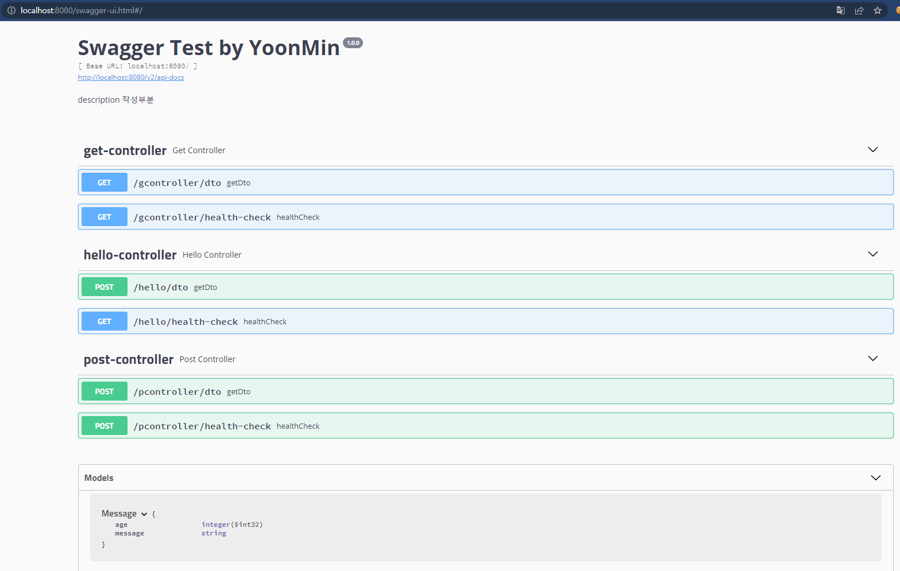
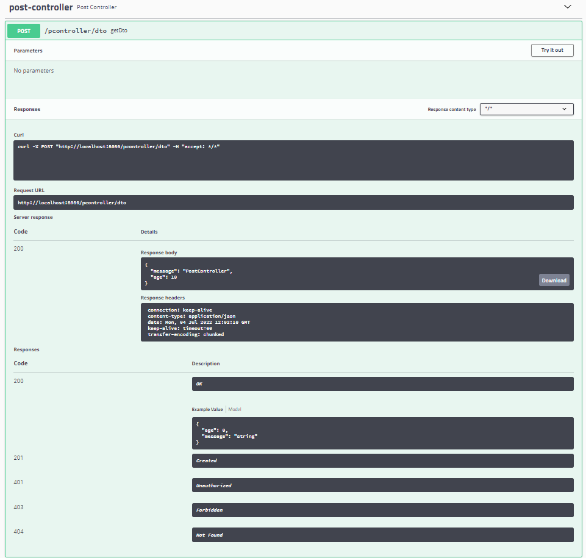

## Swagger
### Swagger가 필요한 이유
* REST API의 스펙을 문서화 하는 것은 매우 중요하다
* API를 변경할 때마다 Reference 문서를 계속 바꿔야하는 불편함이 있다

### Swagger 설정 방법
* @Configuration : 
  * 어노테이션 기반의 환경 구성을 돕는 어노테이션이다
  * IoC Container에게 해당 클래스를 Bean구성 Class 임을 알려줌
* @Bean : 개발자가 직접 제어가 불가능한 외부 라이브러리 등을 Bean으로 만들 경우에 사용

```java
@Configuration
@EnableSwagger2
public class SwaggerConfiguration {

	@Bean
	public Docket api() {
		return new Docket(DocumentationType.SWAGGER_2)
			.apiInfo(apiInfo())
			.select()
			.apis(RequestHandlerSelectors.basePackage("hello.swagger")) // RestController 를 스캔할 베이스경로
			.paths(PathSelectors.any())
			.build();
	}

	private ApiInfo apiInfo() {
		return new ApiInfoBuilder()
			.title("Swagger Test by YoonMin")
			.description("description 작성부분")
			.version("1.0.0")
			.build();
	}
}
```

### pom.xml

```xml

(2.9.2버전 사용시)
-> application.properties에 옵션 추가
-> Springfox 플러그인은 Spring Boot 기본 설정에서 이전 Ant 기반 일치를 대체한 Spring MVC의 PathPattern 기반 일치와 호환되지 않습니다.
# spring.mvc.pathmatch.matching-strategy=ant_path_matcher

(3.0.0버전 사용시)
-> 다음과 같은 오류가 발생할경우 메인메소드 클래스에 @EnableWebMvc 추가
-> Cannot invoke "org.springframework.web.servlet.mvc.condition.PatternsRequestCondition.getPatterns()" because "this.condition" is null
  -> 참고 : https://stackoverflow.com/questions/70036953/springboot-2-6-0-spring-fox-3-failed-to-start-bean-documentationpluginsboot
<!-- https://mvnrepository.com/artifact/io.springfox/springfox-swagger2 -->
<dependency>
    <groupId>io.springfox</groupId>
    <artifactId>springfox-swagger2</artifactId>
    <version>3.0.0</version>
</dependency>
<!-- https://mvnrepository.com/artifact/io.springfox/springfox-swagger-ui -->
<dependency>
    <groupId>io.springfox</groupId>
    <artifactId>springfox-swagger-ui</artifactId>
    <version>3.0.0</version>
</dependency>
<!-- https://mvnrepository.com/artifact/io.springfox/springfox-boot-starter -->
<dependency>
    <groupId>io.springfox</groupId>
    <artifactId>springfox-boot-starter</artifactId>
    <version>3.0.0</version>
</dependency>
```



