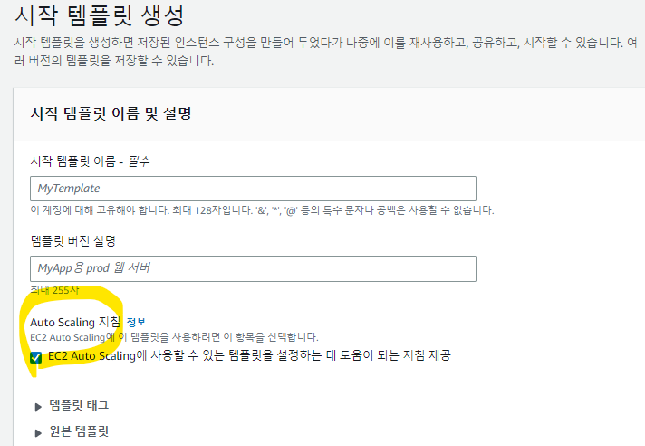
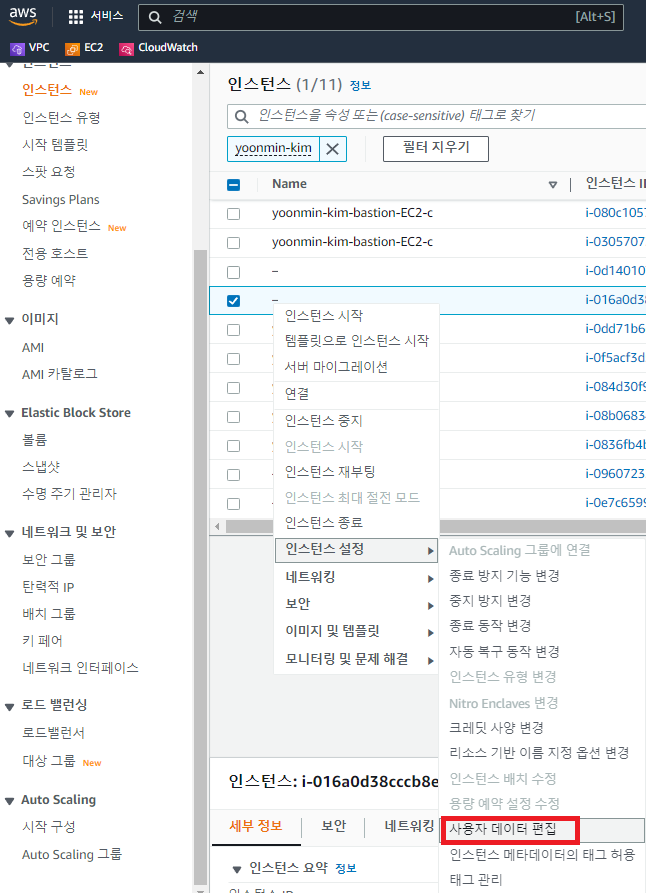
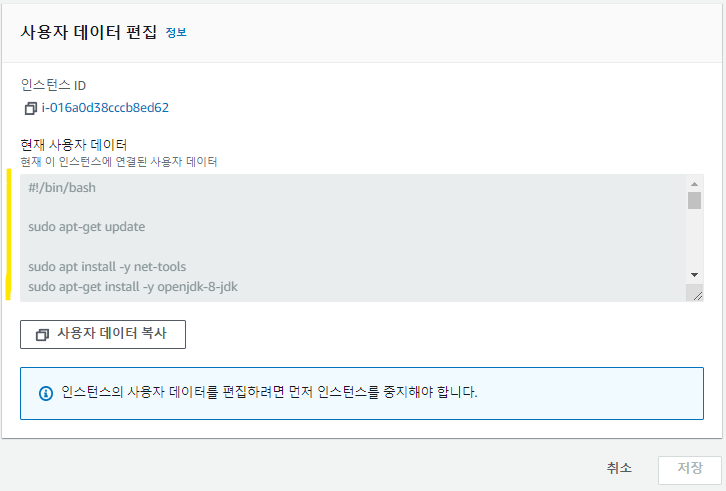
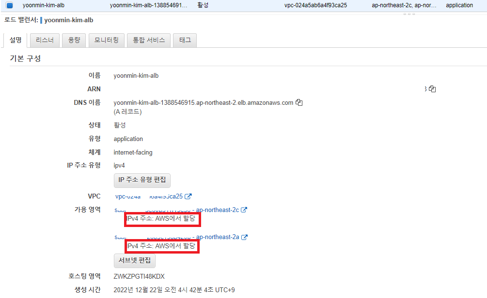
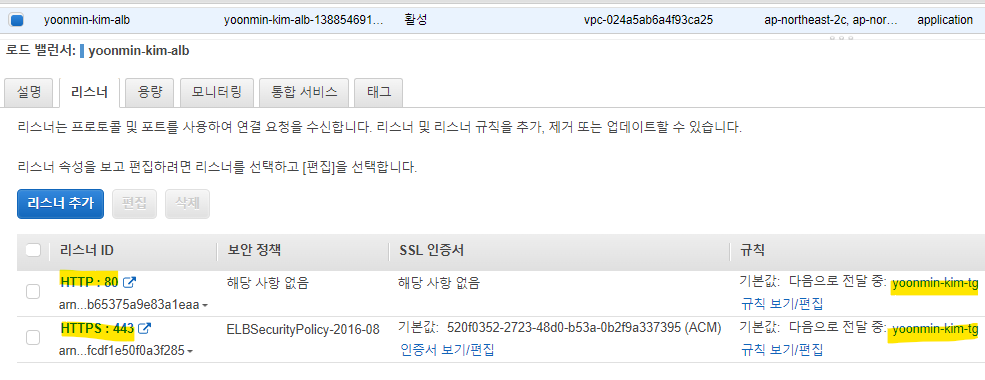
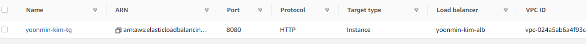
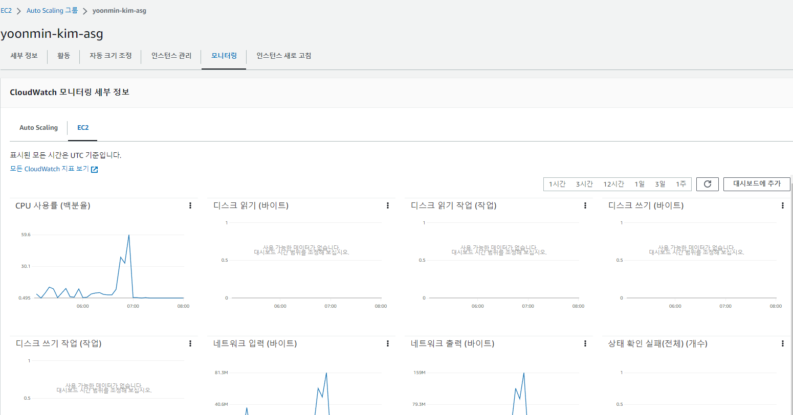
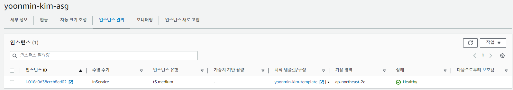

### 시작템플릿
* 지침 정보에 반드시 체크할 것!
* 체크하지 않고 생성할 경우 시작명령어가 수행되지 않음



### 타겟
* AutoScaling 으로 시작템플릿을 수행하여 생성된 타겟(=instance) 는 다음과 같이 시작 명령어가 설정되어있다




```sh
#!/bin/bash

sudo apt-get update

sudo apt install -y net-tools
sudo apt-get install -y openjdk-8-jdk

sudo apt-get update && \
sudo apt-get install -y apt-transport-https ca-certificates curl software-properties-common && \
curl -fsSL https://download.docker.com/linux/ubuntu/gpg | sudo apt-key add - && \
sudo apt-key fingerprint 0EBFCD88 && \
echo -ne '\n' | sudo add-apt-repository "deb [arch=amd64] https://download.docker.com/linux/ubuntu $(lsb_release -cs) stable" && \
sudo apt-get update && \
sudo apt-get install -y docker-ce && \
sudo usermod -aG docker ubuntu && \
sudo curl -L "https://github.com/docker/compose/releases/download/1.23.2/docker-compose-$(uname -s)-$(uname -m)" -o /usr/local/bin/docker-compose && \
sudo chmod +x /usr/local/bin/docker-compose && \
sudo ln -s /usr/local/bin/docker-compose /usr/bin/docker-compose

cd /home/ubuntu

sudo apt install unzip
curl "https://awscli.amazonaws.com/awscli-exe-linux-x86_64.zip" -o "awscliv2.zip"
unzip awscliv2.zip
sudo ./aws/install

sudo -i -u ubuntu aws s3 cp s3://nextstep-camp-pro/yoonmin-kim-deploy.sh /home/ubuntu
sudo -i -u ubuntu chmod 755 /home/ubuntu/yoonmin-kim-deploy.sh
sudo -i -u ubuntu /bin/bash /home/ubuntu/yoonmin-kim-deploy.sh

```

### 로드밸런서
* internal이 아니라 외부에 노출되도록 구성
* internal로 구성할 경우 인터넷게이트웨이(igw) 가 설정되어 있어야함



* 리스너는 로드밸런서가 리스닝하는 포트이고
* 타겟그룹으로 해당 요청을 포워딩 시킬 수 있도록 설정했다



* 타겟그룹은 8080포트에 대해서 리스닝 하도록 설정되어 있다
* WAS서비스 자체를 8080으로 배포하거나 niginx와 같은 웹서버가 리스닝하도록 서비스하고
WAS에게 리다이렉트 시켜주자




### Auto Scaling 그룹
* CloudWatch 를 통해 모니터링이 가능하며
* 현재 스케일아웃 된 인스턴스의 Pending InService 와 같은 상태를 확인할 수 있다


