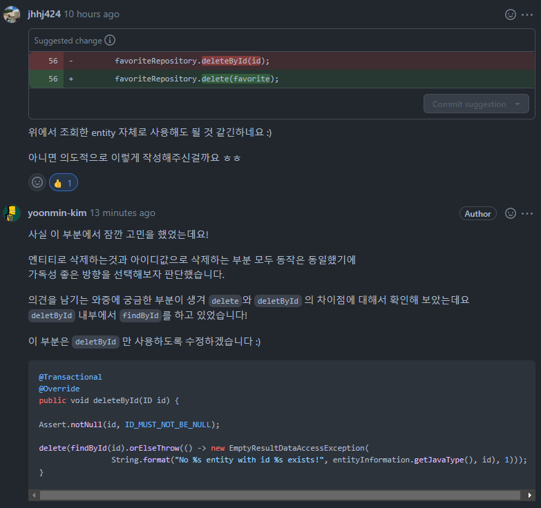

### @MappedSuperclass
* 엔티티별로 공통 필드가 존재하는 경우 불 필요한 중복 코드를 제거하기 위해 사용
* 별도로 생성할 일이 없다면 추상 클래스로 작성하는것이 권장된다

### save()의 비밀
* isNew() 메소드에 의해 Id 값이 없으면 em.persist() 호출
* Id값이 있으면 em.merge() 호출
  * 해당 Id 값으로 DB에 select 쿼리가 수행된다

### 메소드명으로 카운트, exists 쿼리 생성 가능
* countByName()
* existsByName()

### 준영속 엔티티를 비교할 경우 equals() hashCode() 를 활용하자
* <a href="https://velog.io/@park2348190/JPA-Entity%EC%9D%98-equals%EC%99%80-hashCode">링크</a>

### CascadeType의 활용
* PERSIST, REMOVE 등을 활용하면 부모 엔티티로 자식엔티티를 함께 저장하거나 삭제할 수 있다

### orphanRemoval
* 객체 그래프 탐색으로 영속상태인 자식 엔티티를 준영속 상태로 만들면 해당 엔티티에 대해서 delete쿼리를 날린다

### 계층형 쿼리
* 오라클 `start with connect by prior` 를 JPA로 풀어내고자 할때 `Self Join`으로 해결한다

```java
@Entity
@Table(name = "section")
public class Section {
    ..생략..
    @OneToOne(fetch = FetchType.LAZY, cascade = CascadeType.PERSIST)
    @JoinColumn(name = "pre_section_id")
    private Section preSection;

    @OneToOne(mappedBy = "preSection", cascade = CascadeType.PERSIST)
    private Section nextSection;
    ..생략..
}
```

### delete와 deleteById의 차이
* `deleteById` 내부에서 `findById`를 먼저 수행 후 삭제를 진행한다
* `delete` 는 엔티티가 Null인지 체크후 삭제를 진행한다
* 둘의 성능상의 차이는 없다
* 참고 : https://hwanchang.tistory.com/7


