### 일반 배열보다는 컬렉션 프레임워크를 적극적으로 활용하자
* 두번 이상의 프로퍼티 접근을 하지 말자는 얘기는 최소지식 원칙을 의미한다(의존관계 최소화)


### Junit 기능 중 null과 빈값을 지원해주는 기능이 있다
* @NullAndEmptySource
```java
@ParameterizedTest
@NullAndEmptySource
void null_empty(String data) {
    target = new Target(data);
    assertThat(target.target()).contains(0);
}
```

### 매직넘버를 사용하지 말고 상수를 통해 의미를 명확히 전달하자


### RuntimeException은 그 범위가 너무 크기 때문에 자식 클래스를 활용하여 좀 더 명확한 의미를 전달하자
* assertj 에서 제공하는 assertThatIllegalArgumentException() 를 테스트에 활용할 수 있다
```java
[기능]
public class PositiveNumberValidator implements CalculatorValidator {

    private static final Pattern NUMBER_PATTERN = Pattern.compile("^[0-9]+$");

    @Override
    public void validate(String target) {
        if (!NUMBER_PATTERN.matcher(target).matches()) {
            throw new IllegalArgumentException(ERROR_NUMBER_MESSAGE);
        }
    }
}

[테스트]
@ParameterizedTest
@ValueSource(strings = {"-1", "-2", "-3"})
void 음수라면_EX(String target) {
    assertThatIllegalArgumentException().isThrownBy(() -> validator.validate(target))
            .withMessageContaining(ERROR_NUMBER_MESSAGE);
}
```

## 로또(자동)
### [피드백]


### (스트림 사용)


```java
private List<Integer> isNotNullAndNotEmptyThenSplit() {
    String[] splits = splitter.split(target);
    List<Integer> result = new ArrayList<>();
    Arrays.stream(splits).forEach(split -> result.add(isValidatedThenParseInt(split))); // 스트림으로 변경
    return result;
}
```
### (가독성)


```java
public void createLotto() {
    Runnable readWinningNumber = () -> service.saveLotto(view.readWinningNumber());

    while (!isComplete(readWinningNumber)) {
    }
}
```

### (클래스명을 명확히 하라)


* 클래스명을 LottoGame으로 변경

### (직관적인 코드, Iterator 를 가져오기보다는 의미가 명확한 메소드로 만들어 해당 객체에게 메시지로 전달)


```java
public DefaultLottoResult result() {
    lottoNumbers.createMatchCount(winningNumber)
            .forEach(matchCount -> lottoResult.calculateTotalCount(matchCount));
    return lottoResult;
}

public List<Integer> createMatchCount(WinningNumber winningNumber) {
    return lottoNumbers.stream()
            .map(lottoNumber -> winningNumber.matchNumber(lottoNumber.createIterator()))
            .collect(Collectors.toList());
}
```


### (과한 상수추출은 피하라)


* 둘다 substring()을 사용하는 구간이였음

### (생성자를 간결하게 유지하고 검증기보다는 차라리 생성기를 만들어서 내부에서 검증하라)


### (인터페이스에 상수를 보관하지 말라)
* 링크 : https://jinseongsoft.tistory.com/190


### (해당 구조를 유지할 경우 멀티스레드 환경에 대한 고려가 필요)


```
- 메모리 Repository를 유지한다면 ThreadLocal를 활용하여 LottoNumbers 를 저장해야 할 것으로 보임
- 피드백 주신 내용을 듣고 Repository를 제거 후 LottoGame 객체내부에서 LottoNumbers의 상태를 갖도록 하였음
- 현재 요구사항에는 단일쓰레드 구현이다보니 LottoGame을 싱글턴으로 구현하였으나 만약 멀티쓰레드 환경으로 변경되어야 한다면
- LottoGame를 각 쓰레드마다 생성하도록 수정해야 할 것 같음
``` 
### (`equals()`, `hashCode()`의 오버라이드를 항상 고려하자)


### (변수명은 혼란을 줄일 수 있는 명칭으로 생각하자)


### (하나의 메소드가 여러일을 하지 않도록 하자)


```java
// LottoResult 메소드
public LottoResult matchResult(MatchCount matchCount) {
    if (matchCount.equals(this.matchCount)) {
        return matchCount.isMatchBonus(this);
    }
    return MISS;
}

public void addTotalCount() {
    this.totalCount++;
}

// MatchCount 메소드
public LottoResult isMatchBonus(LottoResult lottoResult) {
    if (lottoResult == LottoResult.FIVE) {
        return !matchBonus ? LottoResult.FIVE : LottoResult.MISS;
    }
    if (lottoResult == LottoResult.FIVE_BONUS) {
        return matchBonus ? LottoResult.FIVE_BONUS : LottoResult.MISS;
    }
    return lottoResult;
}
```

### (`default`가 필요 할 경우 `abstract class`의 사용을 고려하자)


### (코드는 항상 모든 테스트가 성공 되어야만 커밋을 하자)

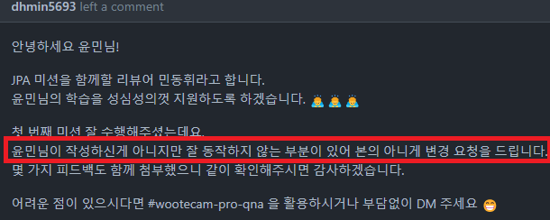

### (테스트는 독립적인 환경에서 진행 될 수 있도록 해야한다)
* 단위 테스트를 단독으로만 실행해 보지 말고 전체로 실행했을 경우도 고려하자

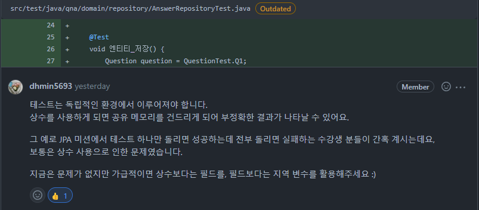

### (OOP를 위해 엔티티 클래스도 의미있는 메소드 외 상태 변경을 하는 상황을 철저히 관리하자)
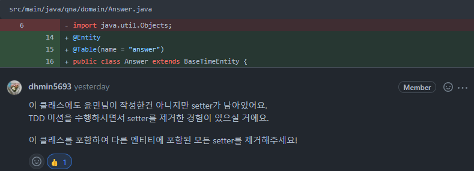

### (@MappedSuperClass 의 무분별한 생성 방지에 관한 의견)
* 철저하게 객체 생성을 막기 위한 상황을 강제해야 한다면 abstract 를 활용하자
* abstract에 대한 자바 스펙을 지키지 않는게 불편하다면 제거하자

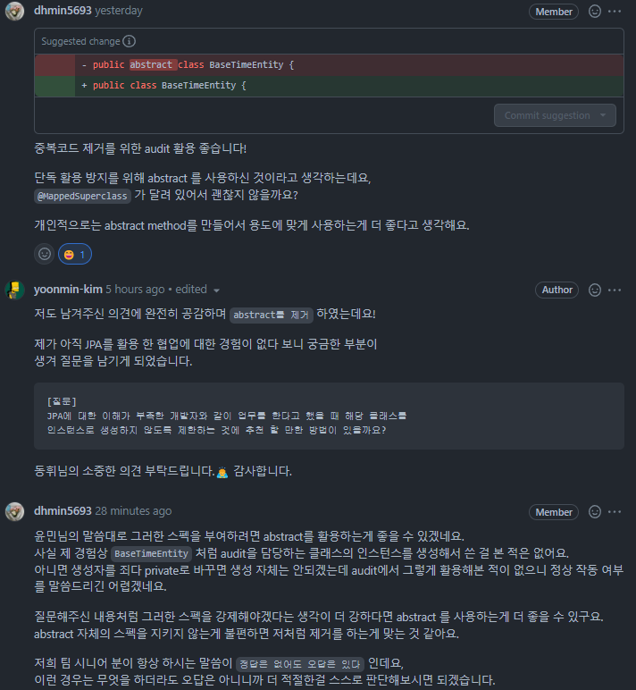

### 생성에 대한 책임을 팩토리로 이관한건 GOOD, 단순히 validation을 위함 이라면 
### 오히려 제약점 파악이 어려워 지는 단점이 있기 때문에 테스트 코드는 필수

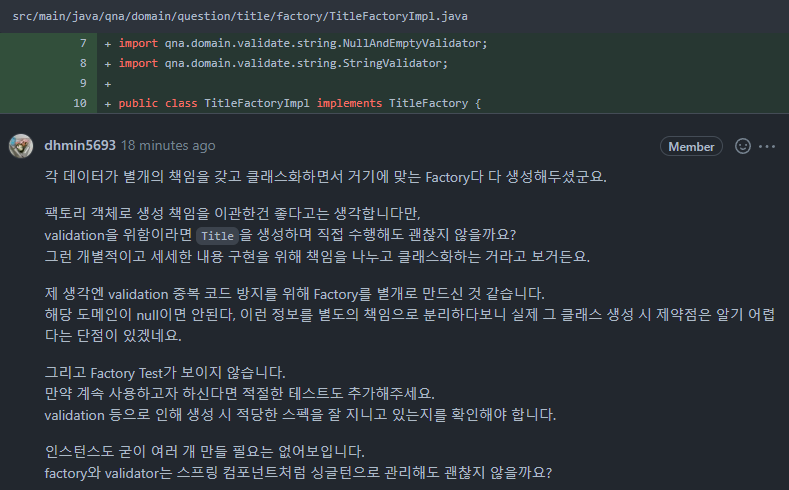

### JPA 사용시 영속성을 잘 유지하는지 염두에 두어야 하기 때문에 표현 계층과 서비스 계층의 진입점에서
### 엔티티가 직접 넘어오는건 위험한 방식이다. 때문에 엔티티를 직접 넘기지 않도록 하자

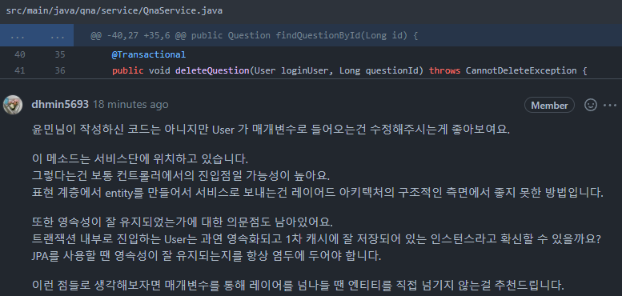

### Command와 Query를 분리하라

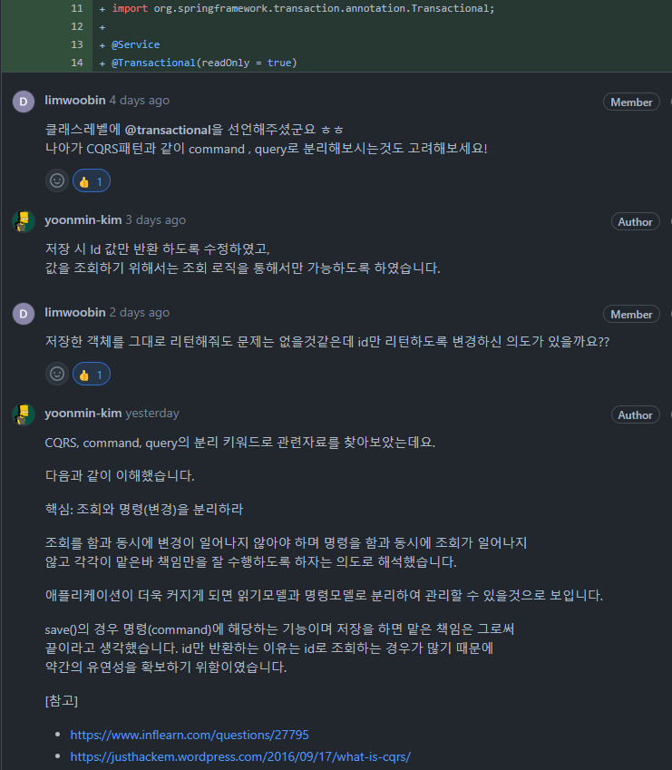

### id값만 들고있기 보다는 해당 객체와 관계를 맺는것이 더 자연스럽다

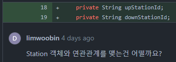

### 위 내용과 같은 맥락으로 보인다

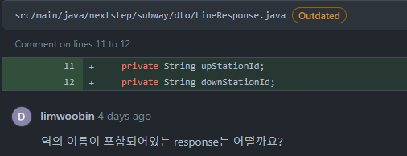

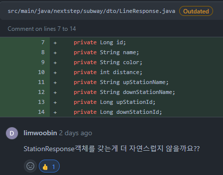

### 공통으로 사용되는 기능에 대해서만 TestFixtures로 정의 및 테스트 주체 클래스에서 상속
### 각 기능별 메소드는 별도의 클래스에서 public으로 제공

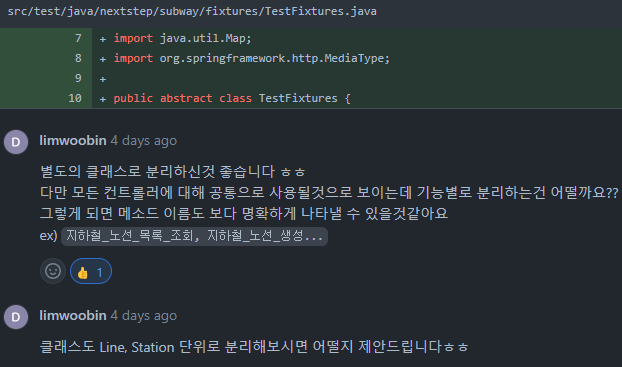
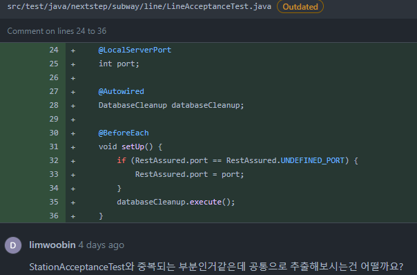

### 과한 상속을 피하라

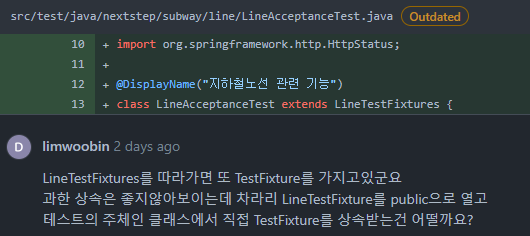

### repository는 service layer에서 처리되도록 하라

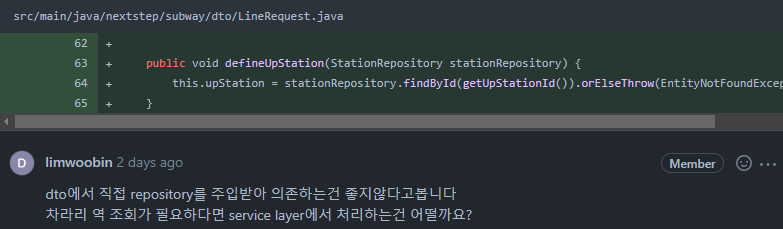

### 변경이 필요한 값에 대해서만 오픈하라

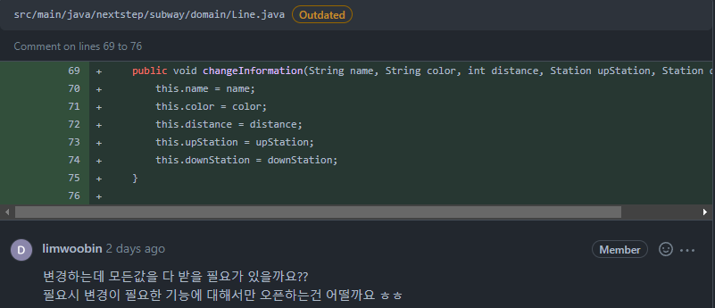

### 각 기능별로 라인을 개행하고 테스트에서는 given, when, then으로 구분 해주면 가독성이 좋다

### 기능의 목적에 맞는 결과를 정확히 테스트하자

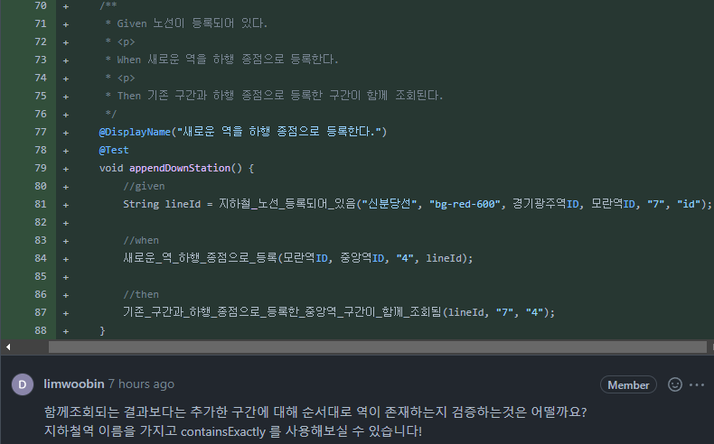

### 외부에서 컬렉션 조작을 하면 어떻게 될까? 방어적 복사를 활용하라
* 참고: https://tecoble.techcourse.co.kr/post/2021-04-26-defensive-copy-vs-unmodifiable/

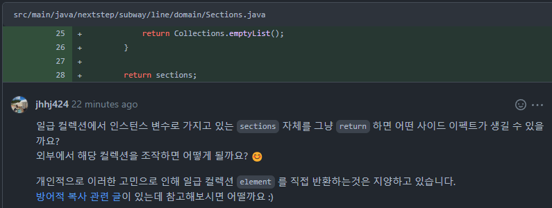

### 외부 라이브러리의 경우 변경 될 가능성을 고려하여 인터페이스로 기능을 정의하라

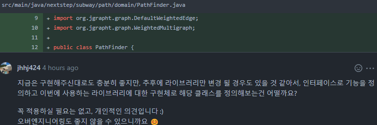

### BDDMockito 를 활용하면 given / when / then 에 맞춘 메소드 명으로 가독성을 높일 수 있다
* 참고 : https://velog.io/@lxxjn0/Mockito%EC%99%80-BDDMockito%EB%8A%94-%EB%AD%90%EA%B0%80-%EB%8B%A4%EB%A5%BC%EA%B9%8C

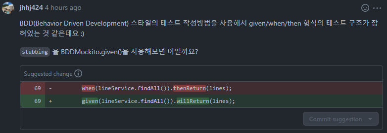

### 하나의 테스트에서 두개이상의 검증이 필요할때 assertAll() 을 활용하라
* 참고: 
  * https://sas-study.tistory.com/316, 
  * https://escapefromcoding.tistory.com/358?category=1184809

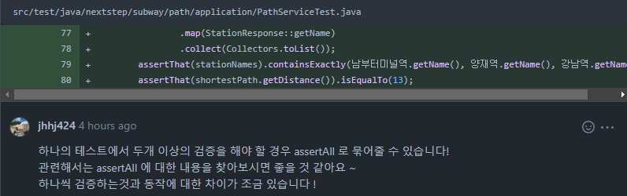

### 부하 테스트는 예측한 만큼의 사용자 요청을 처리할 수 있는가에 대한 테스트이다
* 장애상황은 QA단계에서 기능테스트 시 이뤄진다

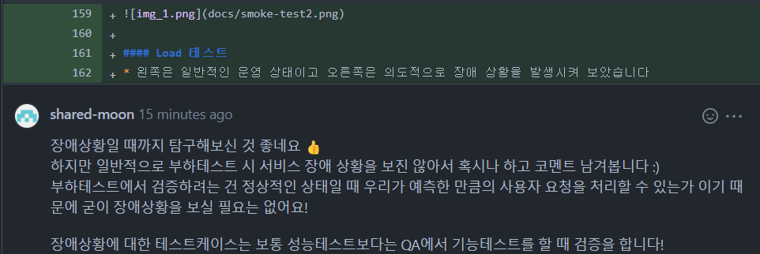

### Stress 테스트는 순단현상이 일어나는 지점을 보는것에 의미가 있다

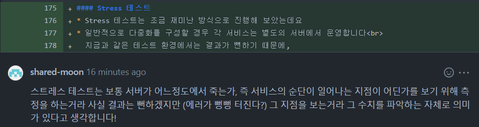

### 서비스 상황에 대한 판단은 서버의 리소스, 연동하는 서비스의 상태, JVM일 경우 쓰레드상태 등 다방면에서 확인이 필요하다
* 때문에 같은 정보를 보더라도 현재 본인이 알고있는 지식수준 확보 된 정보의 양에 따라서 다르게 해석 될 수 있음을 주의하자

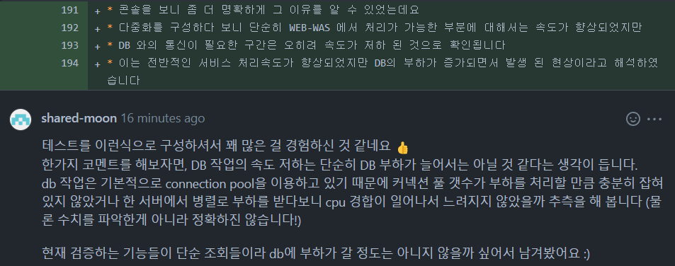

### 편리성을 생각해서 클래스레벨에 어노테이션을 사용했으나 그에 따른 부작용도 고려하자

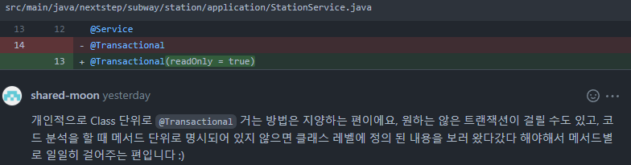

### 스프링부트는 설정을 통해 편리하게 기능들을 제공하지만 그에 따른 보안이슈는 없는지도 함께 확인해 보자

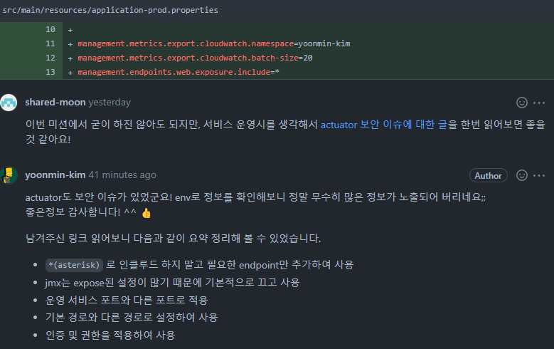