### 일반 배열보다는 컬렉션 프레임워크를 적극적으로 활용하자
* 두번 이상의 프로퍼티 접근을 하지 말자는 얘기는 최소지식 원칙을 의미한다(의존관계 최소화)

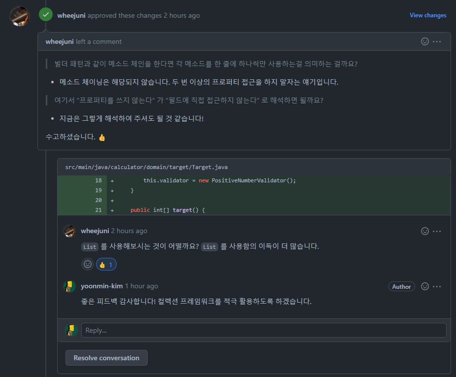

### Junit 기능 중 null과 빈값을 지원해주는 기능이 있다
* @NullAndEmptySource
```java
@ParameterizedTest
@NullAndEmptySource
void null_empty(String data) {
    target = new Target(data);
    assertThat(target.target()).contains(0);
}
```

### 매직넘버를 사용하지 말고 상수를 통해 의미를 명확히 전달하자
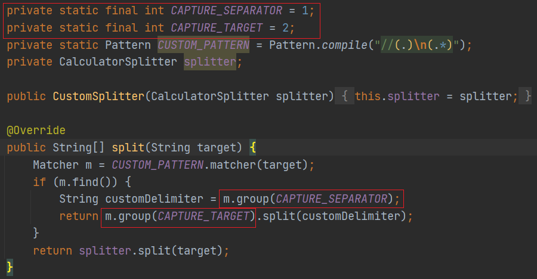

### RuntimeException은 그 범위가 너무 크기 때문에 자식 클래스를 활용하여 좀 더 명확한 의미를 전달하자
* assertj 에서 제공하는 assertThatIllegalArgumentException() 를 테스트에 활용할 수 있다
```java
[기능]
public class PositiveNumberValidator implements CalculatorValidator {

    private static final Pattern NUMBER_PATTERN = Pattern.compile("^[0-9]+$");

    @Override
    public void validate(String target) {
        if (!NUMBER_PATTERN.matcher(target).matches()) {
            throw new IllegalArgumentException(ERROR_NUMBER_MESSAGE);
        }
    }
}

[테스트]
@ParameterizedTest
@ValueSource(strings = {"-1", "-2", "-3"})
void 음수라면_EX(String target) {
    assertThatIllegalArgumentException().isThrownBy(() -> validator.validate(target))
            .withMessageContaining(ERROR_NUMBER_MESSAGE);
}
```

## 로또(자동)
### [피드백]
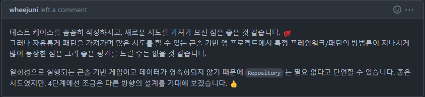

### (스트림 사용)

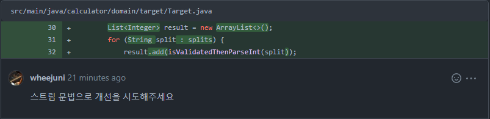

```java
private List<Integer> isNotNullAndNotEmptyThenSplit() {
    String[] splits = splitter.split(target);
    List<Integer> result = new ArrayList<>();
    Arrays.stream(splits).forEach(split -> result.add(isValidatedThenParseInt(split))); // 스트림으로 변경
    return result;
}
```
### (가독성)
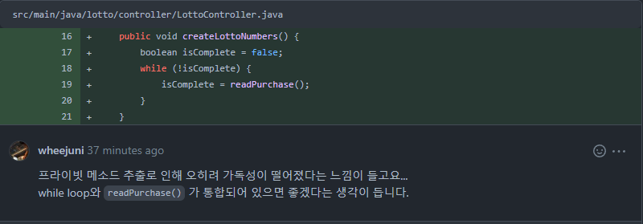

```java
public void createLotto() {
    Runnable readWinningNumber = () -> service.saveLotto(view.readWinningNumber());

    while (!isComplete(readWinningNumber)) {
    }
}
```

### (클래스명을 명확히 하라)
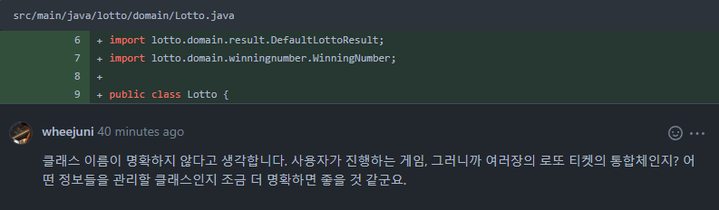

* 클래스명을 LottoGame으로 변경

### (직관적인 코드, Iterator 를 가져오기보다는 의미가 명확한 메소드로 만들어 해당 객체에게 메시지로 전달)

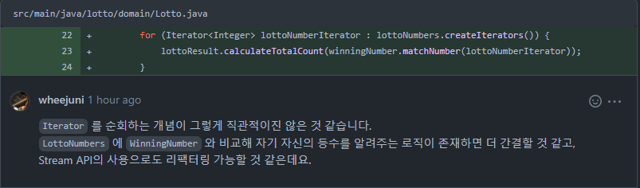

```java
public DefaultLottoResult result() {
    lottoNumbers.createMatchCount(winningNumber)
            .forEach(matchCount -> lottoResult.calculateTotalCount(matchCount));
    return lottoResult;
}

public List<Integer> createMatchCount(WinningNumber winningNumber) {
    return lottoNumbers.stream()
            .map(lottoNumber -> winningNumber.matchNumber(lottoNumber.createIterator()))
            .collect(Collectors.toList());
}
```


### (과한 상수추출은 피하라)
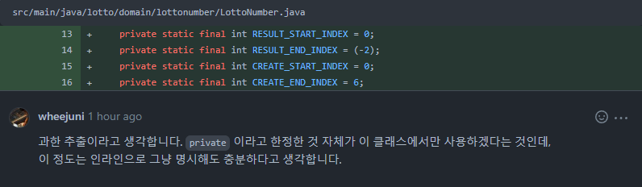

* 둘다 substring()을 사용하는 구간이였음

### (생성자를 간결하게 유지하고 검증기보다는 차라리 생성기를 만들어서 내부에서 검증하라)
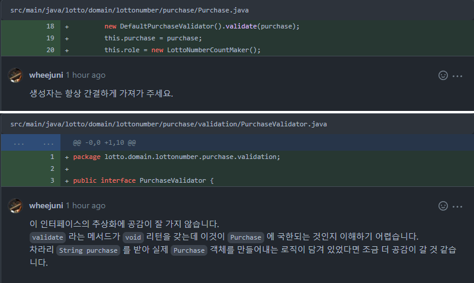

### (인터페이스에 상수를 보관하지 말라)
* 링크 : https://jinseongsoft.tistory.com/190

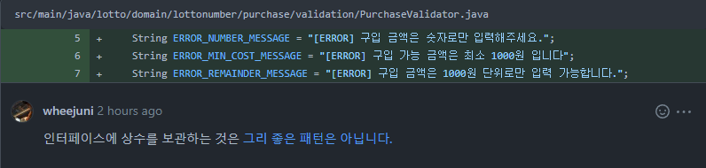

### (해당 구조를 유지할 경우 멀티스레드 환경에 대한 고려가 필요)
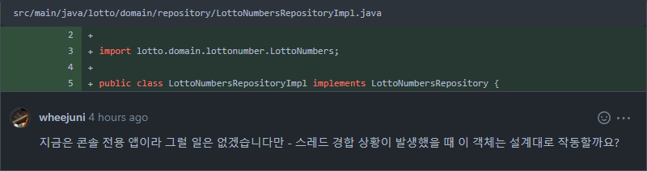

```
- 메모리 Repository를 유지한다면 ThreadLocal를 활용하여 LottoNumbers 를 저장해야 할 것으로 보임
- 피드백 주신 내용을 듣고 Repository를 제거 후 LottoGame 객체내부에서 LottoNumbers의 상태를 갖도록 하였음
- 현재 요구사항에는 단일쓰레드 구현이다보니 LottoGame을 싱글턴으로 구현하였으나 만약 멀티쓰레드 환경으로 변경되어야 한다면
- LottoGame를 각 쓰레드마다 생성하도록 수정해야 할 것 같음
``` 
### (`equals()`, `hashCode()`의 오버라이드를 항상 고려하자)
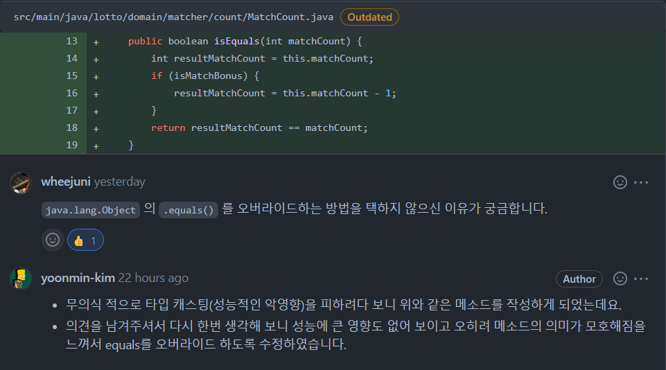

### (변수명은 혼란을 줄일 수 있는 명칭으로 생각하자)
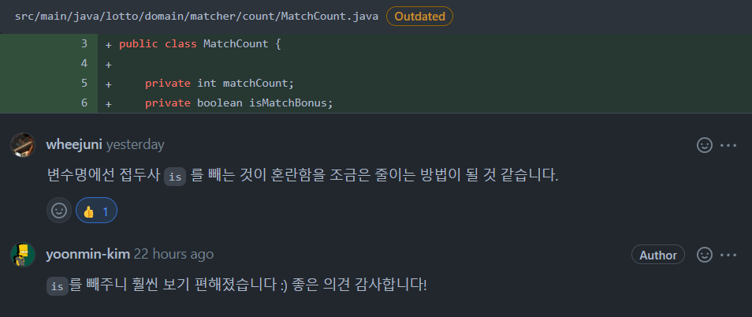

### (하나의 메소드가 여러일을 하지 않도록 하자)
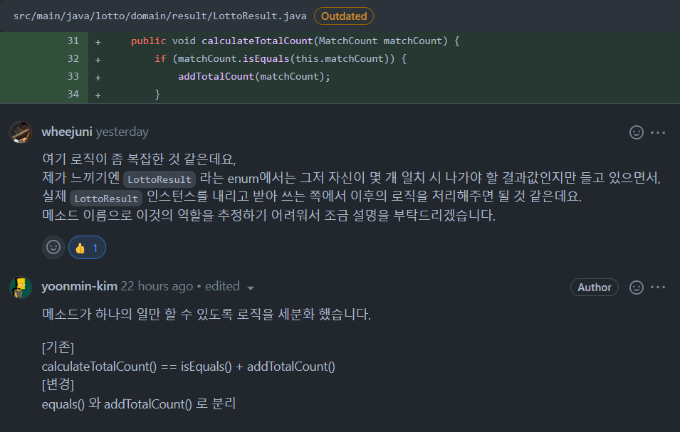

```java
// LottoResult 메소드
public LottoResult matchResult(MatchCount matchCount) {
    if (matchCount.equals(this.matchCount)) {
        return matchCount.isMatchBonus(this);
    }
    return MISS;
}

public void addTotalCount() {
    this.totalCount++;
}

// MatchCount 메소드
public LottoResult isMatchBonus(LottoResult lottoResult) {
    if (lottoResult == LottoResult.FIVE) {
        return !matchBonus ? LottoResult.FIVE : LottoResult.MISS;
    }
    if (lottoResult == LottoResult.FIVE_BONUS) {
        return matchBonus ? LottoResult.FIVE_BONUS : LottoResult.MISS;
    }
    return lottoResult;
}
```

### (`default`가 필요 할 경우 `abstract class`의 사용을 고려하자)
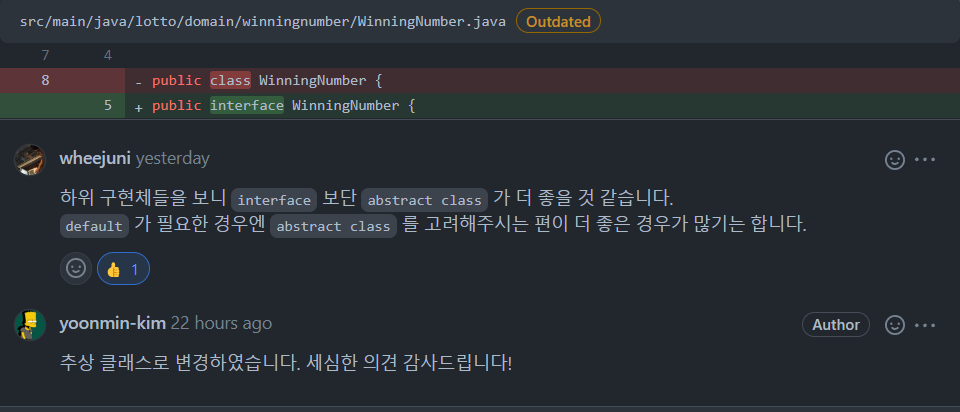
