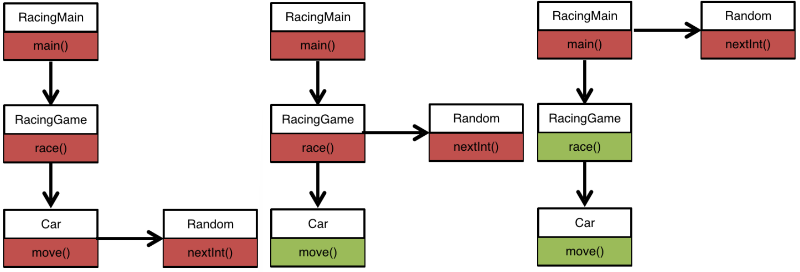
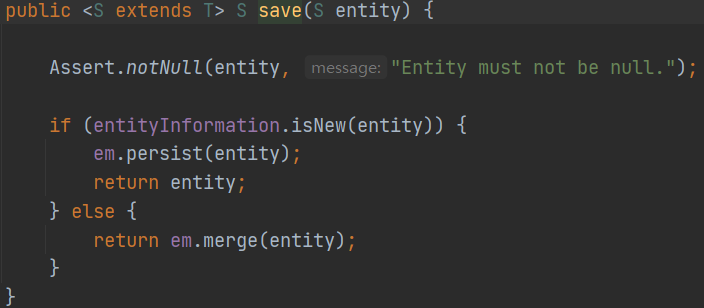
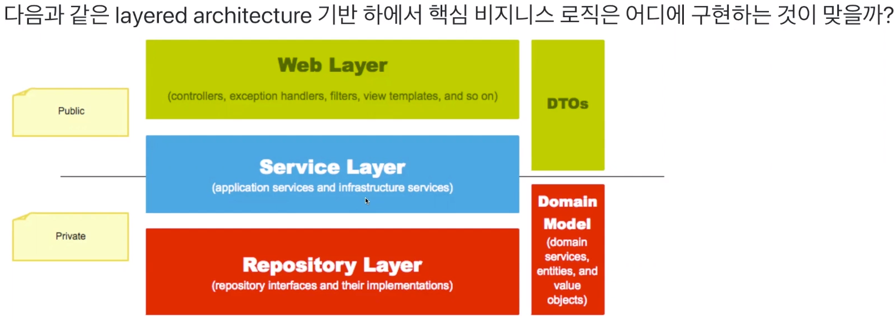

### TDD
```
(TDD를 하는이유)
- 디버깅 시간을 줄여준다
- 동작하는 문서 역할을 한다
- 변화에 대한 두려움을 줄여준다
```

* 요구사항 분석을 통해 대략적인 설계 - 객체 추출
* UI, DB에 의존하지 않는 핵심 도메인 영역을 집중 설계
* 도메인 로직을 테스트하는 것에 집중
* 테스트하기 어려운 부분을 찾아 테스트 가능한 구조로 개선
   * 객체 그래프에서 다른 객체와 의존관계를 가지지 않는 마지막 노드를 먼저 찾는다
   * 테스트하기 어려운 코드의 의존관계를 객체 그래프의 상위로 이동 시킨다
    

### 리팩토링
* indent를 줄이고, 가독성을 높인다
    * else 예약어 쓰지않기
* 메서드 분리 리팩토링 규칙
    * 한메서드에 오직 한단계의 들여쓰기(indent)만 한다
    * 클린코드 책: 작게 만들어라
        * 함수를 만드는 첫번째 규칙은 `작게`다 두번째 규칙은 `더 작게`다
    * 클린코드 책: 한가지만 해라
        * 함수는 한가지를 해야하며, 그 한가지를 잘해야 하며, 그 한가지만 해야한다
* 클래스 분리 리팩토링 규칙
    * 모든 원시값과 문자열을 포장
    * 일급 콜렉션을 쓴다
    * 클린코드 책: 함수 인수
        * 함수에서 이상적인 인수 개수는 0개(무항)이며 그 다음은 1개 그 다음은 2개
        * 3개는 가능한 피하는 편이 좋다
        * 4개 이상은 특별한 이유가 있어도 사용하면 안된다

### 2022-10-27 온라인 강의
* test fixture -> input/output -> assert검증
* 테스트를 위해 메서드를 추가하는것은 매우 나쁜 방식
* 테스트를 위해 생성자를 추가하는것은 장려하는 방식
```
1단계: 실패하는 테스트코드 작성, 컴파일에러 해결
2단계: 초록불을 볼 수 있도록 동작하는 기능 빠르게 구현
3단계: 리팩토링
```
* 객체에서 getter를 써서 값을 꺼내지말고 객체에게 직접 메세지를 보내라
  * 깔끔한 코드가 나온다
  * TDD하기에도 수월한 코드가 나온다
* 리팩토링을 안정적으로 하기 위해 잠시 중복코드를 만드는 악행을 저질러도 된다

### 1차 네트워킹 데이
* 본인의 역량을 기를 수 있도록 꾸준한 학습을하자
* 연봉 협상을 위해서는 내가 회사에 기여한 일들을 미리미리 정리해두고 어필하자
* TDD 시작전에 도메인에 대한 충분한 이해를 먼저 선행하고, 클래스 설계 구조를 먼저 생각해보는게 좋다
* 쥬니어끼리 성장하는 공부법
  * 내가 원하는 스터디를 구하려하지말고 내가 만든다
    * 노션으로 내용을 정리해서 구글폼으로 신청을 받자
* 좋은 개발자란 무엇인가?
* 시간을 효율적으로 쓰는 방법이란?
  * 조급함을 버리고 깊이있게 몰입해보자(선택과 집중)
* 조직의 개발문화가 마음에 들지않아 고민일때(유지보수성이 매우 떨어진다 생각이 들정도로)
  * 사람은 변화를 싫어하기 때문에 개발문화를 바꾸기란 쉽지 않다
  * 내 잘못이라고 생각하지 말고 영향력을 발휘할 수 있는 경력을 먼저
  쌓고 도전(노력)을 해야한다
  * 파랑새 신드롬 <a href="https://docs.google.com/document/d/e/2PACX-1vQPmcYwCUlpMsbtmzxq9-scTEatnXLZkr5FevOZe-Tvaj6yljWAKvrw5gM8clszT2j1iLQ3Q9nYK-Gt/pub">(링크)</a>
* 회사 이직할때의 가이드
  * 로켓펀치, 원티드: 인재를 뽑기위해 돈을 쓸 줄 아는 회사
  * 3년차(이상): 3년차에 준하는 실력을 가진 자
  * 만 3년차: 찐 3년차
  * 스타트업도 고려해보자, 스타트업 관련 정보 참고 <a href="https://thevc.kr">(링크)</a>
  * 연봉, 개발문화, 집과의 거리 여러가지를 고려해보자
  * 채용기간이 정해진 기업 먼저 지원하고 상시채용을 지원하는 등의 전략 필요
  * 여성복지를 챙길 줄 아는 회사가 인류애를 챙길 줄 아는 회사이다
  * 가고싶은 회사의 기본사항은 당연히 만족시키고, 우대사항까지 만족하려고 공부해야한다
  * 최근 개발트렌드 공부(카카오사태 dr, 마이크로서비스 트랜잭션 관리 등..)
  * 여기서 일하면 어떤점이 좋은지
  * 어떤 방식의 업무프로세스를 진행하는지
  * 단위테스트, CI/CD를 하고있는지
  * 이직의 근거가 될 만한 정보를 충분히 물어본다
 
### JPA Hands-on 강의
```java
@Test
    void identity() {
        final Station stations1 = stations.save(new Station("잠실역"));
        final Station stations2 = stations.findById(stations1.getId()).get();
        // 자바에서는 일반적으로 equals() hashCode() 동등성 비교는 제공함
        // jvm 의 메모리까지 같아야 동일성
        // Integer 는 자바에서 일부값들을 캐싱해두기 때문에 일부는 동일성이 보장되지만 해당 범위를 벗어나면 동일성 보장 안됨
        // JPA 는 Id만 같다면 1차 캐시를 통해서 동일성을 보장해준다
        // key 값이 똑같은 녀석이 2개이상 존재할 수 없다(유일하게 존재)
        // 영속성 컨택스트 캐시는 트랜잭션이 열리고 닫히는 시간까지만 유지된다
        assertThat(stations1 == stations2).isTrue();
    }
```
* save() 호출시 insert 쿼리가 나가는데 Id 가 없을 경우에는 새로 생성 될 데이터로 판단된다
* save() 호출시 Id를 들고있을 경우 select 쿼리가 나가는데 db에서 데이터가 있는지 확인후 합치는 작업는 작업을 진행한다

* merge() 는 경우에 따라서 내가 인자로 넣어준 entity 를 그대로 반환하지 않을 수 있다 (주소값이 달라짐)



* 때문에 save() 호출시 반환되는 값을 담아주고 사용한다
```java
Station stations = new Station("잠실역");
stations = stations.save(new Station("잠실역"));
```

* Id를 들고있지만 save()시 select를 나가지 않게 하기 위한 방법

```java
@Entity
public class Station implements Persistable<Long> {
    @Override
    public boolean isNew() {
        return true;
    }
}
```

* @Transactional 애노테이션 속성에 readOnly = true 를 사용 할 경우 `영속성 컨텍스트 스냅샷`을 사용하지 않기 때문에 Heap메모리 최적화를 할 수 있다

* not null 제약조건을 걸기위한 2가지 방법

```java
@Entity
public class Station implements Persistable<Long> {

    ..생략..

    @ManyToOne(optional = false) // optional을 false로 주면 무조건 값이 있다고 설정하게 된다
    @JoinColumn(name = "line_id", nullable = false) // 별도로 nullable 을 줄 수도 있다
    private Line line;
```

* 디버거로 프록시 객체를 확인하게 되면 select 쿼리가 나가는점을 참고하자
* 연관관계 주인인 쪽에서 읽기, 수정, 삭제를 해야한다

### 레거시 코드 리팩토링
* 대부분의 레거시 코드는 Service Layer에 핵심 비즈니스 로직이 구현되어있다
* Service Layer 비즈니스 로직을 구현하게 되면 절차지향적인 프로그래밍을 할 수 밖에 없다
* Service Layer 는 Thin Layer라고 부르기도 할 만큼 가벼워야 되며 단순히 Web Layer 와 Repository<br>
Layer 의 인터페이스를 연결해주는 역할만 해야한다
* 또한, 데이터를 조회해 오면 도메인 객체에 메세지를 보내는 역할만 하는것이다
* Domain Model 에 비즈니스 로직을 구현해야 진정한 OOP를 지킬 수 있으며 단위테스트 인수테스트의 작성<br>
비용도 현저히 줄일 수 있다

```
Service Layer 에 비즈니스 로직을 구현하게 되면 단위테스트를 구현할 때 Mock 프레임워크의 
의존성이 강하게 형성되고 테스트 코드의 작성 비용이 굉장히 커지게 된다
```



### 레거시 코드 리팩토링 1단계
* Service Layer에 단위 테스트를 추가한 후 비즈니스 로직을 도메인 객체로 이동하는 리팩토링
* Acceptance Test를  추가한 후 리팩토링