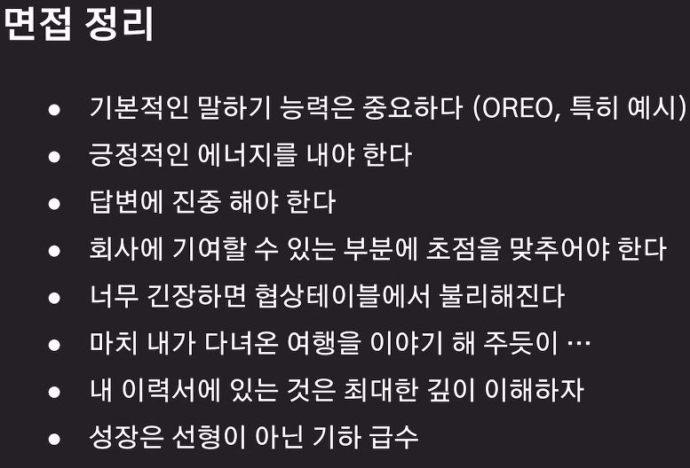

### 개발자는 `실력`이 좋아야한다
- 개발자의 핵심역량 키워드 적어도 3개 를 생각해보고 이력서를 읽었을때 
그 키워드들이 잘 녹아들어야 한다

### 개발자가 갖춰야 할 역량 우선순위
1. 기본기가 탄탄한가? - 1차면접, 코딩테스트, 과제
2. 구현능력 - 이력서
3. 꾸준한 성장 가능성 - 이력서
4. 인성/태도/커뮤니케이션/협업 - 2차 면접

### Skills 에는 높이 보다는 넓이가 길게(그룹핑)
- 좀 더 비중있는 스킬과 덜 비중있는 스킬의 레벨링 정도만 주자

### `What How 법칙`(How에 좀 더 힘을 실어서)
- 무엇을 어떻게 개발했다 
- 경험을 통해서 무엇을 배웠다
- 경험을 통해서 어떻게 성장했다

### 자세한건 경력사항에 적어라 
- 자기소개에는 간단한 내용만 적는다
- `경력 사항의 내용이 풍부`해야 그 안에서 면접때 할 이야기가 많아진다

### 이력서로 What How 봤다면 면접은 Why를 물어본다

### 최종 항력을 적어라
- 학력에 자격지심이 있는지 볼 수 있기 때문에

### 내가 SI에서 CRUD만 했다고 하더라도/ 내가 유지보수 업무만 했다고 하더라도
- `그속에서 무엇을 배웠는지가 중요하다`

## 자기소개와 지원동기가 합쳐지면 막강해진다
- 열정 -잠재력 -빠른성장 -리더쉽
- 안정적인 서비스에 대한 전문가입니다

### 회사에서 경력중심으로 자기소개해달라
* 2차면접은 자기소개서와 지원동기를 잘 얘기하면 50프로는 먹고간다

### 우리회사에 지원한 이유는 무엇인가요?
* 내가 가는길과 회사가 가는길이 같다 -> 때문에 내가 회사에 기여를 할 수 있다, 도움을 줄 수 있다

### 이직사유는 무엇인가요?
* 내가가는 길과 회사가 가는길이 달라서

### 역량검증
- 자바 어노테이션이 뭔가요?
- AMQP프로토콜은 무엇인가요? + Excgange Type의 종류와 특징을 설명해주세요
- RabbitMQ의 단점은 무엇인가요?
- 기술 스택과 기술경험에 대해서도 다양한 질문이 나올 수 있다

=> 경력사항 내용은 내것으로 만들자 , 단순히 사용해봤다가 아닌 왜 선택했고(종류가 뭐가있었는지) 장/단점은 무엇이였는지

## `면접은 깊이 있는 이해가 중요하다`
* 오레오기법
* 의견(결론) - 근거/이유 - 예시 - 의견(결론)

* 서술어는 중요하다(아는것과 모르는것의 경계를 명확히하라)
  * `~입니다`
  * ~라고 생각합니다
  * ~인것 같습니다
  * ~라고 알고 있습니다
  * ~이라고 들었습니다

### 실패를 묻는 이유?
* 나로 인해 발생한 가장 큰 문제(장애)는 무엇인가요?
-> 똑같은 실수를 반복하지 않기위해서 무엇을 했는지 물어보기위해
* 가장 성공한 프로젝트는 무엇이고 이유는?
-> 성공의 기준이 무엇인지 보기위해서
* 자신의 단점은 무엇인가요?
-> 단점을 잘 알고 이를 보완하는 노력을 하는가?

