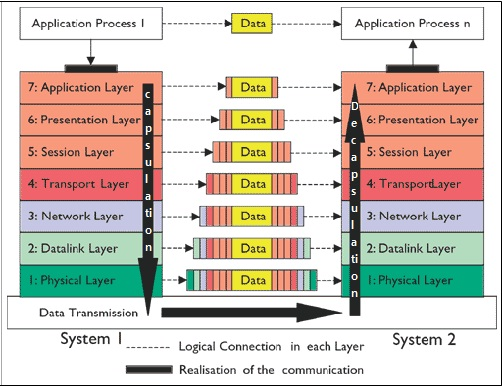
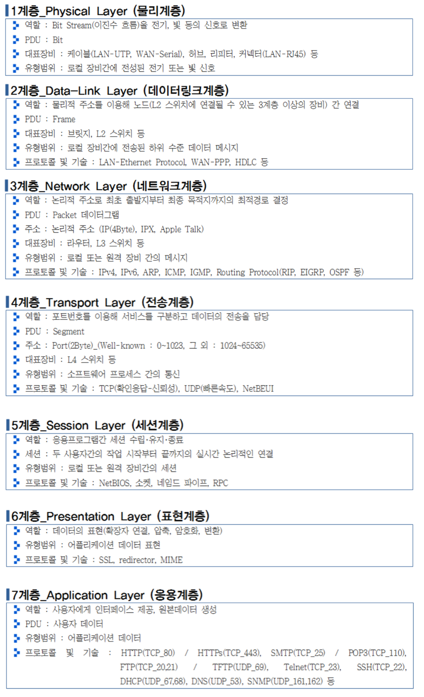
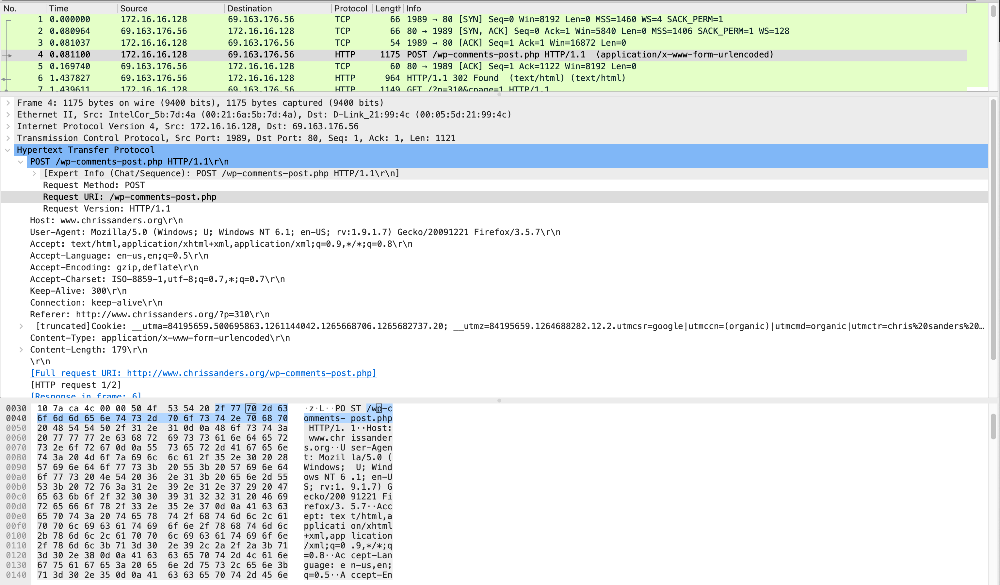

### 1. OSI 7 Layer
* <a href="https://www.youtube.com/watch?v=1pfTxp25MA8&ab_channel=%EC%9A%B0%EC%95%84%ED%95%9CTech">링크</a>






### 2. wireshark
* wireshark를 활용하여 패킷을 캡쳐하면 통신과정에서 일어난 이벤트를 기록할 수 있어요.

<a href="https://drive.google.com/drive/folders/1xF-DNq4cY9v-i8MEO4W_JeHkt6HmkpNa">예제패킷</a>

### 3. Ping check
* `IP 정보만으로 서버에 요청이 가능한지를 확인`합니다. Ping은 ICMP란 프로토콜을 사용합니다. ICMP란, IP가 신뢰성을 보장하지 않아<br>
네트워크 장애나 중계 라우터 등의 에러에 대처할 수 없는데, 오류정보 발견 및 보고 기능을 담당하는 프로토콜입니다. (TCP가 아니라 Port 번호가 없어요)
```
$ ping [대상 IP]
```
```
$ ping google.com -c 1
PING google.com (216.58.220.110): 56 data bytes
64 bytes from 216.58.220.110: icmp_seq=0 ttl=115 time=38.167 ms

-- google.com ping statistics --
1 packets transmitted, 1 packets received, 0.0% packet loss
round-trip min/avg/max/stddev = 38.167/38.167/38.167/0.000 ms
```

* RTT(Round Trip Time)란, 한 패킷이 왕복한 시간을 의미합니다. 네트워크 시간은 연결 시간, 요청 시간, 응답 시간 등으로 구성됩니다. RTT가 높을 경우 어느 구간에서 오래 걸리는지 확인하여야 합니다.

```
$ traceroute google.com
traceroute to google.com (172.217.26.46), 30 hops max, 60 byte packets
 1  ec2-52-79-0-132.ap-northeast-2.compute.amazonaws.com (52.79.0.132)  0.807 ms  0.748 ms ec2-52-79-0-94.ap-northeast-2.compute.amazonaws.com (52.79.0.94)  4.504 ms
 2  100.66.8.102 (100.66.8.102)  2.706 ms 100.66.8.88 (100.66.8.88)  6.450 ms *
```
* ⁉️ IP 정보로 통신을 할 때, 실제 서버의 위치는 어떻게 알 수 있을까요?<br>
ARP(Address Resolution Protocol) 란, 논리적 주소인 IP주소 정보를 이용하여 물리적 주소인 MAC 주소를 알아와 통신이 가능하게 도와주는 프로토콜입니다. <br>
ARP Request를 Braodcast로 요청하면 수신한 장비들 중 자신의 IP에 해당하는 장비가 응답을 합니다. 응답받은 NIC 포트 정보와 IP, MAC 주소를 기반으로 이후 통신을 진행합니다.

```
# ARP Table 확인
## Ping으로 다른 서버와 통신한 이후 arp table을 다시 확인해보면 ARP Table이 추가됨을 확인할 수 있습니다.
$ arp
Address             HWtype   HWaddress           Flags Mask            Iface
[디폴트 Route IP]     ether    02:ef:51:c6:c4:28   C                     eth0

$ ip route
default via [디폴트 Route IP] dev eth0 proto dhcp src [자신의 IP] metric 100

## ARP 변경
## Default Route의 MAC주소를 변경할 경우 연결이 끊어짐을 확인할 수 있습니다.
$ sudo arp -s 192.168.0.1 [다른 MAC주소]
```

### 4. Port check
* 서비스의 정상 구동 여부를 확인할 수 있습니다.
```
$ telnet [Target Server IP] [Target Service Port]
```

⁉️ 서버는 서비스에 하나의 포트번호를 오픈해두고도 많은 사용자와 연결을 맺을 수 있습니다. 그 이유는 <a href="http://jkkang.net/unix/netprg/chap2/net2_1.html">소켓이 이용하는 정보</a>를 확인해보면 알 수 있어요.

⁉️ 그렇다면 <a href="https://woowabros.github.io/experience/2018/04/17/linux-maxuserprocess-openfiles.html">현재 서버에서 (프로세스별로) 몇개의 연결이 가능한지</a> 한번 확인해볼까요. 몇개의 소켓파일을 생성할 수 있을지 생각해보면 되겠지요?

```
$ sysctl fs.file-max
fs.file-max = 399683

$ ulimit -aH
core file size          (blocks, -c) unlimited
data seg size           (kbytes, -d) unlimited
scheduling priority             (-e) 0
file size               (blocks, -f) unlimited
pending signals                 (-i) 15622
max locked memory       (kbytes, -l) 16384
max memory size         (kbytes, -m) unlimited
open files                      (-n) 1048576
pipe size            (512 bytes, -p) 8
POSIX message queues     (bytes, -q) 819200
real-time priority              (-r) 0
stack size              (kbytes, -s) unlimited
cpu time               (seconds, -t) unlimited
max user processes              (-u) 15622
virtual memory          (kbytes, -v) unlimited
file locks                      (-x) unlimited
```

⁉️ AWS Security Group에 80 포트번호만 오픈해두었다고 가정해볼게요. 80번으로 서버에 연결 요청시에 8080번으로 연결되도록 소켓을 생성할 수는 없을까요

😈 Port forwarding
```
## 원격지 서버에서 8080 포트로 소켓을 열어봅니다.
$ sudo socket -s 8080

## iptables 를 활용하여 port forwarding 설정을 합니다. 
## 아래의 설정은 80번 포트로 서버에 요청을 하면 서버의 8080번 포트와 연결해준다는 내용을 담고 있어요
$ sudo iptables -t nat -A PREROUTING -p tcp --dport 80 -j REDIRECT --to-port 8080

## 서버의 공인 IP 확인해봅니다., 
$ curl wgetip.com

## 자신의 로컬에서 연결해봅니다.
$ telnet [서버의 공인 IP] 80

## 설정 삭제 
$ sudo iptables -t nat -L --line-numbers
$ sudo iptables -t nat -D PREROUTING [라인 넘버]
```

동일하게 22번으로 연결하면 접속이 가능하겠지요? 사실 이 방법이 아니더라도, ssh 기본 포트를 22번이 아닌 다른 포트로 변경하여 연결을 시도할 수도 있을거에요. 하지만 전체 대역에 대해 ssh 접속을 허용하는 것은 보안상 위험하니 주의해주세요 🙏🏻

### 5. HTTP Response check

* HTTP <a href="https://tools.ietf.org/html/rfc2616#section-10">Status code</a>를 기반으로 보다 상세하게 이상유무를 판단할 수 있습니다.
  * 서비스별로 사용하는 응답코드가 다르기도 하고 (<a href="https://gist.github.com/vkostyukov/32c84c0c01789425c29a">예시</a>), 그 의미가 다르기도 합니다. (<a href="https://brainbackdoor.tistory.com/137">예시</a>)
  * HTTP Message의 형태는 <a href="https://github.com/brainbackdoor/bbd-http-web/blob/master/docs/message/README.md">링크</a>를 참조바랍니다.
```
$ curl -I google.com
```

⁉️ 우리는 어떻게 google.com으로 요청을 할 수 있는걸까요
```
$ sudo systemd-resolve --flush-caches
$ nslookup google.com
$ sudo tcpdump -nni eth0 port 53
```
1. 우선, /etc/hosts 파일에 정적으로 설정한 정보를 확인합니다.
2. 로컬의 DNS Cache를 확인해봅니다.
3. /etc/resolv.conf에 설정한 정보를 기반으로 DNS 서버에게 질의합니다.
4. DNS 서버는 정보가 있으면 반환하고 없으면 본인의 상위 DNS에게 질의를 하여 정보를 알아옵니다.
5. 도메인에 해당하는 IP를 알게되면 DNS Cache에 추가합니다.

### 6. 패킷 분석
tcpdump, <a href="https://www.wireshark.org/download.html">wireshark</a> 등의 도구를 사용하여 패킷을 모니터링할 수 있습니다.
```
$ tcpdump host 192.168.0.207
$ tcpdump port 80
$ tcpdump net 192.168
```