### 정규식은 왜 정규식이라고 부를까?
* 문자열에 숨겨진 패턴을 컴퓨터가 알아먹도록 표현한 언어
* 패턴은 반복되지는 않지만 규칙은 존재한다
* 결국 정규식은 문자열의 규칙을 표현하는 식이다

### 정규식의 탄생배경
* 언어를 표현하기 위한 시도
* 우리가 일상적으로 표현하는 자연어를 뜻하는게 아닌
* 간단한 기초적인 언어를 수식으로 표현하여 기계들이 언어라는 개념을 인지할 수 있도록 하는 것
* 프로그래밍 언어에 가까운 느낌

### 기계에게 언어라는 개념을 알려주기 위해 해야할 것은?
* 언어라는게 무엇인지 고민한다
* 기계는 애매모호한 개념을 이해할 수 없기 때문이다
* 때문에 언어라는 개념의 정의를 수학적으로 접근을 시도했다

```
(수학에서 언어의 정의)
1. 유한한 길이의 기호들의 집합 S가 반드시 존재한다
-> 사실 알파벳을 의미하지만 알파벳이라는 표현은 추상적이다. 때문에 누군가 "그래서 알파벳이 뭔데?" 라고 질문한다면 또다시 정의를 해야한다

2. S의 원소들로 만들어진 문자열의 집합인 S*를 만드는 규칙이 존재한다
-> 알파벳을 사용하여 어떤 단어나 문장을 만들어야한다는 의미이다. 같은 알파벳을 사용하더라도 어떤 규칙에 따라서 단어나 문장을 만들었는지에 따라 속성이 달라지기 때문이다

3. 규칙에 맞게 만들어진 문자열들이 어떤 의미를 가지는지 결정할 수 있다
```

### 정규식
`언어라는 수학적개념을 기계가 알아들을 수 있는 표현으로 바꾼것이 정규표현이고 정규표현식은 컴퓨터가 알아들을 수 있는 형태로 표현한 것이라고 이해하면된다.`

### 문자의 집합으로 문자열 속에서 내가 원하는 패턴 찾기
* 삼성카드(1234)승인 김*민 3,700원 라는 문자가 있다
* "삼성카드"라는 문자가 포함되었는지 찾기 위해서 "삼성카드"단어 그대로를 정규표현식으로 지정할 수 있다
* 요구사항이 변경되어 "삼성카드" 뿐만 아니라 "신한카드"가 포함되었는지 함께 찾고싶을 수 있다

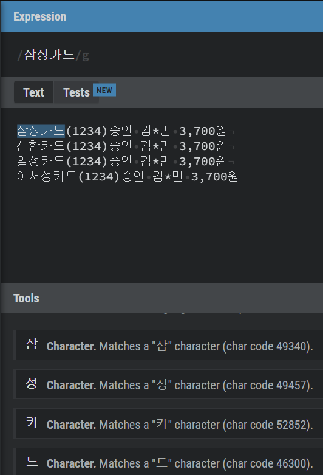

* Tool를 살펴보면 각각의 단어가 Character로 표현되어 있는데 엄밀히 말하면 Character Set이다 그러나 어짜피 문자가 하나밖에 없기에 문자라고 표현해도 상관이 없다

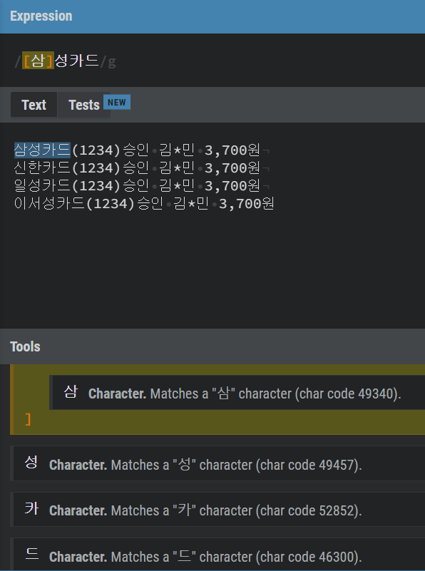

* 삼이라는 글자에 대괄호로 감싸주어 Character Set으로 만들어 주었다. 하지만 위에서도 말했다 싶이 어차피 Character Set이기 때문에 결과가 바뀌지는 않는다

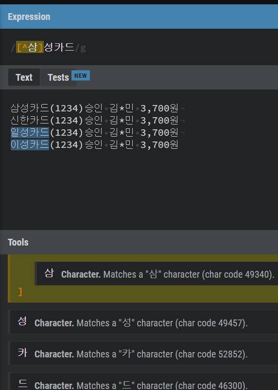

* 대괄호안에 ^를 붙여주었다. Tools를 살펴보면 Negated set(부정집합)으로 바뀌었고 '삼'을 제외한 나머지 모든 문자와 매칭이 된다고 적혀있다
* 캐럿(^)은 집합단위로 적용이 된다 [^삼이] 라고 표현하면 삼 또는 이 가 아닌 문자를 뜻하는 것이지 삼은 아니고 이는 포함된 문자를 찾는게 아니다

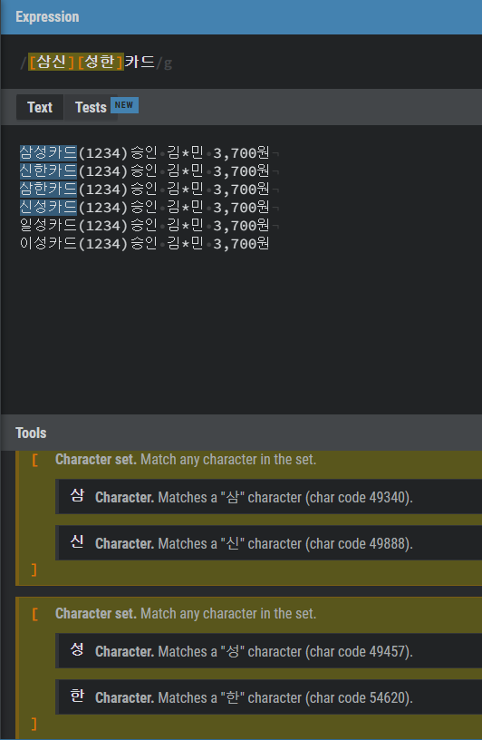

* 대괄호에 표기한 문자들은 문자 하나마다 한 요소로 판단한다. 따라서 [삼신]은 삼이 포함 되거나 신이 포함 된 문자를 뜻한다
* 다시말해 대괄호는 본인이 가지고있는 요소중에서 하나라도 매칭이 되면 매칭이 되었다고 판단한다

### 와일드카드(dot character class, ...)
* 이름을 매칭하기 위해서는 문자의 집합으로는 매칭하기에 한계가 있다
* 극단적인예로 일론머스크의 아들은 이름에 영어, 특수문자, 숫자가 포함되어있다

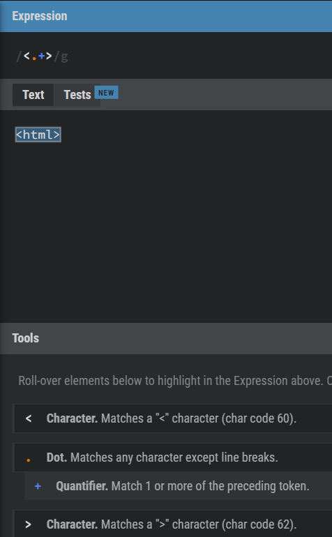

* dcc의 경우 괄호안에 있는 문자들과 매칭할때 특히 유용하게 쓰인다
* 위 이미지는 꺽쇠 사이에 문자가 들어가는 html태그를 예로 보여주고 있는데 요즘에는 웹 컴포넌트도 많이 사용되기 때문에 꺽쇠 사이에 근본없는 문자들도 많이 들어간다
* html태그는 꺽쇠안에 꼭 4글자만 들어가는것은 아니기 때문에 +라는 수량자를 함께 사용하였다
```
수량자(Quantifier): 수량자 앞에 들어가는 토큰이 1번이상 등장해야 한다
```

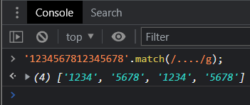
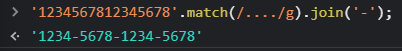

* 자바스크립트의 math 함수는 인자로 받은 정규식에 매칭 된 결과를 반환해준다
* 정규식에 사용된 g는 Global flag인데 한번 매칭됐다고 해서 매칭을 끝내는게 아니라 문자열이 끝날때까지 계속 매칭을 시도해달라는 의미이다
```
무슨문자인지는 중요하지 않은데 등장횟수가 중요한 패턴이나 html태그처럼 괄호가 열리고
닫힌다는 패턴정도만 정해져있고 그안의 문자는 뭐가 들어가든지 상관없는 상황에서 많이 사용된다
```


### \d, \w, \s 캐릭터 클래스로 추상적인 문자의 집합 표현해보기


* dcc는 너무 추상적인 표현이라서 휴대폰번호와 같이 숫자만 매칭되면 될 상황에 문제가 된다

```
(정규식에서 제공하는 구체적인 표현방법)
모든숫자(Digit): \d, \D
모든 영어, 숫자(Word), 언더바(_): \w, \W
공백(Whitespace, space, tab, linebreak): \s, \S

(소문자는 positive, 대문자는 nagative를 의미한다)
소문자: 모든 숫자, 모든 영어/숫자/언더바, 모든 공백
대문자: 모든 숫자를 제외한 나머지, 모든 영어/숫자/언더바를 제외한 나머지, 모든 공백을 제외한 나머지 (= 캐럿(^)과 비슷한 의미)
```

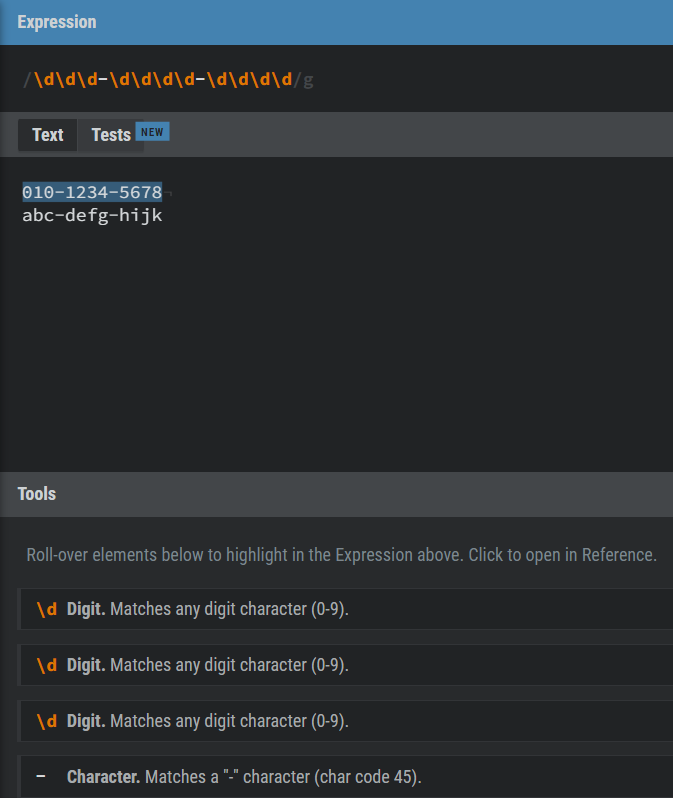

### 문자의 집합 안에서 문자 범위 지정하기
* 문자 집합으로 한글을 모두 표현하려면 어떻게 해야할까? 기존에 문자를 일일이 나열하는 방식으로 하면 거의 불가능에 가깝다
* 영어는 대소문자 합쳐서 48자이지만 한글은 11,172자이고 실생활에서 자주 쓰이는 문자만 쓴다고 하더라도 2,350자이다
* 때문에 정규식에서는 범위로 표현하는 방법을 제공한다. 범위로 표현할 경우 표현방법이 더 짧고 가독성이 좋으며 명확하다

```
한글: [가-힣]
영어: [A-Za-z]
숫자: [0-9]
```
* 한글과 숫자의 경우 범위표현식이 한번에 표현되고 있는데 영어의 경우 대문자와 소문자를 나눠서 표현하고있다
* 그 이유는 컴퓨터의 경우 문자를 실제로는 ASCII코드로 저장하고, 저장했던 코드를 화면에 보여줄 때도 ASCII-Table에 매칭되는 문자를 보여주기 때문이다
* 다음의 그림과 같이 A-z 를 표시하는 ASCII-Table을 보면 단번에 이해할 수 있다

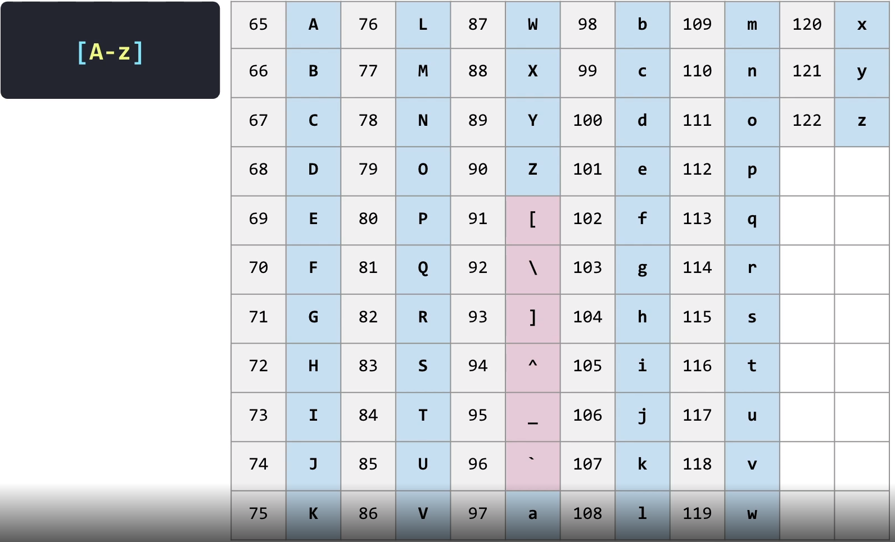

### 수량자(Quantifier)
* 특정 문자집합이 몇번 등장해야 하는지를 표현할때 사용한다
* dcc를 사용하여 아무런 문자나 200번 등장하면 매칭된다고 표현할때 dot(.)을 200번 찍어서 표현할 수 있다 하지만 200개를 일일이 작성하면 생산성, 가독성은 현저히 떨어질 것이다
* 또한 "200개 이상"이라는 추상적인 표현을 위해서는 위와 같은 방식으로는 해결할 수 없다 이럴때 사용하는것이 수량자이다

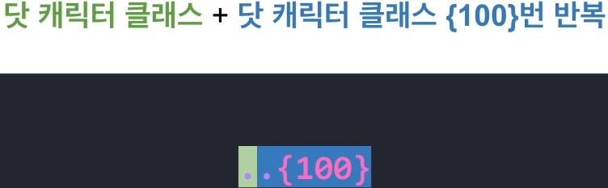

* 수량자는 바로앞에 등장하는 문자에 대해서만 표현한다. 위 그림과 같이 dcc가 수량자앞에 2개 있더라도 바로앞의 dcc만 수량자영역에 해당된다

```
.{100}  n번 반복
.{100,} n번 이상 반복
.{100,200} n번 이상, m번 이하 반복
```

### 추상적인 수량 표현을 쉽게 할 수 있는 스타, 플러스, 옵셔널 수량자

```
[있을 수도 있고 없을 수도 있음(0번 이상)]
.*

[몇 번이어도 상관없지만 있긴 해야함(1번 이상)]
.+

[있거나 없거나(0번 또는 1번)]
.?
```

### 앵커란 무엇인가?
* 앵커를 이해하기 위해서는 문자의 경계를 생각해야한다. 다음 이미지와 같이 문자와 문자사이 문자와 공백사이가 모두 문자의 경계이다


* 경계를 알아야하는 이유는 다음과 같은 패턴을 찾아야 할때 사용되기 때문이다
```
· "원"으로 끝나는 문자열
· "a"로 시작하는 문자열
· 문자열의 맨 뒤에 있는 문자
```

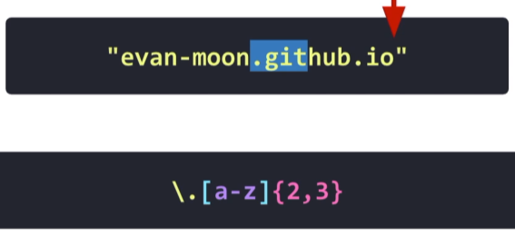

* 문자의끝에 위치한 top도메인을 매칭하기 위해 정규식을 사용하였다(.io)
* 하지만 중간에 있는 엉뚱한 문자가 매칭되었다(.git)

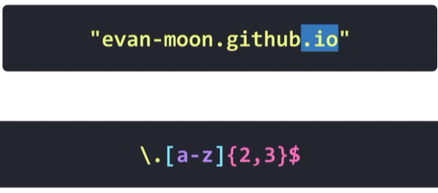

* 붉은 화살표의 위치와 같이 문자의 끝이라는 경계를 표현해주면 해결이 된다($)

* Beginning 앵커(^): 문자의 시작경계를 나타내며 Nagative집합과 잘 구분해야한다
* End 앵커($): 문자의 끝경계를 나타낸다

```
(Beginning)
^[a-z]{3}

(nagative)
[^a-z]{3}
```

### 주의사항
`/\d{3}^-\d{4}-\d{4}$/g`
* 다음과 같이 Beginning 앵커가 문자의 중간에 들어가 있다
* 해당 표현은 논리적으로 틀린 표현이다 문자의 시작이 문자의 중간에 들어간다는 것은 말이 안되기 때문이다
* 정규식은 프로그래밍과 같이 에러라는 개념이 없기 때문에 위와 같이 논리적으로 틀린 표현을 사용하더라도 에러가 발생하지 않음에 주의해야한다

### 정규식을 더 똑똑하게 만들어주는 i, g, m플래그
* 정규식을 파싱하고 실행하는 정규식 엔진의 기능이다
* 때문에 내가 사용하고있는 언어에서 어떤 정규식엔진을 사용하고 있느냐에 따라 조금식 문법이나 기능이 다를 수도 있다

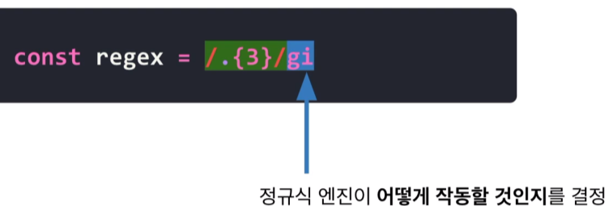

* i(ignore case) : 영어 대소문자 구분을 하지 않겠다
* https://github.com/yoonmin-kim / HTTPS://GITHUB.COM/YOONMIN-KIM 와 같이 문자의 대소문자 보다는 문자가 가지고있는 의미가 중요할때 사용한다

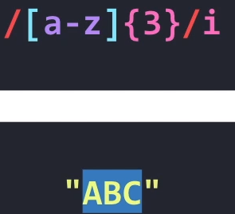

* g(global search) : 한번 매칭이 되었더라도, 매칭을 끝내지말고 문자열 끝까지 다 찾아봐라
* 정규식은 원래 패턴에 매칭되는 부분을 찾게되면 매칭을 끝내게 된다. 하지만 g플래그를 사용하면 문자열의 끝까지 매칭을 계속하게된다

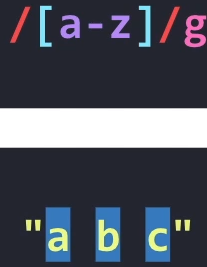

* m(multiline) : 여러줄로 되어있는 문자열에 대한 기능
* m플래그를 사용하면 Beginning/End 앵커의 의미가 라인의 시작/끝 경계로 변경된다

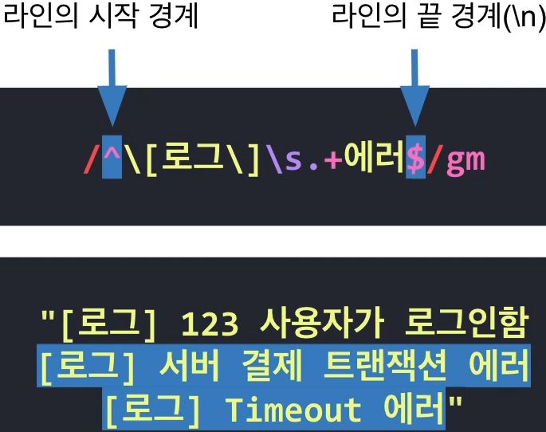
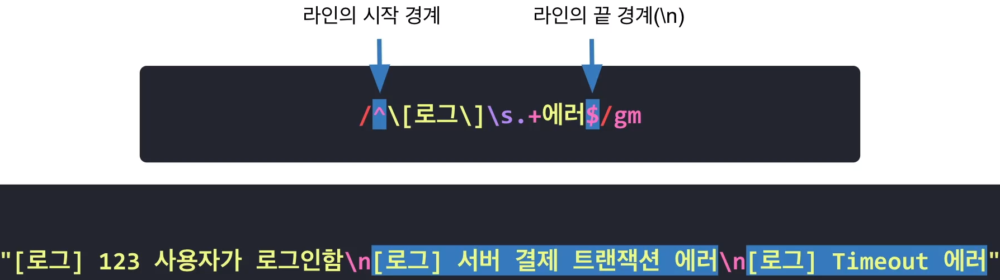

### 문자열을 하나의 문자처럼 다루는 그룹

* import와 export를 매칭하기 위해 문자집합을 이용해서 다음과같이 표현할 수 있었다

```
[ie][mx]port
```

* 이 방법의 문제점은 import, export만 매칭되는게 아니라 ixport, emport도 매칭된다는 점이다. 그 이유는 정규식엔진이 문자하나를 받으면 해당 문자에 대해서 처리가 끝나야지만 다음 문자도 받아서 처리할 수 있는 개념으로 동작하기 때문이다
* i를 처리하고 있을때 잠시 저장해뒀다가 다음에 처리할 문자가 m인지 판단해서 매칭을 시도하는 개념이 아니라는 뜻이다
* 다행히도 현대에는 컴퓨터의 성능이 많이 좋아셔서 메모리를 활용하여 잠시 저장해 둘 수 있는 기능이 추가되었고 그것이 바로 그룹이라는 기능을 탄생시켰다
* 정규 표현식은 다음과 같다

```
(im|ex)port
```
* hellohello와 같이 hello가 연속 두번 사용되는 문장과 매칭하기 위해서 어떻게 해야할까?
* hellohello{2}와 같이 해야할까? 수량자는 바로앞에 등장하는 문자에 대해서만 적용되기 때문에 hellohelloo와 매칭을 시도하게 된다
* 이럴 경우에도 그룹을 사용하여 해결 할 수 있다

```
(hello){2}
```

### 원하는 표현을 찍어서 저장하는 캡처링
* 캡처그룹을 만들면 캡처그룹에 매칭 된 패턴을 기억하고 있는것이다
* 캡처링은 웹 크롤링 스크래핑과 같이 비정형적인 데이터에 의미를 찾고 패턴을 만들어 가는 과정에서 많이 쓰인다
* 다음과 같이 동일한 문자가 2번 반복되는 부분을 매칭하기 위해 문자열 집합과 수량자의 조합으로 매칭을 시도해보았지만 쉽지가 않다
* a~z까지 모든 문자집합에 대해서 2번 등장하는 부분에 대한 매칭을 시도했기 때문이다

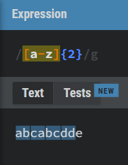

* 캡처링을 사용해주면 이전 문자를 기억해두고 현재 문자와 동일한지 비교하는 과정을 거치게 되어 해결이 가능하다

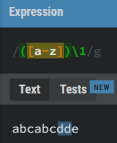

* 캡처링한 문자집합은 다시 꺼낼 수 있기 때문에 다음과 같이 원하는 포맷으로 변경할때 유용하게 활용할 수 있다

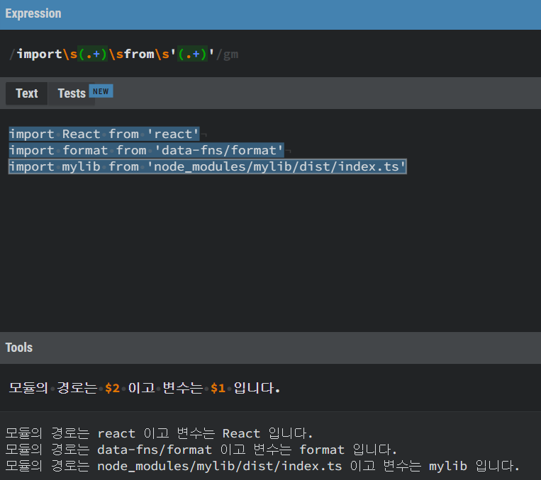