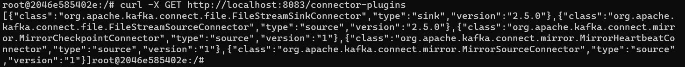
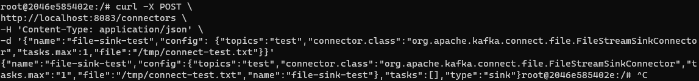
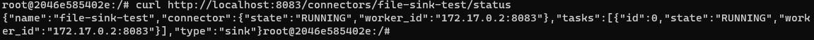
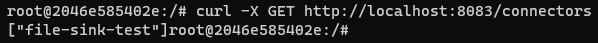
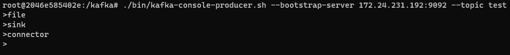
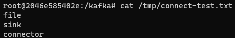

### 분산모드 커넥트 실행, 플러그인 확인

```
$ ./bin/connet-distributed.sh ./config/connect-distributed.properties
$ curl -X GET http://localhost:8083/connector-plugins
```



### FileStreamSinkConnector 테스트
```
$ curl -X POST \
http://localhost:8083/connectors \
-H 'Content-Type: application/json' \
-d '{"name":"file-sink-test",
"config": {
    "topics":"test",
    "connector.class":"org.apache.kafka.connect.file.FileStreamSinkConnector",
    "tasks.max":1,
    "file":"/tmp/connect-test.txt"
 }
}'
```

### FileStreamSinkConnector 실행 확인
```
$ curl http://localhost:8083/connectors/file-sink-test/status
```

### FileStreamSinkConnector로 생성된 파일 확인
```
$ ./bin/kafka-console-producer.sh --bootstrap-server my-kafka:9092 --topic test
$ cat /tmp/connect-test.txt
```





