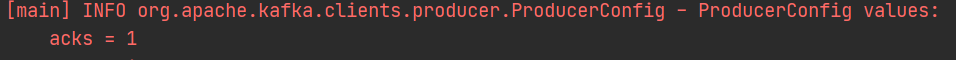

## 아파치 카프카 TOOL
<em><u>모두 JAVA기반이다.</u></em> <br>
`프로듀서` : 데이터 넣는역할 <br>
`토픽` : 프로듀서가 넣은 데이터가 토픽에 들어간다<br>
`컨슈머` : 토픽에 있는 데이터를 가져가는 역할<br>
`스트림즈` : 토픽에 있는 데이터를 StateFull, StateLess 하게 어떠한 처리를 해서 다시 토픽에 넣는역할 <br>
`커넥트` : 
1. 데이터 파이프라인을 연결하는 가장 핵심적인 tool 이다
2. 일반적인 프로듀서, 컨슈머와의 차이점은 클러스터로 운영이 가능하고, 템플릿형태로써 반복적으로 여러번 생성이 가능하다
```
프로듀서, 컨슈머를 개별로 운영하는것보다 훨씬 효율적인데, REST-API 
로 커넥트에 통신을 하여 반복적으로 만들 수 있다는 장점이 있다
```
* 커넥트(소스) : 
  * 프로듀서 역할 
  * 특정 데이터베이스나 소스 애플리케이션으로 부터  데이터를 가져와서 토픽에 넣는역할
* 커넥트(싱크) : 
  * 컨슈머 역할
  * 타겟 애플리케이션으로 데이터를 보내는 역할
___

## 카프카 브로커와 클러스터
`주키퍼` : 카프카 클러스터를 운영하기 위해 반드시 필요한 애플리케이션, 버전2까지는 필수이며 버전3부터는 주키퍼 없이 클러스터 운영이 가능하다(단, 아직 완벽하진 않음)
```
- 한개의 카프카 클러스터는 여러개의 브로커로 이루어져 있다
- 한개의 브로커는 한개의 Physical-Machine 이나 서버 혹은 Instance에서 동작하게 된다
- 상용환경에서 최소한 3개의 브로커를 운용하는게 일반적이고 데이터량이 많고 확장이 
 필요한 경우에는 50~100개까지 운영하는 경우도 있다
- 또는 상황에 따라서 클러스터를 2~3개로 나눠서 운영하는 경우도있다
```
`브로커` : 데이터를 분산저장하여 장애가 나더라도 데이터를 안전하게 사용할 수 있도록 도와주는 애플리케이션
___
## 카프카 클러스터와 주키퍼
`클러스터` : 
* 카프카 클러스터를 실행하기 위해서는 주키퍼가 필요함
* 여러대를 동시에 운영하는 경우도 많음(주키퍼 앙상블) 여러대를 운영하기 위해서는
* 주키퍼의 서로 다른 znode에 클러스터를 지정하면 되며, root znode에 <br>
각 클러스터별 znode를 생성하고 클러스터 실행시 root가 아닌 하위 znode로 설정
* 카프카3버전 부터는 주키퍼가 없어도 클러스터 동작 가능
___
## 브로커의 역할 - 컨트롤러, 데이터 삭제
`컨트롤러` :
* 다수의 브로커중 한대가 컨트롤러 역할을 한다
* 다른 브로커들의 상태체크, 브로커가 클러스터에서 빠지는 경우에(어떠한 이슈가 생겼을 경우) 브로커에 존재하는<br> 리더파티션을 재분배 한다
* 카프카는 지속적으로 데이터를 처리해야 하므로 비정상적인 브로커를 빠르게 클러스터에서 빼내는 것이 중요하다
* 컨트롤러 역할을 하는 브로커가 장애가 생기면 다른 브로커가 역할을 대신한다
```
데이터삭제:
- 다른 메시징 플랫폼과는 다르게 컨슈머가 데이터를 가져가도 토픽의 데이터는 삭제되지 않는다
- 데이터 삭제는 오직 브로커만 가능하며 파일 단위로 이루어지는데 이 단위를  '로그 세그먼트(log segment)'라고 한다
- 세그먼트에는 다수의 데이터가 들어있기 때문에 일반적인 데이터베이스처럼 특정 데이터를 선별해서 삭제할 수 없다
- CleanUp Policy라고 하는 delete 옵션에 의해서 특정 시간, 용량에 따라서 삭제를 수행할 수 있고 혹은 특수한 상황에서 Compact 옵션을 주게되면 가장 최신의 메시지KEY 가 있는 레코드를 제외하고 나머지 메시지KEY 가 있는 레코드를 삭제 할 수도있다
```
`컨슈머의 오프셋 저장` :
* 컨슈머가 토픽에서 데이터를 가져가면 어느 위치까지 가져갔는지 commit을 하게되는데 이때 __consumer_offsets 토픽에 저장한다.
* __consumer_offsets 토픽은 자동으로 생성되어 자동으로 관리되기 때문에 Internal 토픽이라고 부른다

`그룹 코디네이커`:
* 컨슈머 그룹의 상태를 체크하고 파티션을 컨슈머와 매칭되도록 분배하는 역할을 한다
* 일반적으로 파티션과 컨슈머는 1:1 매칭되는데 특정 컨슈머에 문제가 생길경우 문제가 발생한 컨슈머와 매칭되어있던 파티션이 다른 문제없는 파티션을 바라보도록 재할당(`리밸런스(rebalance)`) 하여 데이터가 끊임없이 처리되도록 도와준다
___

## 브로커의 역할 - 데이터의 저장
* 카프카를 실행할 때 config/server.properties의 log.dir 옵션에 정의한 디렉토리에 데이터를 저장한다
* 토픽의 이름과 파티션 번호의 조합으로 디렉토리가 생성된다
  * 예시) 파티션이 3개라면 hello.kafka-0, hello.kafka-1, hello.kafka-2
* 그 하위에 .index, .log, .timeindex, leader-epoch-checkpoint 와 같이 로그와 관련된 데이터파일들이 생성된다
  * log에는 메시지와 메타데이터를 저장
  * index는 메시지의 오프셋을 인덱싱한 정보를 담는다
  * timeindex에는 메시지에 포함된 timestamp값을 기준으로 인덱싱한 정보가 담긴다
  
## 로그와 세그먼트
* 여기서 말하는 로그는 .log 라고하는 세그먼트 파일이다
* 로그는 저장 할 최대크기를 설정 할 수도 있고, 신규 생성 될 다음 파일로 넘어가는 시간 주기를 설정 할 수도있다
  * log.segment.bytes: 바이트 단위의 최대 세그먼트 크기 지정 (기본값은 1GB)
  * log.roll.ms(hours): 세그먼트가 신규 생성된 이후 다음 파일로 넘어가는 시간 주기 (기본값은 7일)
* 가장 마지막 세그먼트 파일(쓰기가 일어나고 있는 파일)을 `액티브 세그먼트`라고 부른다
* 액티브 세그먼트는 브로커의 삭제대상에 포함되지 않는다
* 액티브가 아닌 일반 세그먼트는 retention 옵션에 따라 삭제 대상으로 지정된다
___

## 세그먼트와 삭제 주기(cleanup.policy=delete)
* delete 옵션은 세그먼트 파일을 삭제할때 사용하는 옵션이다(active 제외)
  * retention.ms(minutes, hours): 세그먼트를 보유할 최대 기간(기본값 7일)
  * retention.bytes: 파티션당 로그 적재 바이트 값(기본값 -1, 지정하지 않음을 뜻함)
  * log.retention.check.interval.ms: 세그먼트가 삭제 영역에 들어왔는지 확인하는 간격(기본값 5분)
## 세그먼트의 삭제
### (cleanup.policy=delete)
* 데이터삭제는 세그먼트 단위로만 이뤄지며 로그 단위(레코드 단위)로 개별삭제는 불가능하다
* 또한, 로그(레코드)의 메시지 키, 메시지 값, 오프셋, 헤더 등 이미 적재된 데이터의 수정또한 불가능 하기 때문에<br>프로듀서에서 데이터를 전송하기전, 컨슈머에서 데이터를 가져온 직후 데이터가 정상적인지 검증하는 과정이 필요하다
### (cleanup.policy=compact)
* 토픽 압축 정책은 일반적인 zip압축과는 다른 개념이다
* 하나의 세그먼트에는 동일한 메시지key를 여러 offset에 저장하는 경우가 생기는데 이때 최신 offset을 남겨두고 나머지 offset은 전부 삭제시키는 방식이다
* 물론 이 경우에도 active는 삭제대상에서 제외된다

### 테일/헤드 영역, 클린/더티 로그
* 테일 영역: 압축 정책에 의해 압축이 완료 된 레코드들, 중복 메시지 키가 없기 때문에 클린(clean)로그라고도 부른다
* 헤드 영역: 압축 정책이 되기 전 레코드들, 중복 메시지 키가 존재하기 때문에 더티(dirty)로그 라고도 부른다
* 데이터 압축 시작 시점 : min.cleanable.dirty.ratio 옵션을 따른다
  * 액티브 세그먼트를 제외한 세그먼트에 남아있는 테일 영역의 레코드 개수와 헤드 영역의 레코드 개수의 비율을 뜻한다.
  * 0.5로 설정하면 테일 영역의 레코드 개수와 헤드 영역의 레코드 개수가 동일할 경우 압축이 실행된다
  * 0.9와 같이 크게 설정하면 압축 시 데이터가 많이 줄어들기 때문에 압축효과가 좋으나 0.9비율이 될때까지 용량을 차지한다는 단점이 있다
  * 0.1과 같이 작게 설정하면 압축이 자주 일어나 가장 최신 데이터만 유지할 수 있지만 그만큼 브로커에 부담을 준다
___
## 브로커의 역할 - 복제(Replication)
* 복제를 통해 카프카는 장애허용 시스템(fault tolerant system)으로써 동작할 수 있다
* 클러스터로 묶인 브로커 중 일부에 장애가 발생하더라도 데이터 복제를 통해 데이터 유실을 방지한다
* 복제는 파티션 단위로 이뤄진다
* 토픽을 생성할때 파티션의 복제개수(replication factor)도 같이 설정되는데 직접 옵션을 선택하지 않으면 브로커에 설정된 옵션을 따라간다
* 복제 개수의 최솟값은1(복제없음)이고 최댓값은 브로커 개수만큼 설정 가능하다
* 프로듀서에 의해서 데이터가 처음 저장되는 파티션을 리더 파티션, 복제가 이뤄지는 파티션을 팔로워 파티션 이라고한다, 참고로 컨슈머도 리더 파티션으로 부터 데이터를 가져간다
* replication factor 가 3이고 데이터가 1GB 들어왔다고 가정한다면 나머지 팔로워 파티션에도 각각 1GB가 저장되기 때문에 총 3GB가 저장된다(Disk를 소모하여 고가용성을 챙기는 행위)
* 일반적으로 factor 2를 사용하고 gps 정보와 같이 일부 데이터가 유실되어도 큰 영향이 없는 경우 1, 금융 정보와 같이 유실에 민감한 데이터의 경우 3을 설정한다
* factor 설정값이 커질수록 그만큼 네트워크 통신도 더 발생하고 디스크 소모도 배수로 늘어나는 것을 고려해야한다
___
## ISR(In-Sync-Replicas)
* ISR은 리더 파티션과 팔로워 파티션이 모두 싱크가 된 상태를 뜻한다
* 리더 파티션에 오프셋3까지 데이터가 저장되어있는데 팔로워 파티션에 오프셋2까지만 저장되어 있다면 싱크가 이뤄지지 않았다고 판단한다
* 싱크가 되지 않은 상태에서 팔로워 파티션을 새로운 리더로 선출할 경우가 필요할 수도 있다
(= 서비스를 중단하지 않고 지속적으로 토픽을 사용)
  * unclean.leader.election.enable=true : 유실을 감수함. 복제가 안된 팔로워 파티션을 리더로 승급
  * unclean.leader.election.enable=false : 유실을 감수하지 않음. 해당 브로커가 복구될 때까지 중단
### (ISR이 완전히 이뤄지지 않은 상태에서 컨슈머는 어디까지 데이터를 가져가는가?)
* 토픽에서 min.insync.replicas=2 와 같은 옵션을 설정할 수 있다
* 리터 파티션(오프셋3) / 팔로워 파티션1(오프셋2) / 팔로워 파티션2(오프셋1)의 상태일때 위 옵션에 따라서 오프셋2까지 데이터를 가져가게 되며 옵션값이3 이였다면 오프셋1까지 가져가게된다
* 컨슈머가 가져갈 수 있는 상태의 레코드 오프셋 번호를 하이 워터마크라고 부른다
___
## 토픽과 파티션
* 토픽은 1개이상의 파티션을 소유하고 있다
* 파티션에는 프로듀서가 보낸 데이터가 저장되며 '레코드(record)' 라고 부른다
* 일반적인 자료구조인 큐(FIFO)와 비슷하다 큐와는 다르게 데이터를 꺼낸다고 삭제되진 않는다
* 때문에 다양한 목적을 가진 여러 컨슈머 그룹들이 토픽의 데이터를 여러번 가져갈 수 있다
## 토픽 생성시 파티션이 배치되는 방법
* 파티션이 5개인 토픽을 생성할 경우 0번 브로커부터 2번 브로커까지 round-robin 방식으로 파티션들이 생성된다
* 카프카 클라이언트는 리더 파티션이 있는 브로커와 통신하여 데이터를 주고받기 때문에 여러 브로커에 부하분산을 할 수 있다
* 한마디도 통신이 집중되는(hot spot)현상을 막고 선형 확장(linear scale out)을 하여 데이터가 많아지더라도 자연스럽게 대응할 수 있다
* 특정 브로커에 리더파티션이 몰려 생성되어 있을 경우 해당 브로커의 부하가 커질 수 있기 때문에 kafka-reassign-partitions.sh 명령으로 파티션을 재분배 할 수 있다
### (파티션 개수와 컨슈머 개수의 처리량)
* 한개의 컨슈머는 경우에따라 여러개의 파티션으로 부터 데이터를 가져올 수 있으나 한개의 파티션은 여러개의 컨슈머에게 데이터를 전달 할 수 없다 (1:N 관계)
* 컨슈머 개수를 늘림과 동시에 파티션 개수도 늘리면 처리량 증가의 효과를 볼 수 있다
* 프로듀서가 초당 10개의 데이터를 보내는데 컨슈머가 초당1개의 데이터를 가져갈 경우 데이터 추가에 지연이 발생하고 이를 컨슈머랙이라고 한다
### (파티션 개수를 줄이는 것은 불가능)
* 한번 생성 된 파티션을 줄이는 방법은 토픽을 삭제하고 재생성하는 방법밖에 없기 때문에 파티션을 늘리때는 신중해야한다
___
## 레코드
* 타임스탬프, 헤더, 메시지 키, 메시지 값, 오프셋으로 구성된다
* 프로듀서가 생성한 레코드가 브로커에 전송되면 오프셋과 타임스탬프가 지정되어 저장된다
* 브로커에 한번 적재된 레코드는 수정할 수 없고 로그 리텐션 기간 또는 용량에 따라서만 삭제된다
### (타임스탬프)
* 스트림 프로세싱에 활용하기 위한 시간을 저장하는 용도로 사용된다
* 카프카 0.10.0.0이후 버전부터 추가된 타임스탬프는 Unix timestamp가 포함된다
* 설정하지 않으면 기본값으로 ProducerRecord 생성시간(CreateTime)이 들어간다
* 또는 브로커 적재 시간(LogAppendTime)으로 설정할 수 있다
* 해당 옵션은 토픽 단위로 설정 가능하며 message.timestamp.type을 사용한다
### (오프셋)
* 오프셋은 프로듀서가 생성한 레코드에는 존재하지 않는다
* 프로듀서가 전송한 레코드가 브로커에 적재될 때 오프셋이 지정된다
* 오프셋은 0부터 시작되고 1씩 증가한다
* 컨슈머는 오프셋을 기반으로 처리 완료된 데이터와 앞으로 처리할 데이터를 구분한다
* 각 메시지는 파티션별로 고유한 오프셋을 가지므로 컨슈머에서 중복 처리를 방지하기 위한 목적으로도 사용한다
### (헤더)
* key/value 데이터를 추가할 수 있다
* 레코드의 스키마 버전이나 포맷과 같이 데이터 프로세싱에 참고할만한 정보를 담아 사용할 수 있다
### (메시지 키)
* 처리하고자 하는 메시지 값을 분류하기 위한 용도로 사용되며, 이를 파티셔닝이라고 부른다.
* 파티셔너(Partitioner)에 따라 토픽의 파티션 번호가 정해진다
* 필수값이 아니며, 지정하지 않으면 null로 설정된다
* 메시지 키가 null인 레코드는 특정 토픽의 파티션에 라운드 로빈으로 전달된다
* null이 아닌 메시지 키는 해쉬값에 의해서 특정 파티션에 매핑되어 전달된다(기본 파티셔너의 경우)
### (메시지 값)
* 메시지 값은 실직적으로 처리할 데이터가 담기는 공간이다
* 메시지 값의 포맷은 제네릭으로 사용자에 의해 지정된다
* Float, Byte[], String 등 다양한 형태로 지정 가능하며 사용자 지정 포맷으로 직렬화/역직렬화 클래스를 만들어 사용할 수도 있다
* 컨슈머는 브로커에 저장된 레코드 메시지 값의 포맷을 알지 못하기 때문에 미리 역직렬화 포맷을 알고 있어야 한다
___
## 토픽이름 제약조건
* 빈 문자열 토픽 이름은 지원하지 않는다
* 토픽 이름은 마침표 하나(.)또는 마침표 둘(..)로 생성될 수 없다
* 토픽 이름의 길이는 249자 미만으로 생성되어야 한다
* 토픽 이름은 영어 대, 소문자와 숫자 0~9 그리고 마침표(.), 언더파(_), 하이픈(-) 조합으로 생성할 수 있다
* 카프카 내부 로직 관리에 사용되는 __consumer_offsets, __transaction_state 와 동일한 이름으로 생성 불가능
* 카프카 내부저긍로 사용하는 로직때문에 마침표(.)와 언더바(_)가 동시에 들어가면 안된다(사용은 가능하나 WARNING메시지 발생)
* 토픽의 이름은 최초 생성이후 변경이 불가능하기 때문에 신중히 작명해야한다
## 토픽 작명의 템플릿과 예시
<환경>.<팀-명>.<애플리케이션-명>.<메시지-타입><br>
예시)prd.marketing-team.sms-platform.json<br>
<프로젝트-명>.<서비스-명>.<환경>.<이벤트-명><br>
예시)commerce.payment.prd.notification<br>
<환경>.<서비스-명>.<JIRA-번호>.<메시지-타입><br>
예시)dev.email-sender.jira-1234.email-vo.custom<br>
<카프카-클러스터-명>.<환경>.<서비스-명>.<메시지-타입><br>
예시)aws-kafka.live.marketing-platform.json<br>
___
## 클라이언트 메타데이터
* 카프카 클라이언트는 통신하고자 하는 리더 파티션의 위치를 알기 위해 데이터를 주고(프로듀서) 받기(컨슈머) 전에 메타데이터를 브로커로부터 전달받는다
* 메타데이터는 다음과 같은 옵션을 통해 리프래쉬된다
  * 카프카 프로듀서 메타데이터 옵션
  * metadata.max.age.ms : 메타데이터를 강제로 리프래시하는 간격(기본값 5분)
  * metadata.max.idle.ms : 프로듀서가 유휴상태일 경우 메타데이터를 캐시에 유지하는 기간. 예를들어 프로듀서가 특정 토픽으로 데이터를 보낸 이후 지정한 시간이 지나고 나면 강제로 메타데이터를 리프래쉬(기본값 5분)
## 클라이언트 메타데이터의 이슈가 발생한 경우
* 카프카 클라이언트는 반드시 리더파티션과 통신해야 한다
* 메타데이터가 최신상태로 리프래쉬되지 않아 잘못된 브로커에 요청할 경우 LEADER_NOT_AVAILABLE 익셉션이 발생한다
* 보통 클라이언트가 데이터를 요청한 브로커에 리더파티션이 없는 경우 나타나며 대부분 메타데이터 리프래쉬 이슈로 발생한다
* 이 에러가 자주 발생한다면 메타데이터 리프래쉬 간격을 확인하고, 클라이언트가 정상적인 메타데이터를 가지고 있는지 확인한다
___
## 카프카 클러스터를 운영하는 방법
```
아파치 카프카 클러스터를 서버에 직접 설치하고 운영하는것은 일반적인 방법이지만
최적화된 카프카 클러스터를 사용하기 위해서는 노하우가 필요하기 때문에 SaaS(Software-as-a-Service)를 도입하는 것을 고려해보자.
```
 ### (오픈소스 카프카 VS 기업용 카프카(컨플루언트 플랫폼))
 오픈소스 카프카는 기본적인 프로듀서, 컨슈머, 커넥트, 스트림즈를 제공하며 기업용도 마찬가지이다 기업용 카프카의 차이점이라면 환경에 맞추어 제공되는 플러그인, 모니터링툴, 최적의 설정 노하우 등의 서비스를 유료로 제공받을 수 있다.

 ### 오픈 소스 카프카를 직접 설치하여 운영하는 경우
|항목|개발용 카프카 클러스|상용 환경 카프카 클러스터|
|-|-|-|
|브로커 개수|5개|10개|
|메모리|16GB(heap memory 6GB)|32GB(heap memory 6GB)|
|CPU|16core|24core|
|디스크|사용량에 따라 달라짐|사용량에 따라 달라짐|
___
## 클라우드 서비스 - 컨플루언트
```
카프카에 대한 개념을 최초로 생각하고 아키텍처를 제안, 개발한 인물인 제이 크랩스와 그의 동료들이 설립한 회사이다. 아파치 카프카의 생태계를 가꾸고 발전시키는 데에 선구적인 역할을 하고 있다. 컨플루언트에서 오픈소스로 공개하고 관리하고 있는 스키마 레지스트리, ksqlDB, connector, restproxy 등과 같은 소스 코드들은 카프카를 활용하는 생태계의 범위를 점차 늘려가고 있다.
```
|<center>컨플루언트 클라우드</center>|<center>컨플루언트 플랫폼</center>|
|-|-|
|- 클라우드 기반 카프카 클러스터|- 온프레미스 기반 설치형 카프카 클러스터|
|- 요구사항에 따라 자동으로 늘려주는 클러스터 리소스 제공|- 서버를 내부에서 발급하여 직접 설치|
|- GCP, AWS등 클러스터 설치 위치 지정(리전 단위) 가능|- 필요에 따라 컨플루언트 팀에서 지원, 학습 제공|
|- 120개가 넘는 커넥터, ksqlDB, 스키마 레지스트리 서비스 제공|- 단계별 스토리지 기능(Tiered-storage)제공|
|- 99.95% SLA |- GUI 기반 모니터링 시스템 제공|
|- 엔터프라이즈 수준의 보안 수준 제공|
|- 데이터 적재 제한 없음||
___
## 클라우드 서비스 - AWS MSK
* Amazon Managed Streaming for Apache Kafka
* 카프카 클러스터의 생성, 업데이트, 삭제 등과 같은 운영 요소를 대시보드를 통해 제공한다
* 안전하게 접속할 수 있도록 클러스터와 연동시 TLS인증 보안을 설정 할 수 있다
* 아파치 카프카 버전을 직접 선택할 수 있다
* 따라서 이미 운영중이던 카프카를 연동할때 버전이슈를 발생시키지 않는다
___
## SaaS로 카프카 클러스터를 운영할 경우 장점
(인프라 관리의 효율화)

* 카프카 클러스터는 상용환경에서 최소 broker 서버 3대 2버전 이하라면 zookeeper 3대를 함께 운영 관리해야하는데, 이렇게 많은 서버를 운영자가 관리하는것은 굉장히 힘든 일이다.
* SaaS 환경에서는 서비스 이슈에 대해서 자동으로 감지하고 Scale in/out 이 자유롭기 때문에 운영관리함에 있어 훨씬 효율적이다


(모니터링 대시보드 제공)
* 브로커들이 제공하는 지표들을 수집하고 적재하고 대시보드화 하여 시각화해야 카프카 클러스터를 효과적으로 운영하기 위한 설정들을 수정하고 적용할 수 있을것이다. 
* 운형 노하우가 없다면 어떤 지표들을 수집해야하는지, 어떤 지표가 중요한지 알아가는데에도 시간이 걸리며, 수집한 지표를 저장할 저장소를 구축하고 대시보드를 운영하기 위해 신규로 추가 플랫폼을 설치, 운영해야한다. 
* SaaS형 카프카에서는 이러한 부분들을 단지 몇번의 클릭으로 해결할 수 있다.

(보안설정)
* 보안이 설정되지 않은 클러스터의 경우 호스트와 포트 번호만 알면 모든 토픽의 데이터를 가져갈 수 있다.
* 또한, 어드민API를 통해 카프카 클러스터에 악의적인 공격을 할 수도 있다. 
* 카프카 브로커는 SSL, SASL, ACL과 같이 불특정 다수의 침입을 막기위해 다양한 종류의 보안 설정 방안을 제공한다. 
* 이또한 노하우가 없다면 어떤 종류의 보안설정을 할지 고르고 설정, 운영하는 것은 쉬운일이 아니다. 
* SaaS형에서는 클러스터 접속 시 보안 설정을 기본으로 제공하고 있다. 
* 클러스터 생성 시 보안 설정을 통해 인가된 사용자만 카프카 클러스터에 접근할 수 있도록 할 수 있다.
___
## SaaS로 카프카 클러스터를 운영할 경우 단점
(서비스 사용 비용)
* 직접 설치하고 운영한다면 발생되지 않을 서버 사용 비용이 추가로 발생한다
* 인스턴스 발급 및 사용 비용은 클러스터를 단순히 실행만 하더라도 빠져나가는 비용이며 추가적으로 스토리지 요금과 데이터 전송 요금이 발생한다

(커스터마이징의 제한)
* 카프카 클러스터를 운영하다 보면 서버의 최적화 옵션이나 카프카 브로커 옵션의 조정이 필요한 경우가 발생한다
* SaaS 서비스들은 자동화된 설정에 맞춰 아키텍처를 따라가기 때문에 상세한 설정을 적용하거나 클러스터 아키텍처의 변화가 필요할 경우 적용하기가 매우 어렵다
* 멀티 클라우드, 하이브리드 클라우드 형태로 카프카 클러스터를 구성하는 것은 SaaS형에서 불가능하다.
___
## 카프카 커맨드 라인 툴
* 카프카를 운영할 때 가장 많이 접하는 도구이다
* 카프카 브로커 운영에 필요한 다양한 명령을 내릴 수 있다
* 토픽이나 파티션 개수 변경과 같은 명령을 실행하는 경우 활용할 수 있다
* 커맨드 라인 툴을 통해 토픽 관련 명령을 실행할 때 필수 옵션과 선택 옵션이 있다
* <strong>선택 옵션은 지정하지 않을시 브로커에 설정된 기본 설정값 또는 커맨드 라인 툴의 기본값으로 대체되어 설정된다</strong>
* 그러므로 커맨드 라인 툴을 사용하기 전에 현재 브로커에 옵션이 어떻게 설정되어 있는지 확인한 후에 사용하면 커맨드라인 툴 사용시 실수할 확률이 줄어든다
____
### 카프카 설정
log.dirs : 파일시스템을 설정한다, 프로듀서가 전송하여 브로커에서 적재되는 데이터저장소<br>
num.partitions : 카프카 토픽을 만들때 기본적으로 만들 파티션 갯수

log.retention.hours : 설정한 시간이 지난 데이터는 삭제한다<br>
log.segment.bytes<br>
log.retention.check.interval.ms<br>
___
### kafka-topics.sh
* hello.kafka 토픽처럼 카프카 클러스터 정보와 토픽 이름만으로 토픽을 생성할 수 있었다
* 클러스터 정보와 토픽 이름은 토픽을 만들기 위한 필수 값이다
* kafka-topics.sh로 토픽을 생성할 수 있으며 파티션 개수, 복제 개수 등과 같이 다양한 옵션이 포함되어 있지만 별도의 설정을 하지 않으면 모두 브로커에 설정된 기본값으로 생성된다

```
$KAFKA/bin/kafka-topics.sh -- create \
--bootstrap-server my-kafka:9092 \
--topic hello.kafka

$KAFKA/bin/kafka-topics.sh --describe \
--bootstrap-server my-kafka:9092 \
--topic hello.kafka 
```
 
 * 파티션 개수, 복제 개수, 토픽 데이터 유지 기간 옵션들을 지정하여 토픽을 생성하고 싶다면 다음과 같이 명령을 실행하면 된다
 * 생성된 토픽들의 이름을 조회하려면 --list 옵션을 사용한다

```
$KAFKA/bin/kafka-topics.sh --create \
--bootstrap-server my-kafka:9092 \
--partitions 10 \
--replication-factor 1 \
--topic hello.kafka2 \
--config retention.ms=172800000

$KAFKA/bin/kafka-topics.sh --list --bootstrap-server my-kafka:9092
```

* 파티션 개수를 늘리기 위해서 --later 옵션을 사용하면 된다

```
$KAFKA/bin/kafka-topics.sh --bootstrap-server my-kafka:9092 --topic hello.kafak \
--alter --partitions 4
```

* <strong>파티션 개수를 늘릴 수 있지만 줄일 수는 없다</strong> 다시 줄이는 명령을 내리면 InvalidPartitionsException이 발생한다
* 분산 시스템에서 이미 분산된 데이터를 줄이는 방법은 매우 복잡하다
* 삭제 대상 파티션을 지정해야할 뿐만 아니라 기존에 저장되어 있던 레코드를 분산하여 저장하는 로직이 필요하기 때문이다
* 피치못할 사정으로 파티션 개수를 줄여야 할 때는 토픽을 새로만드는 편이 좋다


____
### kafka-config.sh
* 토픽의 일부 옵션을 설정하기 위해 사용하는 쉘스크립트이다
* --alter와 --add-config 옵션을 사용하여 min.sync.replicas 옵션을 토픽별로 설정할 수 있다

```
$KAFKA/bin/kafka-config.sh --bootstrap-server my-kafka:9092 \
--alter \
--add-config min.insync.replicas=2 \
--topic test
```


* server.properties의 값을 확인하지 않더라도 브로커에 설정한 기본값은 --all --broker --describe 옵션을 사용하여 조회할 수 있다
* 기본설정된 파티션 갯수는 몇개인지, 네트워크 설정은 어떻게 되어있는지 등 자세한 정보를 확인할 수 있다

```
$KAFKA/bin/kafka-config.sh --bootstrap-server my-kafka:9092 \
--broker 0 \
--all \
--describe
```

___
### kafka-console-producer.sh
* 별도의 프로듀서를 개발하지 않고 테스트 용도로 토픽에 데이터를 넣을 때 활용할 수 있다
* 특정 레코드에 대해서 순서를 지키고싶거나, 특정 레코드끼리 같이 처리하고 싶을때에 메세지 키를 활용할 수 있다
* 메세지 키와 함께 메세지 벨류를 전송할때는 parse.key=true 옵션을 주며 해당 옵션이 없으면 메세지 키가 null로 전송된다
* parse.key=true 옵션과 함께 key.separator 옵션을 주지 않으면 기본값 "Tab delimiter(\t)"로 설정된다

```
(메세지 값만 전송할때)
$KAFKA/bin/kafka-console-producer.sh --bootstrap-server my-kafka:9092 \
--topic hello.kafka
>hello
>kafaka
>0
(메세지 키도 함께 전송할때)
$KAFKA/bin/kafka-console-producer.sh --bootstrap-server my-kafka:9092 \
--topic hello.kafka \
--property "parse.key=true" \
--property "key.separator=:"
>key1:no1
>key2:no2
```

```
메시지 키와 메시지 값을 함께 전송한 레코드는 토픽의 파티션에 저장된다
메시지 키가 null인 경우에는 레코드 배치 단위(레코드 전송 묶음)로 라운드 로빈으로 전송한다
메시지 키가 존재하는 경우에는 키의 해시값을 작성하여 존재하는 파티션 중 한개에 할당된다
이로 인해 메시지키가 동일한 경우 동일한 파티션으로 전송된다
```
___
### kafka-console-consumer.sh
* 별도의 컨슈머를 개발하지 않고 테스트 용도로 토픽의 데이터를 조회할 때 활용할 수 있다
* --from-beginning 옵션을 주면 토픽에 저장된 가장 처음 데이터부터 출력한다
* 레코드의 메시지 키와 메시지 값을 확인하고 싶다면 --property 옵션을 사용한다

```
(메세지 값만 조회할 때)
$KAFKA/bin/kafka-console-consumer.sh \
--bootstrap-server my-kafka:9092 \
--topic hello.kafka --from-beginning
hello
kafka
0
1
2
3

(메세지 키도 함께 조회할 때)
$KAFKA/bin/kafka-console-consumer.sh \
--bootstrap-server my-kafka:9092 \
--topic hello.kafka \
--property print.key=true \
--property key.separator="-" \
--from-beginning
key2-no2
key2-no2
key1-no1
null-1
null-2
```
* 실제 운영 환경에서는 토픽에 많은 데이터 레코드들이 쌓여있을 텐데 콘솔컨슘을 할게 되면 해당 데이터들이 전부 print되면서 확인하기 불편한 상황이 발생할 수 있다
* --max-messages 옵션을 사용하면 최대 컨슘 메세지 개수를 설정할 수 있다

```
$KAFKA/bin/kafka-console-consumer.sh \
--bootstrap-server my-kafka:9092 \
--topic hello.kafka --max-messages 1
hello
```

* --partition 옵션을 사용하면 특정 파티션만 컨슘할 수 있다

```
$KAFKA/bin/kafka-console-consumer.sh \
--bootstrap-server my-kafka:9092 \
--topic hello.kafka \
--partition 2 \
--from-beginning
hello
```

* --group 옵션을 사용하면 컨슈머 그룹을 기반으로 kafka-console-consumer가 동작한다
* 컨슈머 그룹이란 특정 목적을 가진 컨슈머들을 묶음으로 사용하는것을 뜻한다
* 컨슈머 그룹으로 토픽의 레코드를 가져갈 경우 어느 레코드까지 읽었는지에 대한 데이터가(커밋) 카프카 브로커(__consumer_offsets)에 저장된다

```
$KAFKA/bin/kafka-console-consumer.sh \
--bootstrap-server my-kafka:9092 \
--topic hello.kafka \
--group hello-group --from-beginning
key2-no2
key2-no2
key1-no1
null-1
null-2
```
___
### kafka-consumer-groups.sh
* 컨슈머 그룹은 따로 생성하는 명령을 날리지 않고 컨슈머를 동작할 때 컨슈머 그룹이름을 지정하면 새로 생성된다
* 생성된 컨슈머 그룹의 리스트는 다음과 같이 확인할 수 있다
* 상세정보를 확인할 때 --describe 옵션을 같이 설정하자

```
$KAFKA/bin/kafka-consumer-groups.sh \
--bootstrap-server my-kafka:9092 \
--list
hello-group
```
* --describe 옵션을 사용하면 해당 컨슈머 그룹이 어떤 토픽을 대상으로 레코드를 가져갔는지 상태를 확인할 수 있다
* 파티션 번호, 현재까지 가져간 레코드의 오프셋, 파티션 마지막 레코드의 오프셋, 컨슈머 랙, 컨슈머ID, 호스트를 알 수 있기 때문에 컨슈머의 상태를 조회할때 유용하다
* 컨슈머랙 : 마지막 레코드의 오프셋과 현재까지 가져간 레코드의 오프셋 차이


(오프셋 리셋)
* commit했던 기록을 초기화 하고 어느 오프셋부터 가져갈지 정할 수 있다
* 한번 처리했던 데이터를 다시 처리하고 싶을 때 활용할 수 있다

```
$KAFKA/bin/kafka-consumer-groups.sh \
--bootstrap-server my-kafka:9092 \
--group hello-group \
--topic hello.kafka \
--reset-offsets --to-ealiest --execute
```


(오프셋 리셋 종류)
* --to-ealist : 가장 처음 오프셋(작은 번호)으로 리셋
* --to-latest : 가장 마지막 오프셋(큰 번호)으로 리셋
* --to-current :  현 시점 기준 오프셋으로 리셋
* --to-datetime{YYYY-MM-DDTHH:mmSS.sss} : 특정 일시로 오프셋 리셋(레코드 타임스탬프 기준)
* --to-offset{long} : 특정 오프셋으로 리셋
* --shift-by{+/- long} : 현재 컨슈머 오프셋에서 앞뒤로 옮겨서 리셋
___
### kafka-producer-perf-test.sh
* 카프카 프로듀서로 퍼포먼스를 측정할 때 사용된다

```
$KAFKA/bin/kafka-producer-perf-test.sh \
--producer-props bootstrap.server=my-kafka:9092 \
--topic hello.kafka \
--num-records 10 \   
--throughput 1 \
--record-size 100 \
--print-metric
```

### kafka-consumer-perf-test.sh
* 카프카 컨슈머로 퍼포먼스를 측정할 때 사용된다
* 카프카 브로커와 컨슈머(여기서는 해당 스크립트를 돌리는 호스트)간의 네트워크를 체크할 때 사용할 수 있다

```
$KAFKA/bin/kafka-consumer-perf-test.sh \
--bootstrap-server my-kafka:9092 \
--topic hello.kafka \
--messages 10 \
--show-detailed-stats
```

### kafka-reassign-partitions.sh
* 리더 파티션과 팔로워 파티션이 위치를 변경할 수 있다
* 카프카 브로커에는 auto.leader.rebalance.enable 옵션이 있는데 이 옵션의 기본값은 true로써 클러스터 <br>단위에서 리더 파티션을 자동 리밸런싱하도록 도와준다
* 브로커의 백그라운드 스레드가 일정한 간격으로 리더의 위치를 파악하고 필요시 리더 리밸런싱을 통해 리더의<br> 위치가 알맞게 배분된다

```
$KAFKA/bin/kafka-reassign-partitions.sh --zookeeper my-kafka:2181 \
--reassignment-json-file partitions.json --execute
```

### kafka-delete-record.sh
* 레코드를 바로 삭제하는 것이 아니라 워터마크를 표시한다

```
$KAFKA/bin/kafka-delete-records.sh --bootstrap-server my-kafka:9092 \
--offset-json-file delete.json
```

### kafka-dump-log.sh
* 운영 환경 중 세그먼트 로그의 디테일한 정보를 확인할 때 활용한다

```
$KAFKA/bin/kafka-dump-log.sh \
--files data/hello.kafka-0/00000000000000000000.log \
--deep-iteration
```
___
## 토픽을 생성하는 두가지 방법
* 첫번째, 카프카 컨슈머 또는 프로듀서가 카프카 브로커에 생성되지 않은 토픽에 대해 데이터를 요청할 때
* 두번째, 커맨드 라인 툴로 명시적으로 토픽을 생성할 때
* 토픽을 효과적으로 유지보수 하기 위해 명시적으로 생성하는것을 추천한다
* 토픽마다 처리되어야 하는 데이터의 특성이 다르기 때문이다
* 토픽을 생성할 때는 데이터 특성에 따라 옵션을 다르게 설정할 수 있다
```
예를 들어, 동시에 데이터 처리량이 많아야 하는 토픽의 경우 파티션의 개수를 100으로 설정한다.
단기간 데이터 처리만 필요한 경우에는 토픽에 들어온 데이터의 보관기간 옵션을 짧게 설정할 수도 있다. 
그러므로 토픽에 들어오는 데이터양과 병렬로 처리되어야 하는 용량을 잘 파악하여 생성하는 것이 중요하다
```
___
## 카프카 브로커와 로컬 커맨드 라인 툴 버전을 맞춰야 하는 이유
* 브로커의 버전이 업그레이드 됨에 따라 커맨드 라인 툴의 상세 옵션이 달라진다
* 때문에 명령이 정상적으로 실행되지 않을 수 있다
* 브로커 버전이 2.5.0 이라면 커맨드 라인 툴 바이너리 버전도 2.5.0으로 맞춰주자
___
## 프로듀서
* 콘솔 프로듀서가 아닌 별도의 애플리케이션을 개발할때 카프카 클러스터와 연동하기 위해 사용되는<br> 라이브러리는 공식적으로 자바 라이브러리가 제공되며 파이썬이나 고랭 같은 라이브러리도<br> 존재하지만 공식적인 라이브러리가 아니기 때문에 성능, 기능, 안정성 등에 차이가 발생할 수 있다
* 프로듀서 애플리케이션은 카프카에 필요한 데이터를 선언하고 브로커의 특정 토픽의 파티션에 전송한다
* 데이터 전송시 리더파티션을 갖고 있는 카프카 브로커와 직접 통신한다
* 카프카 브로커로 데이터를 전송할 때 내부적으로 파티셔너, 배치 생성 단계를 거친다

(프로듀서 내부 구조)
* ProducerRecord : 프로듀서에서 생성하는 레코드. 오프셋은 미포함
* send() : 레코드를 전송 요청 메서드
* Partitioner : 어느 파티션으로 전송할지 지정하는 파티셔너. 기본값으로 DefaultPartitioner로 설정됨
* Accumulator : 배치로 묶어 전송할 데이터를 모으는 버퍼
___
## 파티셔너(Partitioner)
* 프로듀서API를 사용하면 'UniformStickyPartitioner'와 'RoundRobinPartitioner' 2개 파티셔너를 제공한다
* 카프카 클라이언트 라이브러리 2.5.0 기준 'UniformStickyPartitioner'가 기본 설정된다

(메시지 키가 있을 경우 동작)
* 'UniformStickyPartitioner'와 'RoundRobinPartitioner' 둘다 메시지 키와 파티션을 매칭하여 레코드를 전송
* 동일한 메시지 키가 존재하는 레코드는 동일한 파티션 번호에 전달된다
* <strong>만약 파티션 개수가 변경 될 경우 메시지 키와 파티션 번호 매칭은 깨지게 된다</strong>

(메시지 키가 없을 경우 동작)<br>
RoundRobinPartitioner:
* ProducerRecord가 들어오는 대로 파티션을 순회하면서 전송
* 어큐뮤레이터에서 묶이는 정도가 적기 때문에 전송 성능이 낮음

UniformStickyPartitioner:
* 어큐뮤레이터에서 레코드들이 배치로 묶일 때까지 기다렸다가 전송
* 배치로 묶일 뿐 결국 파티션을 순회하면서 보내기 때문에 모든 파티션에 분개되어 전송됨
* RoundRobinPartitioner에 비해 향상된 성능을 가진다


### 프로듀서의 커스텀 파티셔너
* 카프카 클라이언트 라이브러리에는 사용자 지정 파티셔너를 생성하기 위한 Partitioner 인터페이스를 제공한다
* Partitioner 인터페이스를 상속받은 사용자 정의 클래스에서 메시지 키 또는 메시지 값에 따른 파티션 지정 로직을 적용할 수도 있다
* 파티셔너를 통해 파티션이 지정된 데이터는 어큐뮬레이터에 버퍼로 쌓인다
* 센더(sender)스레드는 어큐뮬레이터에 쌓인 배치 데이터를 가져가 카프카 브로커로 전송한다
___
## 프로듀셔 주요 옵션(필수 옵션)
* 필수 옵션은 default 값이 없기 때문에 반드시 값을 지정해야한다

```
- bootstrap.servers: 프로듀서가 데이터를 전송할 대상, 카프카 클러스터에 속한 브로커의 호스트
이름:포트를 1개 이상 작성한다. 2개 이상 브로커 정보를 입력하여 일부 브로커에 이슈가 발생하더라도 접
속하는 데에 이슈가 없도록 설정 가능하다
- key.serialize: 레코드의 메시지 키를 직렬화하는 클래스를 지정한다
- value.serialize: 레코드의 메시지 값을 직렬화하는 클래스를 지정한다
직렬화의 경우 프로듀서와 컨슈머 상호간에 약속(규약)을 통해서만 어떤방식으로 직렬화 했고, 역직렬화 해야하는지 알 수 있다
따라서 "값을 모두 String으로 직렬화한다" 또는 "키 혹은 값에 직렬화 방식을 표시한다" 등의 약속등을 활용하는것도 방법이다
```
(String 으로 직렬화할 경우 트레이드오프)
* kafka-console-consumer 에서 역직렬화 할때 ByteArray를 사용한다. 이때문에 String이 아닌 다른 방식으로 직렬화할때 화면으로 출력이 되지<br> 
않아 디버깅하지 못하는 데이터가 발생할 수 있다
* String으로 직렬화할 경우 다른 방식에 비해 데이터가 크기 때문에 네트워크 사용량, 디스크 사용량 등에 상대적으로 소모도가 크다
* 하지만 컨슈머 입장에서 직렬화 방식을 알 수 있는 방법이 없기 때문에 "값을 모두 String으로 직렬화한다" 와 같은 규약으로 운영할 경우 운영상 이점이 있다
## 프로듀서 주요 옵션(선택 옵션)
* acks: 프로듀서가 전송한 데이터가 브로커들에 정상적으로 저장되었는지 전송 성공 여부를 확인하는 데에 사용하는 옵션이다<br>
0, 1, -1(all)중 하나로 설정할 수 있다, 기본 값은 1이다
* linger.ms: send() 메소드를 통해 sender가 브로커로 데이터를 전송하며 이때, 배치로 전송하기 전까지 기다리는 최소 시간이며, 기본값은 0이다
* retries: 브로커로부터 에러를 받고 난 뒤 재전송을 시도하는 횟수를 지정한다, 기본값은 2147483647이다
* max.in.flight.requests.per.connection: 한번에 요청하는 최대 커넥션 개수, 설정된 값만큼 동시에 전달 요청을 수행하며, 기본값은 5이다
* partitioner.class: 데이터를 전송했을때 파티셔너에 의해서 어느 파티션에 저장될지 결정되며, 커스텀 파티셔너를 해당옵션에 지정하여
기본값인 UniformStickyPartitioner를 커스텀으로 바꿀 수 있다
* enable.idempotence: 멱등성 프로듀서로 동작할지 여부를 설정하며, 기본값은 false이다
  * 네트워크 문제로 인해 프로듀서가 데이터를 중복해서 전송할 수 있는데 중복전송을 막기위해 설정하는 값이다
* transactional.id: 프로듀서가 레코드를 전송할 때 레코드를 트랜잭션 단위로 묶을지 여부를 설정하며, 기본값은 null이다

___

### ISR(In-Sync-Replicas)
* ISR은 리더 파티션과 팔로워 파티션이 모두 싱크가 된 상태를 말한다
* 리더 파티션에 장애가 발생하면 팔로워 파티션중 하나를 리더 파티션으로 승격시키게 된다
* 이때 팔로워 파티션이 리더 파티션과 완전히 싱크가 된 상태여야 컨슈머가 데이터를 가져감에 <br>
있어서 문제가 없을 것이다
* 하지만 싱크하는데 시간차이가 발생하기 때문에 리더 파티션과 팔로워 파티션간에 오프셋 차이<br>
(replication lag)이 발생할 수 있다

### acks옵션
* 카프카 프로듀서의 acks옵션은 0, 1, all(또는 -1) 값을 가질 수 있다
* 팔로워 파티션이 리더 파티션으로 부터 데이터를 복제하여 싱크를 맞추는데는 어느정도 시간이 발생한다
* 따라서 성능과 데이터 신뢰도 간에 트레이드 오프가 발생할 수 밖에 없고 애플리케이션의 상황에 따라 acks 옵션을<br>
적절히 지정해야 한다
* 팔로워 파티션의 갯수가 늘어날 수록 이 차이는 더 크게 발생할 수 있음을 참고하자
```
(acks=0)
프로듀서가 리더 파티션에 send() 하고 나서 리더 파티션에 저장이 정상적으로 됐는지 확인하지 않고 전송이 성공한 것에
대해서만 확인을 하겠다는 의미이다. 때문에 데이터 처리 속도를 가장 빠르게 설정하는 옵션이며 전송이후 어떠한 네트워크 장애로
인해 리더파티션에 데이터가 적재가 되지 않더라도(일부 데이터 유실) 상관 없을 경우에 활용하면 좋다

(acks=1, 일반적인 경우 가장 많이 사용하는 옵션)
send()이후 리더 파티션에 정상적으로 데이터가 저장됐는지 리턴값을 받는 옵션이다. 팔로워 파티션까지는 확인하지 않는다.
리턴 값을 받기까지 시간이 발생하기 때문에 acks=0에 비해 처리속도는 느리지만 데이터 신뢰도를 좀 더 높일 수 있다.
팔로워 파티션까지의 데이터 싱크를 확인하지 않기 때문에 리더 파티션에 장애가 발생했을 경우 싱크가 되지 못했던 일부
데이터가 유실될 수 있다

(acks=all 또는 -1)
리더 파티션에 저장하고 팔로워 파티션까지 저장이 완료되었는지 확인하는 과정을 거치기 때문에 데이터의 신뢰도는 가장높다.
대신 당연하게도 데이터 처리 속도는 가장 낮다. 그렇다면 replication factor를 3으로 지정했다면 팔로워 파티션이 2개가 되는데
팔로워 파티션 2개 모두 확인을 하게되는가? 라는 의문이 생길 수 있는데 min.insync.replicas 옵션으로 조절이 가능하다

한가지 주의할 점은 acks=all 로 설정했더라도 min.insync.replicas를 1로 설정할 경우 acks=1 로 설정한 것과 동일하게 처리되기
때문에 최소 한개의 팔로워 파티션까지 체크하기 위해서는 min.insync.replicas를 2이상으로 설정해야 한다.
```
___

## 메시지 키를 가진 레코드를 전송하는 프로듀서
* 메시지 키가 포함된 레코드를 전송하고 싶다면 ProducerRecord 생성 시 파라미터로 추가해야 한다. 토픽 이름, 메시지 키, 메시지 값을<br>
순서대로 파라미터로 넣고 생성했을 경우 메시지 키가 지정된다

```java
public class ProducerWithKeyValue {
    private final static String TOPIC_NAME = "test";
    private final static String BOOTSTRAP_SERVERS = "my-kafka:9092";

    public static void main(String[] args) {

        Properties configs = new Properties();
        configs.put(ProducerConfig.BOOTSTRAP_SERVERS_CONFIG, BOOTSTRAP_SERVERS);
        configs.put(ProducerConfig.KEY_SERIALIZER_CLASS_CONFIG, StringSerializer.class.getName());
        configs.put(ProducerConfig.VALUE_SERIALIZER_CLASS_CONFIG, StringSerializer.class.getName());

        KafkaProducer<String, String> producer = new KafkaProducer<>(configs);

        ProducerRecord<String, String> record = new ProducerRecord<>(TOPIC_NAME, "Pangyo"); // 값만 전송
        producer.send(record);
        ProducerRecord<String, String> record2 = new ProducerRecord<>(TOPIC_NAME, "Busan", "Busan"); // 키와 값을 함께 전송
        producer.send(record2);
        producer.flush();
        producer.close();
    }
}
```

## 커스텀 파티셔너를 가지는 프로듀서
* 프로듀서 사용 환경에 따라 특정 데이터를 가지는 레코드를 특정 파티션으로 보내야 할 때가 있다.
* 기본 설정 파티셔너를 사용할 경우 메시지 키의 해시값을 파티션에 매칭하므로 어느 파티션에 들어가는지 알 수 없다
* 이 때 Partitioner 인터페이스를 사용하여 사용자 정의 파티셔너를 생성하면 무조건 특정 파티션에 데이터를 전송하도록 할 수 있다
* 뿐만아니라 파티션 개수가 변경되더라도 지정했던 파티션으로 적재된다

```java
Properties configs = new Properties();
...
configs.put(ProducerConfig.PARTITIONER_CLASS_CONFIG, CustomPartitioner.class);
KafkaProducer<String, String> producer = new KafkaProducer<>(configs);

/*---------------------------------------------------------------------------------*/

public class CustomPartitioner  implements Partitioner {

    @Override
    public int partition(String topic, Object key, byte[] keyBytes, Object value, byte[] valueBytes,
                         Cluster cluster) {

        if (keyBytes == null) {
            throw new InvalidRecordException("Need message key");
        }
        if (((String)key).equals("Pangyo"))
            return 0;

        List<PartitionInfo> partitions = cluster.partitionsForTopic(topic);
        int numPartitions = partitions.size();
        return Utils.toPositive(Utils.murmur2(keyBytes)) % numPartitions;
    }
    ...
}
```
___

### 레코드의 전송 결과를 확인하는 프로듀서
* KafkaProducer의 send()메서드는 Future 객체를 반환한다.
* RecordMetadata의 비동기 결과를 표현하며 ProducerRecord가 카프카 브로커에 정상적으로 적재되었는지에 대한 데이터가 포함되어있다.
* send().get() 메서드를 사용하면 프로듀서로 보낸 데이터의 결과를 동기적으로 가져온다

```java
KafkaProducer<String, String> producer = new KafkaProducer<>(configs);

ProducerRecord<String, String> record = new ProducerRecord<>(TOPIC_NAME, "Pangyo", "YoonMin");
RecordMetadata metadata = producer.send(record).get();
logger.info(metadata.toString()); // 어느토픽, 몇번파티션, 몇번오프셋 에 저장됐는지 확인가능
```


* 별도의 config설정을 안해줬기 때문에 ack값이 기본값이 1로 설정됐다



* ack값이 1이기 때문에 몇번 오프셋에 저장됐는지 확인한 뒤 데이터가 반환되었다


* 이번에는 config에 acks 옵션을 0으로 설정했다
```java
configs.put(ProducerConfig.ACKS_CONFIG, "0");
```
* 오프셋의 값이 -1로 표기되고 있다, 값을 알지 못하기 때문에 -1로 표기된다


### 프로듀서의 안전한 종료
* 프로듀서를 안전하게 종료하기 위해 close()메서드를 사용하여 어큐뮤레이터에 저장된 모든 데이터를 카프카 클러스터로 전송해야한다

```java
producer.close();
```
___
### 카프카 컨슈머
* 프로듀서가 발송한 데이터는 카프카 브로커에 적재된다
* 카프카 컨슈머는 브로커에 적재된 데이터를 가져와서 필요한 처리를 한다.
* 컨슈머는 여러종류가 있을 수 있고 각 컨슈머마다 필요로하는 데이터가 무엇있지 어떤 토픽에서 데이터를 가져가는지 확인해서<br>
그에 맞게 데이터를 잘 적재시켜 주는 것이 중요하다

### 컨슈머 내부 구조
* Fetcher: 리더 파티션으로부터 레코드들을 미리 가져와서 대기
* poll(): Fetcher에 있는 레코드들을 리턴하는 레코드
* ConsumerRecords: 처리하고자 하는 레코드들의 모음. 오프셋이 포함되어있다
* poll()이라는 메소드를 호출하기 전에 이미 Fetcher에 데이터가 담겨있기 때문에 처리속도가 조금 늦더라도 큰 문제는 없다
* 또한 반대로 데이터 처리속도가 매우 빠르더라도 카프카 클러스터(브로커)에서 데이터를 가져올때 배치로 미리 가져오기 때문에 크게 걱정할 필요가 없다
* 처리 된 데이터 레코드는 커밋을 통해 몇번 오프셋까지 처리했는지 판단할 수 있게 된다

### 컨슈머 그룹
* 특정 토픽에대해서 어떤 목적에 따라 묶어놓은 그룹이다
* 그렇기 때문에 특수한 몇몇 상황을 제외하고 컨슈머 그룹으로 묶인 컨슈머들은 완전히 동일한
로직을 처리하는 어플리케이션 혹은 쓰레드이다
* 토픽의 데이터는 컨슈머가 가져간다고 해서 삭제되는 것이 아니기 때문에 A컨슈머 그룹이 처리한 데이터는 B컨슈머 그룹에서도 다른 목적으로 처리될 수 있다
* 컨슈머를 각 컨슈머 그룹으로부터 격리된 환경에서 안전하게 운영할 수 있도록 도와주는 카프카의 독특한 방식이다
* 컨슈머 그룹으로 묶인 컨슈머들은 토픽의 1개 이상 파티션들에 할당되어 데이터를 가져갈 수 있다
* 컨슈머 그룹으로 묶인 컨슈머가 토픽을 구독해서 데이터를 가져갈 때, 1개의 파티션은 최대 1개의 컨슈머에 할당 가능하다
* 1개의 컨슈머는 여러개의 파티션에 할당될 수 있다
* 따라서 컨슈머 그룹의 컨슈머 개수는 가져가고자 하는 토픽의 파티션 개수보다 같거나 작아야한다

### 컨슈머 그룹의 컨슈머가 파티션 개수보다 많을 경우
* 4개의 컨슈머로 이루어진 컨슈머 그룹으로 3개의 파티션을 가지 토픽에 subscribe를 하게되면 1개의 컨슈머는 파티션을 할당받지 못하고 유휴상태가 된다
* 파티션을 할당받지 못한 컨슈머는 스레드만 차지하고 실질적인 데이터 처리를 하지 못하여 애플리케이션 실행에 있어 불필요한 스레드로 남게 된다

### 컨슈머 그룹을 활용하는 이유
* 운영 서버의 CPU, 메모리 정보를 수집하는 데이터 파이프라인을 구축한다고 가정해보자
* 실시간 리소스를 시간순으로 확인하기 위해 데이터를 엘라스틱서치에 저장하고 이와 동시에 대용량 적재를 위해 하둡에 적재할 것이다
* 만약 카프카를 활용한 파이프라인이 아니라면 서버에서 실행되는 리소스 수집 및 전송 에이전트는 수집한 리소스를 엘라스틱서치와 하둡에 적재하기 위해 동기적으로 적재를 요청한다
* 동기로 실행되는 에이전트는 엘라스틱서치 또는 하둡 둘 중 하나에 장애가 발생한다면 더는 적재가 불가능 할 수 있다
* 이러한 이유때문에 카프카 파이프라인을 운영하여 장애애 유연하게 대응할 수 있다
* 각기 다른 저장소에 저장하는 컨슈머를 다른 컨슈머 그룹으로 묶음으로써 각 저장소의 장애에 격리되어 운영할 수 있다
* 엘라스틱서치의 장애로 인해 더는 적재가 되지 못하더라도 하둡으로 데이터를 적재하는 데에는 문제가 없다
* 또한 엘라스틱서치의 장애가 해소되면 엘라스틱서치로 적재하는 컨슈머의 컨슈머 그룹은 마지막으로 적재 완료한 데이터 이후부터 다시 적재를 수행하여 최종적으로 모두 정상화될 것이다
* 컨슈머 그룹의 파티션 갯수는 토픽의 파티션 갯수와 같거나 더 작게 운영이 가능하기 때문에 필요에 따라 리소스 낭비를 줄이기 위해 컨슈머 갯수를 조정할 수 있다는 장점이 있다
* 만약 MySQL(RDBMS)이나 MongoDB(NoSQL) 과 같은 데이터 저장소를 추가하고 싶을 경우 기존 컨슈머그룹 파이프라인을 건드리지 않고 신규 컨슈머 그룹을 추가하여 데이터 파이프라인을 확장할 수 있다

___
 
 ### 리밸런싱
 * 컨슈머 그룹으로 이루어진 컨슈머 들 중 일부 컨슈머에 장애가 발생하면, 장애가 발생한 컨슈머에 할당 된 파티션은 장애가 발생하지 않은 컨슈머에 소유권이 넘어간다
 * 이러한 과정을 '리밸런싱(rebalancing)'이라고 부른다.
 * 리밸런싱은 컨슈머가 추가되는 상황과 컨슈머가 제외되는 두가지 상황이 있다
 * 이슈가 발생한 컨슈머를 컨슈머 그룹에서 제외하여 모든 파티션이 지속적으로 데이터를 처리할 수 있도록 가용성을 높여준다
 * 리밸런싱은 컨슈머가 데이터를 처리하는 도중에 언제든지 발생할 수 있으므로 데이터 처리 중 발생한 리밸런싱에 대응하는 코드를 작성해야 한다
 * 토픽에 존재하는 파티션의 갯수가 적다면 리밸런싱 과정이 짧게 이뤄지지만 갯수가 100개 1000개 많아질 수록 길면 몇분까지도 소요되기 때문에 장애와 같은 상황이 발생할 수 있다는 점을 유의해야 한다

 ___

 ### 커밋
* 컨슈머는 카프카 브로커로부터 데이터를 어디까지 가져갔는지 커밋을 통해 기록한다
* 특정 토픽의 파티션을 어떤 컨슈머 그룹이 몇 번째 가져갔는지 카프카 브로커 내부에서 사용되는 내부 토픽(__consumer_offsets)에 기록된다
* 컨슈머 동작 이슈가 발생하여 __consumer_offsets 토픽에 어느 레코드까지 읽어갔는지 오프셋 커밋이 기록되지 못했다면 데이터 처리의 중복이 발생할 수 있다
* 때문에 데이터 처리의 중복이 발생하지 않기 위해서는 컨슈머 애플리케이션이 오프셋 커밋을 정상적으로 처리했는지 검증해야만 한다

### Assignor
* 컨슈머와 파티션 할당 정책은 컨슈머의 어싸이너 의해 결정된다
* 카프카에서는 RangeAssignor, RoundRobinAssignor, StickyAssignor 를 제공한다
* 카프카 2.5.0은 RangeAssignor가 기본값으로 설정된다
  * RangeAssignor: 각 토픽에서 파티션을 숫자로 정렬, 컨슈머를 사전 순서로 정렬하여 할당
  * RoundRobinAssignor: 모든 파티션을 컨슈머에서 번갈아가면서 할당
  * StickyAssignor: 최대한 파티션을 균등하게 배분하면서 할당

___

### 컨슈머 주요 옵션(필수옵션)
* bootstrap.servers: 프로듀서가 데이터를 전송할 대상 카프카 클러스터에 속한 브로커의 호스트이름:포트를 1개 이상 작성한다. 2개 이상 브로커 정보를 입력하여 일부 브로커에 이슈가 발생하더라도 접속하는 데에 이슈가 없도록 설정 가능하다
* key.deserializer: 레코드의 메시지 키를 역직렬화하는 클래스를 지정한다
* value.deserializer: 레코드의 메시지 값을 역직렬화하는 클래스를 지정한다

### 컨슈머 주요 옵션(선택옵션)
* group.id: 컨슈머 그룹 아이디를 지정한다. subscribe() 메서드로 토픽을 구독하여 사용할 때는 이 옵션을 필수로 넣어야한다. 기본값은 null이다
* auto.offset.reset: 컨슈머 그룹이 특정 파티션을 읽을 때 저장된 컨슈머 오프셋이 없는 경우 어느 오프셋부터 읽을지 선택하는 옵션이다. 이미 컨슈머 오프셋이 있다면 이 옵션값은 무시되며, 기본값은 latest이다
  * latest: 가장 높은(가장 최근에 넣은)오프셋부터 읽기 시작한다
  * earliest: 가장 낮은(가장 오래전에 넣은)오프셋부터 읽기 시작한다
  * none: 컨슈머 그룹이 커밋한 기록이 있는지 찾아본다. 만약 커밋기록이 없으면 오류를 반환하고, 커밋 기록이 있다면 기록 이후 오프셋부터 읽기 시작한다
* enable.auto.commit: 자동 커밋으로 할지 수동 커밋으로 할지 선택한다. 기본값은 true이다
* auto.commit.interval.ms: 자동 커밋일 경우 오프셋 커밋 간격을 지정한다. 기본값은5000(5초)이다
* max.poll.records: poll()메서드를 통해 반환되는 레코드 개수를 지정한다. 기본값은 500이다
* session.timeout.ms: 컨슈머가 브로커와 연결이 끊기는 최대 시간이다. 기본값은 10000(10초)이다
* heartbeat.interval.ms: 하트비트를 전송하는 시간 간격이다. 기본값은 3000(3초)이다
* max.poll.interval.ms: poll()메서드를 호출하는 간격의 최대 시간. 기본값은 300000(5분)이다
* isolation.level: 트랜잭션 프로듀서가 레코드를 트랜잭션 단위로 보낼 경우 사용한다

### 동기 오프셋 커밋 컨슈머
* poll()메서드가 호출된 이후에 commitSync()메서드를 호춯하여 오프셋 커밋을 명시적으로 수행할 수 있다
* commitSync()는 poll()메서드로 받은 가장 마지막 레코드의 오프셋을 기준으로 커밋한다
* 동기 오프셋 커밋을 사용할 경우에는 poll()메서드로 받은 모든 레코드의 처리가 끝난 이후 commitSync() 메서드를 호출해야한다
* 레코드 단위로 commitSync()를 수행하게 되면 레코드 갯수만큼 commit이 이뤄지기 때문에 그만큼 수행속도가 저하될 수 밖에 없다

### 비동기 오프셋 커밋 컨슈머
* 동기 오프셋 커밋을 사용할 경우 커밋 응답을 기다리는 동안 데이터 처리가 일시적으로 중단 되기 때문에 더 많은 데이터를 처리하기 위해서 비동기 오프셋 커밋을 사용할 수 있다
* 비동기 오프셋 커밋은 commitAsync()메서드를 호출하여 사용할 수 있다

### 비동기 오프셋 커밋 콜백
* 때에 따라서 데이터가 정상적으로 커밋이 되지 않을 수 있다
* 컨슈머와 브로커가 데이터 통신을 하며 커밋을 하게 되는데 통신상태가 원활하지 않을 수도 있기 때문이다
* 그에대한 대응책으로 commitAsync()에 콜백을 인자로 넘겨서 커밋이후에 성공, 실패 여부 실패했다면 몇번째 오프셋에서 실패했는지 왜 실패했는지 등을 로그로 남길 수 있다

### 커밋처리의 주의점
* 기본적으로 auto-commit은 true이다
* 만약 auto-commit을 false로 하여 운영하게 되면 정상적으로 처리한 데이터는 모두 커밋이 되도록 해야한다
* 데이터처리는 완료되었지만 커밋을 수행하지 않으면 데이터 처리에 중복이 발생할 수 있다
___
### 리밸런스 리스너를 가진 컨슈머
* 리밸런스 발생을 감지하기 위해 카프카 라이브러리는 ConsumerRebalanceListener 인터페이스를 지원한다
* 해당 인터페이스는 onPartitionAssigned(), onPartitionRevoked() 메서드를 구현해야한다
  * onPartitionAssigned(): 리밸런스가 끝난 뒤에 파티션이 할당 완료되면 호출되는 메서드이다. 해당 컨슈머가 리밸런스 후 할당되어있는 파티션, 토픽에 대한 정보를 확인할 수 있다
  * onPartitionRevoked(): 리밸런스가 시작되기 직전 에 호출되는 메서드이다. 마지막으로 처리한 레코드를 기준으로 커밋을 하기 위해서는 리밸런스가 시작하기 직전에 커밋을 하면 되므로 onPartitionRevoked() 메서드에 커밋을 구현하여 처리할 수 있다

  ### 파티션 할당 컨슈머
  * 기본적으로 subscribe()를 이용해서 컨슈머 그룹을 운영할 수도 있지만 직접 토픽의 이름과 파티션번호를 지정해서 운영 할 필요가 생길 수도 있다.
  * 지정 된 토픽의 파티션만 consume을 하게되며 assign()메소드를 이용해서 지정할 수 있다
  
```java
KafkaConsumer<String, String> consumer = new KafkaConsumer<>(configs);
consumer.assign(Collections.singleton(new TopicPartition(TOPIC_NAME, PARTITON_NUMBER)));
```

### 컨슈머의 안전한 종료
* 컨슈머 애플리케이션은 안전하게 종료되어야 한다
* 정상적으로 종료되지 않은 컨슈머는 세션 타임아웃이 발생할때까지 컨슈머 그룹에 남게 된다
* 컨슈머를 안전하게 종료하기 위해서 KafkaConsumer 클래스는 wakeup()메소드를 제공한다
* wakeup()메소드를 실행하여 KafkaConsumer 인스턴스를 안전하게 종료할 수 있다
* wakeup()메소드가 호출 된 이후 poll()메소드가 호출되면 WakeupException 예외가 발생한다
* WakeupException 예외를 받은 뒤에는 데이터 처리를 위해 사용한 자원들을 해제하면 된다

* 윈도우 환경에서 `kill -term pid` 를 할 수 없기 때문에 별도의 Thread에서 System.exix(0); 를 호출하여 테스트 해보았다


___

### 멀티스레드 컨슈머
* 데이터 처리량을 늘리기 위해 컨슈머 개수를 늘려 운영할 수 있다
* 데이터 병렬처리를 위해 파티션 갯수와 컨슈머 갯수를 동일하게 맞추는것이 가장 좋다
* 카프카는 기본적으로 1스레드 1컨슈머를 운영하는것이 일반적이다
* 멀티스레드로 컨슈머를 운영하기 위해서 1프로세스에 3스레드 혹은 3프로세스에 각1스레드 환경으로 운영할지 정해야한다
  * 3프로세스 각1스레드 : 하나의 프로세스에 OOME와 같은 장애가 발생하더라도 다른 프로세스에 영양을 미치지 않는다는 장정이 있다 하지만 별도의 프로세스를 관리해야 한다는 부담이 발생한다
  * 1프로세스 3스레드 : 프로세스를 하나만 운영하기 때문에 배포와 같은 관리에 부담이 적다. 하지만 하나의 스레드에 장애가 발생하면 다른 스레드에 영향을 미칠 수 있다
___

### 컨슈머 랙
* 파티션의 최신 오프셋(LOG-END-OFFSET)과 컨슈머 오프셋(CURRENT-OFFSET)간의 차이다
* 프로듀서는 계속해서 새로운 데이터를 파티션에 저장하고 컨슈머는 자신이 처리할 수 있는 만큼 데이터를 가져간다
* 컨슈머 랙은 컨슈머가 정상 동작하는지 여부를 확인할 수 있기 때문에 컨슈머 애플리케이션을 운영한다면 필수적으로 모니터링해야 하는 지표이다
* 컨슈머 랙은 컨슈머 그룹과 토픽, 파티션 별로 생성된다
* 1개의 토픽에 3개의 파티션이 있고 1개의 컨슈머 그룹이 구독하고 있다면 컨슈머 랙은 총 3개가 된다

### 컨슈머 랙 모니터링
* <strong>`카프카를 통한 데이터 파이프라인을 운영하는데 핵심적인 역할이다`</strong>
* 컨슈머 랙을 모니터링 함으로써 컨슈머의 장애를 확인할 수 있고 파티션 개수를 정하는 데에 참고할 수 있다
```
예를들어, 내비게이션의 사용자 데이터를 전송하는 프로듀서가 있다고 가정하자. 추석, 설날과 같이 내비게이션 사용량이 많을 때 프로듀서가 카프카 클러스터로 전송하는 데이터양은 평소와는 확연히 다르다. 반면, 컨슈머는 데이터 처리량이 한정되어 있기 때문에 컨슈머 랙이 발생할 수 있다. 이러한 경우 지연을 줄이기 위해 일시적으로 파티션 개수와 컨슈머 개수를 늘려 병렬처리량을 늘리는 방법을 사용할 수 있다.
```

### 컨슈머 랙 모니터링 - 파티션 이슈
* 프로듀서의 데이터양이 일정함에도 불구하고 컨슈머의 장애로 인해 컨슈머 랙이 증가할 수도 있다
```
예를들어, 2개의 파티션으로 구성된 토픽에 2개의 컨슈머가 각각 할당되어 데이터를 처리한다고 가정했을때, 프로듀서의 데이터양은 동일한데 파티션 1번의 컨슈머 랙이 늘어나는 상황이라면 1번 파티션에 할당된 컨슈머에 이슈가 발생했음을 유추할 수 있다
```

### 컨슈머 랙을 확인하는 방법 3가지
(카프카 명령어 사용)
* kafka-consumer-groups.sh 명령어를 사용하면 컨슈머 랙을 포함한 특정 컨슈머 그룹의 상태를 확인 할 수 있다
* 명령어를 통해 컨슈머랙을 확인하는 방법은 일회성에 그치고 지표를 지속적으로 기록하고 모니터링하기에는 부족하다
* 그렇기 때문에 kafka-consumer-groups.sh를 통해 컨슈머 랙을 확인하는 것은 테스트용 카프카에서 주로 사용한다
```
$ bin/kafak-consumer-groups.sh --bootstrap-server my-kafka:9092 --group my-group --describe
```

(metrics() 메서드 사용)
* 컨슈머 애플리케이션에서 KafkaConsumer 인스턴스의 metrics() 메서드를 활용하면 컨슈머 랙 지표를 확인할 수 있다
* 컨슈머 인스턴스가 제공하는 컨슈머 랙 관련 모니터링 지표는 3가지로 records-lag-max, records-lag, records-lag-avg이다
```java
for(Map.Entry<MetricName, ? extends Metric> entry : kafakConsumer.metrics().entrySet()){
  if("records-lag-max".equals(entry.getKey().name()) |
  "records-lag".equals(entry.getKey().name()) |
  "records-lag-avg".equals(entry.getKey().name())){
    Metric metric = entry.getValue();
    logger.info("{}:{}", entry.getKey().name(), metric.metricValue());
  }
}
```

### metrics() 메서드 사용 이슈
* 컨슈머가 정상 동작할 경우에만 확인할 수 있다
* metrics()메서드는 컨슈머가 정상적으로 실행 될 경우에만 호출된다
* 만약 컨슈머 애플리케이션이 비정상적으로 종료되면 더는 컨슈머 랙을 모니터링 할 수 없다
* 모든 컨슈머 애플리케이션에 컨슈머 랙 모니터링 코드를 중복해서 작성해야한다
* 컨슈머 애플리케이션을 여러 종류로 운영할 경우 각기 다른 컨슈머 애플리케이션에 metrics()메서드를 호출하여 컨슈머 랙을 수집하는 로직을 중복해서 넣어야 한다
  * 왜냐하면, 특정 컨슈머 그룹에 해당하는 애플리케이션이 수집하는 컨슈머 랙은 자기 자신 컨슈머 그룹에 대한 컨슈머 랙만 한정되기 때문이다
* 컨슈머 랙을 모니터링하는 코드를 추가할 수 없는 카프카 서드 파티(third party)애플리케이션의 컨슈머랙 모니터링이 불가능하다

(외부 모니터링 툴 사용)
* 컨슈머랙을 모니터링하는 가장 최선의 방법은 외부 모니터링 툴을 사용하는 것이다
* 데이터독, 컨플루언트 컨트롤 센터와 같은 카프카 클러스터 종합 모니터링 툴을 사용하면 카프카 운영에 필요한 다양한 지표를 모니터링할 수 있다
* 모니터링 지표에는 컨슈머 랙도 포함되어 있기 때문에 클러스터 모니터링과 컨슈머 랙을 함께 모니터링하기에 적합하다
* 또한 모든 토픽, 모든 컨슈머그룹을 한번에 모니터링할 수 있는 장점을 갖고 있다
* 컨슈머 랙 모니터링만을 위한 오픈소스로 버로우가 있다

### 카프카 버로우
* 버로우는 링크드인에서 개발하여 오픈소스로 공개한 컨슈머 랙 체크 툴로서 REST API를 통해 컨슈머 그룹별로 랙을 확인할 수 있다
* 외부 모니터링 툴을 사용하면 카프카 클러스터에 연결된 모든 컨슈머, 토픽들의 랙 정보를 한번에 모니터링 할 수 있다는 장점이 있다.
* 또한, 모니터링 툴들은 클러스터와 연동되어 컨슈머의 데이터 처리와는 별개로 지표를 수집하기 때문에 데이터를 활용하는 프로듀서나 컨슈머의 동작에 영향을 미치지 않는다는 장점도 있다
* 버로우는 다수의 카프카 클러스터를 동시에 연결하여 컨슈머 랙을 확인한다
* 기업 환경에서는 카프카 클러스터를 2개 이상으로 구축하고 운영하는 경우가 많기 때문에 한번의 설정으로 다수의 카프카 클러스터 컨슈머 랙을 확인할 수 있다는 장점이 있다

(REST API 중 일부)
요청 메서드|호출경로|설명
-|-|-
GET|/burrow/admin|버로우 헬스 체크
GET|/v3/kafka|버로우와 연동 중인 카프카 클러스터 리스트
GET|/v3/kafka/{클러스터 이름}|클러스터 정보 조회
GET|/v3/kafka/{클러스터 이름}/consumer|클러스터에 존재하는 컨슈머 그룹 리스트
GET|/v3/kafka/{클러스터 이름}/topic|클러스터에 존재하는 토픽 리스트
GET|/v3/kafka/{클러스터 이름}/consumer/{컨슈머 그룹 이름}|컨슈머 그룹의 컨슈머 랙, 오프셋 정보 조회
GET|/v3/kafka/{클러스터 이름}/consumer/{컨슈머 그룹 이름}/lag|컨슈머 그룹의 파티션 정보, 상태, 컨슈머 랙 조회
GET|/v3/kafka/{클러스터 이름}/topic/{토픽 이름}|토픽 상세 조회

### 카프카 버로우 - 컨슈머 랙 이슈 판별
* 버로우의 기능 중 가장 돋보이는 것은 컨슈머와 파티션의 상태를 단순히 컨슈머 랙의 임계치(threshhold)로 나타내지 않았다는 점이다
* 특정 파티션의 컨슈머 랙이 특정 시점에 100만이 넘었다고 컨슈머 또는 파티션에 이슈가 있다고 단정 지을 수는 없다. 왜냐하면 프로듀서가 데이터를 많이 보내면 일시적으로 임계치가 넘어가는 현상이 발생할 수도 있기 때문이다
* 컨슈머 애플리케이션을 운영할 때 컨슈머 랙이 임계치에 도달할 때마다 알람을 받는것은 무의미하다

### 카프카 버로우 - 컨슈머 랙 평가(Evaluation)
* 버로우에서 임계치가 아닌 슬라이딩 윈도우(sliding window)계산을 통해 문제가 생긴 파티션과 컨슈머의 상태를 표현한다
* 이렇게 버로우에서 컨슈머 랙의 상태를 표현하는 것을 컨슈머 랙 평가(evaluation)라고 부른다
* 컨슈머랙과 파티션의 오프셋을 슬라이딩 윈도우로 계산하면 상태가 정해진다
* 결과적으로 파티션의 상태를 OK, STALLED, STOPPED로 표현하고 컨슈머의 상태를 OK, WARNING, ERROR로 표현한다

### 카프카 버로우 - 정상적인 경우


* 데이터는 시간이 지나면서 계속 쌓이기 때문에 최신 오프셋은 지속적으로 증가하며 컨슈머는 데이터를 처리하면서 때때로 컨슈머 랙이 증가하지만 다시 랙이 0으로 줄어드는 추이를 볼 수 있다
* 이 경우 컨슈머가 정상적으로 동작한다고 볼 수 있으며 버로우는 파티션OK, 컨슈머 OK상태를 나타낸다

### 카프카 버로우 - 컨슈머 처리량 이슈


* 프로듀서의 처리량에 컨슈머의 처리량이 따라가지 못하면서 점차 컨슈머 랙이 증가하고있다
* 이 경우 버로우는 파티션OK, 컨슈머WARNING 상태로 나타낸다
* 컨슈머의 처리량을 늘리기 위해 파티션 갯수와 컨슈머 갯수를 늘려 해결할 수 있다

### 카프카 버로우 - 컨슈머 이슈


* 컨슈머 오프셋이 멈춤으로써 컨슈머 랙이 급격하게 증가하는 모습을 볼 수 있다
* 어떠한 이유로 컨슈머가 데이터를 더는 가져가지 않는 것이다
* 이 경우 버로우는 파티션STALLED, 컨슈머ERROR 상태로 나타낸다
* 컨슈머 상태가 ERROR인 경우 컨슈머가 확실히 비정상 동작하고 있으므로 이메일, SMS, 슬랙 등의 알람을 받고 즉각 조치해야한다

### 전달 신뢰성
* 멱등성이란 여러 번 연산을 수행하더라도 동일한 결과를 나타내는 것을 뜻한다
* 멱등성 프로듀서는 동일한 데이터를 여러 번 전송하더라도 카프카 클러스터에 단 한 번만 저장됨을 의미한다
* 기본 프로듀서의 동작 방식은 적어도 한번 전달(at least once delivery)을 지원한다
* 적어도 한번 전달이란 프로듀서가 클러스터에 데이터를 전송하여 저장 할 때 적어도 한번 이상 데이터를 적재할 수 있고 데이터가 유실되지 않음을 뜻한다
* 다만, 두번 이상 적재할 가능성이 있으므로 데이터의 중복이 발생할 수 있다
```
- At least once : 적어도 한번 이상 전달
- At most once : 최대 한번 전달
- Exactly once : 정확히 한번 전달
```
### 멱등성 프로듀서
* 프로듀서가 보내는 데이터의 중복 적재를 막기 위해 0.11.0 이후 버전부터 프로듀서에서 enable.idempotence 옵션을 사용하여 정확히 한번 전달(exactly once delivery)을 지원 한다
* enable.idempotence 옵션의 기본값은 false 이며 정확히 한번 전달을 위해서는 true로 옵션값을 설정해서 멱등성 프로듀서로 동작하도록 만들면 된다
* 카프카 3.0.0 부터는 enable.idempotence 옵션값의 기본값은 true(acks=all)로 변경되므로 신규 버전에서 프로듀서의 동작에 유의하여 사용하도록 한다

### 멱등성 프로듀서의 동작
* 기본 프로듀서와 달리 데이터를 브로커로 전달할 때 프로듀서 PID(Producer unique ID)와 시퀀스 넘버(sequence number)를 함께 전달한다
* 그러면 브로커는 프로듀서의 PID와 시퀀스 넘버를 확인하여 동일한 메시지의 적재 요청이 오더라도 단 한 번만 데이터를 적재함으로써 프로듀셔의 데이터는 정확히 한번 브로커에 적재되도록 동작한다
```
- PID(Producer unique ID) : 프로듀서의 고유한 ID
- SID(Sequence ID) : 레코드의 전달 번호 ID
```

### 멱등성 프로듀서의 한계
* 멱등성 프로듀서는 동일한 세션에서만 정확히 한번 전달을 보장한다
* 여기서 말하는 동일한 세션이란 PID의 생명주기를 뜻한다
* 멱등성 프로듀서가 어떠한 이유로 종료되고 재시작 되었을 경우 PID는 달라진다
* 프로듀서가 동일한 데이터를 보냈어도 브로커 입장에서는 PID가 다르기 때문에 다른 프로듀서의 데이터라고 판단한다
* 따라서 멱등성 프로듀서는 장애가 발생하지 않았을 경우에만 정확히 한번 적재를 보장한다는 점을 알고 있어야한다

### 멱등성 프로듀서로 설정할 경우 옵션
* enable.idempotence 를 true로 설정하면 정확히 한번 적재 로직이 성립되기 위해 프로듀서의 일부 옵션들이 강제로 설정된다
* 프로듀서의 데이터 재전송 횟수를 정하는 retries는 기본값으로 Integer.MAX_VALUE로 설정되고 acks옵션은 all로 설정된다
* 멱등성 프로듀서는 정확히 한번 브로커에 데이터를 적재하기 위해 정말로 한번 전송하는 것이 아니다
* 상황에 따라 프로듀서가 여러 번 전송하되 브로커가 여러 번 전송된 데이터를 확인하고 중복된 데이터는 적재하지 않는것이다
* 중복데이터에 대한 PID, SID를 메모리에 읽고/쓰기 가 이뤄지기 때문에 브로커에 그만큼 부하가 생길 수 있음을 유념해야한다

### 멱등성 프로듀서 사용시 오류
* 멱등성 프로듀서의 시퀀스 넘버는 0부터 시작하여 숫자를 1씩 더한 값이 전달된다
* 브로커에서 멱등성 프로듀서가 전송한 데이터의 PID와 SID를 확인하는 과정에서 SID가 일정하지 않은 경우에는 OutOfOrderSequenceException이 발생할 수 있다
* 이 오류는 브로커가 예상한 SID와 다른 번호의 데이터의 적재요청이 왔을때 발생한다
* OutOfOrderSequenceException이 발생했을 경우 SID의 역전현상이 발생할 수 있기 때문에 순서가 중요한 데이터를 전송하는 프로듀서는 해당 Exception이 발생했을 경우 대응하는 방안을 고려해야 한다

___

### 트랜잭션 프로듀서의 동작
* 트랜잭션은 다수의 파티션에 데이터를 저장할 경우 모든 데이터에 대해 동일한 원자성(automic)을 만족시키기 위해 사용된다
* 원자성을 만족시킨다는 의미는 다수의 데이터를 동일 트랜잭션으로 묶음으로써 전체 데이터를 처리하거나 전체 데이터를 처리하지 않도록 하는 것을 의미한다
* 트랜잭션 프로듀서는 사용자가 보낸 데이터를 레코드로 파티션에 저장할 뿐만 아니라 트랜잭션의 시작과 끝을 표현하기 위해 트랜잭션 레코드를 한 개 더 보낸다

### 트랜잭션 컨슈머의 동작
* 파티션에 저장된 트랜잭션 레코드를 보고 트랜잭션이 완료(commit)되었음을 확인하고 데이터를 가져간다
* 트랜잭션 레코드는 실질적인 데이터는 가지고 있지 않으며 트랜잭션이 끝난 상태를 표시하는 정보만 가지고 있다

### 트랜잭션 프로듀서 설정
* 트랜잭션 프로듀서로 동작하기 위해 transactional.id를 설정해야한다
* 프로듀서 별로 고유아이디(UUID)를 사용해야한다
* init, begin, send, commit 순서대로 수행되어야 한다
```java
configs.put(ProducerConfig.TRANSACTIONAL_ID_CONFIG, UUID.randomUUID());
Producer<String, String> producer = new KafkaProducer<>(configs);
producer.initTransactions();
producer.beginTransaction();
producer.send(new ProducerRecord<>(TOPIC, "전달하는 메시지 값"));
producer.commitTransaction();
producer.close();
```

### 트랜잭션 컨슈머 설정
* 트랜잭션 컨슈머는 커밋이 완료된 레코드들만 읽기 위해 isolation.level 옵션을 read_committed로 설정 해야 한다
* 기본 값은 read_uncommitted로서 트랜잭션 프로듀서가 레코드를 보낸 후 커밋여부와 상관없이 모두 읽는다
* read_committed로 설정한 컨슈머는 커밋이 완료된 레코드들만 읽어 처리한다
___
### 카프카 스트림즈
* 토픽에 적재된 데이터를 실시간으로 변환하여 다른 토픽에 적재하는 라이브러리이다
* 스트림즈는 카프카에서 공식적으로 지원하는 라이브러리이다
* 매번 카프카 버전이 오를때마다 스트림즈 자바 라이브러리도 같이 릴리즈 된다
* 그렇기 때문에 자바 기반 스트림즈 애플리케이션은 카프카 클러스터와 완변하게 호환되면서 스트림 처리에 필요한 편리한 기능들을 제공한다
* 스트림즈 애플리케이션 또는 카프카 브로커에 장애가 발생하더라도 정확히 한번(exactly once)할 수 있도록 장애 허용 시스템(fault tolerant system)을 가지고 있어서 데이터 처리 안정성이 매우 뛰어나다
* 카프카 클러스터를 운영하면서 실시간 스트림 처리를 해야하는 필요성이 있다면 카프카 스트림즈 애플리케이션으로 개발하는 것을 1순위로 고려하는 것이 좋다

### 프로듀서와 컨슈머를 조합하지 않고 스트림즈를 사용해야 하는 이유
* 스트림 데이터 처리에 있어 필요한 다양한 기능을 스트림즈DSL로 제공하며 필요하다면 프로세서 API를 사용하여 기능을 확장할 수 있다
* 컨슈머와 프로듀서를 조합하여 스트림즈가 제공하는 기능과 유사하게 만들 수 있다
* 그러나 스트림즈 라이브러리를 통해 제공하는 단 한번의 데이터처리, 장애 허용 시스템 등의 특징들은 컨슈머와 프로듀서의 조합만으로 완벽하게 구현이 어렵다
* 다만, 스트림즈가 제공하지 못하는 기능들을 컨슈머 프로듀서 조합으로 구현하면 좋다. 예를들어, 소스토픽(사용하는 토픽)과 싱크토픽(저장하는 토픽)의 클러스터가 서로 다른 경우 스트림즈가 지원하지 않는데 이때 컨슈머 프로듀서 조합으로 직접 클러스터를 지정하는 방식으로 개발할 수 있다

### 스트림즈 내부 구조
* 스트림즈 애플리케이션은 내부적으로 스레드를 1개 이상 생성할 수 있으며, 스레드는 1개 이상의 태스크를 가진다
* 태스크는 스트림즈 애플리케이션을 실행하면 생기는 데이터 처리 최소 단위이다
* 만약 3개의 파티션으로 이루어진 토픽을 처리하는 스트림즈 애플리케이션을 실행하면 내부에 3개의 태스크가 생긴다
* 컨슈머의 병렬처리를 위해 컨슈머 그룹으로 이루어진 컨슈머 스레드를 여러개 실행하는 것과 비슷하다
* 카프카 스트림즈는 컨슈머 스레드를 늘리는 방법과 동일하게 병렬처리를 위해 파티션과 스트림즈 스레드(또는 프로세스)개수를 늘림으로써 처리량을 늘릴 수 있다

### 스트림즈 애플리케이션 스케일 아웃
* 실제 운영한경에서는 장애가 발생하더라도 안정적으로 운영할 수 있도록 2개 이상의 서버로 구성하여 스트림즈 애플리케이션을 운영한다
* 컨슈머 그룹에서 사용하는 group.id 와 비슷하게 application.id를 사용하여 동일한 id로 묶여서 처리된다

### 토폴로지
* 카프카 스트림즈의 구조와 사용 방법을 익히기 위해 토폴로지(topology)와 관련된 개념을 익혀야 한다
* 토폴로지란 2개이상의 노드들과 선으로 이루어진 집합을 뜻한다
* 토폴로지의 종류로는 링형(ring), 트리형(tree), 성형(start)등이 있는데 스트림즈에서 사용하는 토폴로지는 트리 형태와 유사하다

### 프로세서와 스트림
* 카프카 스트림즈에서는 토폴로지를 이루는 노드를 하나의 프로세서라고 부르고 노드와 노드를 이은 선을 스트림이라고 부른다
* 스트림은 토픽의 데이터를 뜻하는데 프로듀서와 컨슈머에서 활용했던 레코드와 동일하다
```
소스 프로세서 : 데이터를 처리하기 위해 최초로 선언 해야 하는 노드로, 하나 이상의 토픽에서 데이터를 가져오는 역할을 한다
스트림 프로세서 : 다른 프로세서가 반환한 데이터를 처리하는 역할을 한다. 변환, 분기처리와 같은 로직이 데이터 처리의 일종이라고 볼 수 있다
싱크 프로세서 : 데이터를 특정 카프카 토픽에 저장하는 역할을 한다. 스트림즈로 처리 된 데이터의 최종 종착지이다
```

### 스트림즈DSL과 프로세서API
* 스트림즈DSL(Domain Specific Language)과 프로세서API 2가지 방법으로 개발 가능하다
* 스트림즈DSL은 스트림 프로세싱에 쓰일 만한 다양한 기능들을 자체API로 만들어 놓았기 때문에 대부분의 변환 로직을 어렵지 않게 개발할 수 있다
* 만약 스트림즈DSL에서 제공하지 않는 일부 기능들의 경우 프로세서 API를 사용하여 구현할 수 있다
```
스트림즈DSL로 구현 하는 데이터 처리 예시
- 메시지 값을 기반으로 토픽 분기 처리
- 지난 10분간 들어온 데이터의 개수 집계

프로세서API로 구현하는 데이터 처리 예시
- 메시지 값의 종류에 따라 토픽을 가변적으로 전송
- 일정한 시간 간격으로 데이터 처리
```

### 스트림즈DSL
* 스트림즈DSL로 구성된 애플리케이션을 코드로 구현하기 전에 스트림즈DSL에서 다루는 새로운 개념들에 대해 짚고 넘어가야한다
* 스트림즈DSL에는 레코드의 흐름을 추상화한 3가지 개념인 KStream, KTable, GlobalKTable이 있다
* 이 3가지 개념은 컨슈머, 프로듀서, 프로세서 API에서는 사용되지 않고 스트림즈DSL에서만 사용되는 개념이다

### KStream
* 레코드의 흐름을 표현한 것으로 메시지 키와 메시지 값으로 구성되어 있다
* KStream으로 데이터를 조회하면 토픽에 존재하는(또는 KStream에 존재하는)모든 레코드가 출력된다
* KStream은 컨슈머로 토픽을 구독하는 것과 동일한 선상에서 사용하는 것이라고 볼 수 있다

### KTable
* KTable은 KStream과 다르게 메시지 키를 기준으로 묶어서 사용한다
* KStream은 토픽의 모든 레코드를 조회할 수 있지만 KTable은 유니크한 메시지 키를 기준으로 가장 최신 레코드를 사용한다
* 그러므로 KTable로 데이터를 조회하면 메시지 키를 기준으로 가장 최신에 추가된 레코드의 데이터가 출력된다
* 새로 데이터를 적재할 때 동일한 메시지 키가 있을 경우 데이터가 업데이트 되었다고 볼 수 있다

### 코파티셔닝
* KStream과 KTable 데이터를 조인한다고 가정하자
* KStream과 KTable을 조인하려면 반드시 코파티셔닝(co-partitioning)되어 있어야 한다
* 코파티셔닝이란 조인을 하는 2개 데이터의 파티션 개수가 동일하고 파티셔닝 전략(partitioning strategy)을 동일하게 맞추는 작업이다
* 파티션 개수가 동일하고 파티셔닝 전략이 같은 경우에는 동일한 메시지 키를 가진 데이터가 동일한 태스크에 들어가는 것을 보장한다
* 이를 통해 각 태스크는 KStream의 레코드와 KTable의 메시지 키가 동일할 경우 조인을 수행할 수 있다

### 코파티셔닝 되지 않는 2개 토픽의 이슈
* 문제는 조인을 수행하려는 토픽들이 코파티셔닝되어 있음을 보장할 수 없다는 것이다
* KStream과 KTable로 사용하는 2개의 토픽이 파티션 개수가 다를 수도 있고 파티션 전략이 다를 수 있다
* 이런 경우 조인을 실행할 수 없다. 코파티셔닝이 되지 않은 2개의 토픽을 조인하는 로직이 담긴 스트림즈 애플리케이션을 실행하면 TopologyException이 발생한다

### GlobalKTable
* 코파티셔닝되지 않은 KStream과 KTable을 조인해서 사용하고 싶다면 KTable을 GlobalKTable로 선언하여 사용하면 된다
* GlobalKTable로 코파티셔닝 되지 않은 KStream과 데이터 조인을 할 수 있다
* 왜냐하면 KTable과 다르게 GlobalKTable로 정의된 데이터는 스트림즈 애플리케이션의 모든 태스크에 동일하게 공유되어 사용되기 때문이다
* 대신 그만큼 데이터양이 클 경우 사용에 유의해야한다

### 스트림즈DSL 중요옵션(필수옵션)
* bootstrap.servers: 프로듀서가 데이터를 전송할 대상 카프카 클러스터에 속한 브로커의 호스트 이름:포트를 1개 이상 작성한다. 2개 이상 브로커 정보를 입력하여 일부 브로커에 이슈가 발생하더라도 접속하는 데에 이슈가 없도록 설정 가능하다
* application.id: 스트림즈 애플리케이션을 구분하기 위한 고유한 아이디를 설정한다. 다른 로직을 가진 스트림즈 애플리케이션들은 서로 다른 application.id값을 가져야 한다

### 스트림즈DSL 중요옵션(선택옵션)
* default.key.serde: 레코드의 메시지 키를 직렬화, 역직렬화하는 클래스를 지정한다. 기본값은 바이트 직렬화, 역직렬화 클래스인 Serdes.ByteArray().getClass().getName()이다
* default.vlaue.serde: 레코드의 메시지 값을 직렬화, 역직렬화하는 클래스를 지정한다. 기본값은 바이트 직렬화, 역직렬화 클래스인 Serdes.ByteArray().getClass().getName()이다
* num.stream.threads: 스트림 프로세싱 실행 시 실행될 스레드 개수를 지정한다. 기본값은 1이다
* state.dir: 상태기반 데이터 처리를 할 때 데이터를 저장할 디렉토리를 지정한다. 기본값은 /tmp/kafka-streams이다

### 필터링 스트림즈 애플리케이션
* 토픽으로 들어온 문자열 데이터 중 문자열의 길이가 5보다 큰 경우만 필터링하는 스트림즈 애플리케이션을 스트림 프로세서를 사용하여 만들 수 있다
* 메시지 키 또는 메시지 값을 필터링하여 특정 조건에 맞는 데이터를 골라낼 때는 filter()메서드를 사용하면 된다
* filter()메서드는 스트림즈DSL에서 사용 가능한 필터링 스트림 프로세서이다


```java
public class StreamsFilter {
  public static void main(String[] args){
    ...
    StreamBuilder builder = new StreamBuilder();
    KStream<String, String> streamLog = builder.stream(STREAM_LOG); // stream_log 토픽에서 데이터를 가져오겠다
    Kstream<String, String> filteredStream = streamLog.filter((key, value) -> value.length() > 5);
    filteredStream.to(STREAM_LOG_FILTER)

    KafkaStreams streams = new KafkaStreams(builder.build(), props);
    streams.start();
  }
}
```

### 스트림즈DSL - KTable과 KStream을 join()
* KTable과 KStream은 메시지 키를 기준으로 조인할 수 있다
* 대부분의 데이터베이스는 정적을 저장된 데이터를 조인하여 사용했지만 카프카에서는 실시간으로 들어오는 데이터들을 조인할 수 있다
* 사용자의 이벤트 데이터를 데이터베이스에 저장하지 않고도 조인하여 스트리밍 처리할 수 있다는 장점이 있다
* 이를 통해 이벤트 기반 스트리밍 데이터 파이프라인을 구성할 수 있다

```
이름을 메시지 키, 주소를 메시지 값으로 가지고 있는 KTable이 있고 이름을 메시지 키, 주문한 물품을 메시지 값으로 가지고 있는 KStream이 존재한다고 가정하자.
사용자가 물품을 주문하면 이미 토픽에 저장 된 이름:주소로 구성된 KTable과 조인하여 물품과 주소가 조합된 데이터를 새로 생성할 수 있다
```


```
만약 사용자의 주소가 변경되는 경우엔 어떻게 될까?
KTable은 동일한 메시지 키가 들어올 경우 가장 마지막의 레코드를 유효한 데이터로 보기 때문에 가장 최근에 바뀐 주소로 조인을 수행할 것이다
```

### 스트림즈DSL - GlobalKTable과 KStream을 join()
* order토픽과 address 토픽은 코파티셔닝되어 있어서 각각 KStream과 KTable로 선언해서 조인할 수 있었다
* 그러나 코파티셔닝 되어있지 않은 토픽을 조인해야 할때는 어떻게 해야 할까?
* 코파티셔닝되지 않은 데이터를 조인하는 방법은 두 가지가 있다
* 첫 번째는 리파티셔닝을 수행한 이후에 코파티셔닝이 된 상태로 조인 처리
* 두 번째는 KTable로 사용하는 토픽을 GlobalKTable로 선언하여 사용하는 것
```
리파티셔닝: 조인하려는 테이블과 파티션갯수가 맞지 않을때 테이블과 동일한 갯수의 파티션을 새로 만들어서 맞춰주는 작업, 데이터를 중복저장하게 된다는 단점이 있다
```

### 스트림즈DSL - window processing
* 스트림 데이터를 분석할때 가장 많이 활용하는 프로세싱 중 하나는 윈도우 연산이다
* 윈도우 연산은 특정 시간에 대응하여 취합 연산을 처리할 때 활용한다
* 카프카 스트림즈에서 4가지 윈도우 프로세싱을 제공한다
* 모든 프로세싱은 메시지 키를 기준으로 취합된다
* 그러므로 해당 토픽에 동일한 파티션에는 동일한 메시지 키가 있는 레코드가 존재해야지만 정확한 취합이 가능하다
* 만약 커스텀 파티셔너를 사용하여 동일 메시지 키가 동일한 파티션에 저장되는 것을 보장하지 못하거나 메시지 키를 넣지 않으면 관련 연산이 불가능하다
* 카프카 스트림즈에서 제공하는 윈도우 연산은 다음과 같다
  * 텀블링 윈도우
  * 호핑 윈도우
  * 슬라이딩 윈도우
  * 세션 윈도우

### 텀블링 윈도우
* 서로 겹치지 않은 윈도우를 특정 간격으로 지속적으로 처리할 때 사용
* 윈도우 최대 사이즈에 도달하면 해당 시점에 데이터를 취합하여 결과를 도출한다
* 텀블링 윈도우는 단위 시간당 데이터가 필요할 경우 사용할 수 있다
* 예를 들어 매 5분간 접속한 고객의 수를 측정하여 방문자 추이를 실시간 취합하는 경우 텀블링 위도우를 사용할 수 있다

### 호핑 윈도우
* 일정 시간 간격으로 겹치는 윈도우가 존재하는 윈도우 연산을 처리할 경우 사용
* 호핑 윈도우는 윈도우 사이즈와 윈도우 간격 2가지 변수를 가진다
* 윈도우 사이즈는 연산을 수행할 최대 윈도우 사이즈를 뜻하고 윈도우 간격은 서로 다른 윈도우 간 간격을 뜻한다
* 텀블링 윈도우와 다르게 동일한 키의 데이터는 서로 다른 윈도우에서 여러번 연산될 수 있다

### 슬라이딩 윈도우
* 슬라이딩 윈도우는 호핑 윈도우와 유사하지만 데이터의 정확한 시간을 바탕으로 윈도우 사이즈에 포함되는 데이터를 모두 연산에 포함시키는 특징이 있다
```
정확한 시간: 각각의 레코드에는 Timestamp가 찍혀있다. 시스템시간 XX시YY분ZZ초 부터 10분 동안에 해당 레코드가 연산에 포함되어야 할지 Timestamp를 활용하여 파악이 가능하다
```

### 세션 윈도우
* 동일 메시지 키의 데이터를 한 세션에 묶어 연산할 때 사용
* 세션의 최대 만료시간에 따라 윈도우 사이즈가 달라진다
* 세션 만료시간이 지나게 되면 세션 윈도우가 종료되고 해당 윈도우의 모든 데이터를 취합하여 연산한다
* 따라서 세션 윈도우의 윈도우 사이즈는 가변적이다

### 텀블링 윈도우 예제코드
* 카프카 스트림즈에서 텀블링 윈도우를 사용하기 위해 groupByKey()와 windowedBy를 사용해야 한다
* windowedBy의 파라미터는 텀블링 윈도우의 사이즈를 뜻한다
* 이후 텀블링 연산으로 출력된 데이터는 KTable로 커밋interval 마다 출력된다

```java
StreamBuilder builder = new StreamBuilder();
KStream<String, String> stream = builder.stream(TEST_LOG);

KTable<Windowed<String>, Long> countTable = stream.gourpByKey().windowedBy(TimeWindows.of(Duration.ofSecond(5))).count();

countTable.toStream().foreach((key, value) -> {log.info(key.key() + " is[" + key.window().startTime() + " ~ " + key.window().endTime() + "] count : " + value);});
```

### 윈도우 연산시 주의점
* 카프카 스트림즈는 커밋(기본 30초)을 수행할 때 윈도우 사이즈가 종료되지 않아도 중간 정산 데이터를 출력한다
* 커밋 시점마다 윈도우의 연산 데이터를 출력하기 때문에 동일 윈도우 사이즈(시간)의 데이터는 2개 이상 출력 될 수 있다
* 최종적으로 각 윈도우에 맞는 데이터를 출력하고 싶다면 Windowed를 기준으로 동일 윈도우 시간 데이터는 겹쳐쓰기(upsert)하는 방식으로 처리하는 것이 좋다

### 스트림즈DSL - Queryable store
* 카프카 스트림즈에서 KTable은 카프카 토픽의 데이터를 로컬의 rocksDB에 Materialized View로 만들어 두고 사용하기 때문에 레코드의 메시지 키, 메시지 값을 기반으로 keyValueStore로 사용할 수 있다
* 특정 토픽을 KTable로 사용하고 ReadOnlyKeyValueSotre로 뷰를 가져오면 메시지 키를 기반으로 토픽 데이터를 조회할 수 있게 된다
* 마치 카프카를 사용하여 로컬 캐시를 구현한것과 유사하다고 볼 수 있다

```java
ReandOnlyKeyValueStore<String, String> keyValueStore;
StreamsBuilder builder = new StreamsBuilder();
KTable<String, String> addressTable = builder.table(ADDRESS_TABLE, Materialized.as(ADDRESS_TABLE));

keyValueStore = streams.store(StoreQueryParameters.fromNameAndType(ADDRESS_TABLE, QueryableStoreTypes.keyValueStore()));

KeyValueIterator<String, String> address = keyValueStore.all();
address.forEachRemaining(keyValue -> log.info(keyValue.toString()));
```

### 프로세서API
* 프로세서API는 스트림즈DSL보다 투박한 코드를 가지지만 토폴로지를 기준으로 데이터를 처리한다는 관점에서는 동일한 역할을 한다
* 스트림즈DSL은 데이터 처리, 분기, 조인을 위한 다양한 메서드들을 제공하지만 추가적인 상세 로직의 구현이 필요하다면 프로세서API를 활용할 수 있다
* 프로세서API에서는 스트림즈DSL에서 사용했던 KStream, KTable, GlobalKTable개념이 없다는 점을 주의해야 한다
* 다만, 스트림즈DSL과 프로세서API는 함께 구현하여 사용할 때는 활용할 수 있다
* 프로세서API를 구현하기 위해서는 Processor또는 Transformer 인터페이스로 구현한 클래스가 필요하다
* Processor 인터페이스는 일정 로직이 이루어 진 뒤 다음 프로세서로 데이터가 넘어가지 않을 때 사용한다
* 반면, Transformer 인터페이스는 일정 로직이 이루어진 뒤 다음 프로세서로 데이터를 넘길 때 사용한다

### 카프카 스트림즈 VS 스파크 스트리밍(structured)


* 카프카 스트림즈 : 카프카 토픽을 input으로 하는 경량 프로세싱 애플리케이션 개발
* 스파크 스트리밍 : 카프카 토픽을 포함한 하둡 생태계(HDFS, hive등)를 input인 복잡한 프로세싱 개발

### 카프카 커넥트
* 카프카 커넥트는 카프카 오픈소스에 포함된 툴 중 하나로 데이터 파이프라인 생성 시 반복 작업을 줄이고 효율적인 전송을 이루기 위한 애플리케이션이다
* 커넥트는 특정한 작업 형태를 템플릿으로 만들어놓은 커넥터를 실행함으로써 반복작업을 줄일 수 있다

### 커넥트 내부 구조
* 사용자가 커넥트에 커넥터 생성 명령을 내리면 커넥트는 내부에 커넥터와 태스크를 생성한다
* 커넥터는 태스크들을 관리한다
* 태스크는 커넥터에 종속되는 개념으로 실질적인 데이터 처리를 한다
* 그렇기 때문에 데이터 처리를 정상적을 하는지 확인하기 위해서는 각 태스크의 상태를 확인해야 한다

### 소스 커넥터, 싱크 커넥터
* 소스커넥터 : 프로듀서 역할
* 싱크커넥터 : 컨슈머 역할
* 커넥터는 템플릿형태로 되어있기 때문에 반복적인 작업을 할 때 유용하다
```
파일을 주고받는 용도로 파일 소스 커넥터와 파일 싱크 커넥터가 있다고 가정하자. 파일 소스 커넥터는 파일의 데이터를 카프카 토픽으로 전송하는 프로듀서 역할을 한다. 파일 싱크 커넥터는 토픽의 데이터를 파일로 저장하는 컨슈머 역할을 한다. 파일 외에도 일정한 프로토콜을 가진 소스 애플리케이션이나 싱크 애플리케이션이 있다면 커넥터를 통해 카프카로 데이터를 보내거나 카프카에서 데이터를 가져올 수 있다
```

### 커넥터 플러그인
* 카프카 2.6에 포함된 커넥트를 실행할 경우 클러스터간 토픽 미러링을 지원하는 미러메이커2 커넥터와 파일 싱크 커넥터, 파일 소스 커넥터를 기본 플러그인으로 제공한다
* 이외에 추가적인 커넥터를 사용하고 싶다면 플러그인 형태로 커넥터 jar파일을 추가하여 사용할 수 있다
* 커넥터 jar파일에는 커넥터를 구현하는 클래스를 빌드한 클래스 파일이 포함되어 있다
* 커넥터 플러그인을 추가하고 싶다면 직접 커넥터 플러그인을 만들거나 이미 인터넷상에 존재하는 커넥터 플러그인을 가져다 쓸 수도 있다

### 오픈소스 커넥터
* 오픈소스 커넥터는 직접 커넥터를 만들 필요가 없이 커넥터 jar파일을 다운로드 하여 사용할 수 있다는 장점이 있다
* 오픈소스 커넥터의 종류는 컨플루언트 허브(https://www.confluent.io/hub/)에서 검색할 수 있다
* 다만, 오픈 소스라고 모두 무료로 제한없이 사용할 수 있는 것은 아니기 때문에 라이선스를 참고하여 사용 범위를 확인한 이후에 사용해야 한다

### 컨버터, 트랜스폼
* 사용자가 커넥터를 사용하여 파이프라인을 생성할 때 컨버터(converter)와 트랜스폼(transform)기능을 옵션으로 추가할수 있다
* 커넥터를 운영할 때 반드시 필요한 설정은 아니지만 데이터 처리를 더욱 풍부하게 도와주는 역할을 한다
* 컨버터는 데이터 처리를 하기 전에 스키마를 변경하도록 도와준다
* JsonConverter, StringConverter, ByteArrayConverter를 지원하고 필요하다면 커스텀 컴버터를 작성하여 사용할 수도 있다
* 트랜스폼은 데이터 처리 시 각 메시지 단위로 데이터를 간단하게 변환하기 위한 용도로 사용된다
* 예를들어, JSON데이터를 커넥터에서 사용할 때 트랜스폼을 사용하면 특정 키를 삭제하거나 추가할 수 있다. 기본제공 트랜스폼으로 Cast, Drop, ExtractField 등이 있다